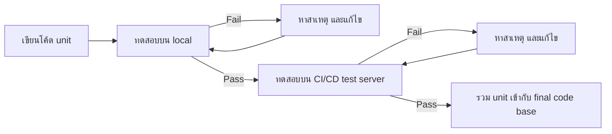

# Unit Testing

`Tags: Python, unit testing, unittest, CI/CD`

| Field             | Value                                    |
| ----------------- | ----------------------------------------- |
| **Certificate**   | IBM Data Engineering Professional Certificate |
| **Course**        | C03 Python Project for Data Engineer      |
| **Module**        | M03 Coding Practices and Packaging Concepts |
| **Lesson**        | L02 Unit Testing                          |
| **Date studied**  | 2026-08-09                                |

---

## Table of Contents

- [Overview](#overview)
- [What is Unit Testing](#what-is-unit-testing)
- [End-to-End Testing Process](#end-to-end-testing-process)
- [Building a Unit Test with unittest](#building-a-unit-test-with-unittest)
- [Reading Unit Test Output](#reading-unit-test-output)
- [Key Terms & Glossary](#-key-terms--glossary)
- [My Questions & Gaps](#-my-questions--gaps)
- [Resources](#-resources)

---

## Overview

วิดีโอนี้อธิบายเรื่อง unit testing ซึ่งเป็นวิธีตรวจสอบว่าโค้ดแต่ละส่วน (unit) ทำงานตามที่ออกแบบไว้หรือไม่ เนื้อหาครอบคลุมขั้นตอนการทดสอบตั้งแต่ local จนถึง server (CI/CD) การเขียน unit test ด้วย Python library `unittest` และวิธีอ่านผลลัพธ์การทดสอบทั้งกรณีผ่านและกรณีล้มเหลว

---

## What is Unit Testing

**Unit testing** คือวิธีการตรวจสอบ (validate) ว่าโค้ดแต่ละหน่วย (unit) ทำงานถูกต้องตามที่ออกแบบไว้หรือไม่ โดย **unit** หมายถึงส่วนที่เล็กที่สุดของแอปพลิเคชันที่สามารถทดสอบได้ เช่น function เดียว ๆ

ตัวอย่างเช่นไฟล์ `mymodule.py` ที่มี 2 function คือ `square` และ `doubler`

```python
# unit ตัวอย่างในไฟล์ mymodule.py
def square(number):
    return number ** 2


def doubler(number):
    return number * 2
```

การเขียน unit test ใน Python ใช้ library ชื่อ **unittest** ซึ่งเป็น module ที่ติดตั้งมาพร้อม Python และมี framework สำหรับการทดสอบให้อยู่แล้ว

---

## End-to-End Testing Process

กระบวนการทดสอบตั้งแต่ unit testing จนถึงการนำโค้ดขึ้น production มี 2 phase หลัก



- **Phase 1 — Local test**: ทดสอบ unit บนเครื่องของตัวเอง ถ้า fail ต้องหาสาเหตุแล้วแก้ไข จากนั้นทดสอบใหม่
- **Phase 2 — Server test**: หลังผ่าน local test แล้ว ต้องทดสอบใน server environment เช่น CI/CD (Continuous Integration Continuous Delivery) test server ถ้า fail จะได้รับรายละเอียดของความล้มเหลวเพื่อนำไปแก้ไข
- เมื่อผ่านทั้ง 2 phase แล้ว unit จะถูก integrate เข้ากับ final code base

---

## Building a Unit Test with unittest

ไฟล์ unit test ควรตั้งชื่อโดยเติมคำว่า `test` ไว้หน้าหรือหลังชื่อไฟล์ unit เพื่อแยกความแตกต่างจากไฟล์ unit ให้ชัดเจน (เช่น unit คือ `mymodule.py` → unit test คือ `test_mymodule.py`)

ขั้นตอนการสร้าง unit test file มีดังนี้

1. Import `unittest` library
2. Import function ที่ต้องการทดสอบจาก module
3. สร้าง class สำหรับ unit test โดยตั้งชื่อขึ้นต้นด้วย `Test` และให้ inherit จาก `unittest.TestCase` เพื่อใช้ method ที่มีอยู่แล้วใน `TestCase`
4. สร้าง function ใน class นั้นให้สอดคล้องกับแต่ละ function ที่จะทดสอบ โดย **ชื่อ function ต้องขึ้นต้นด้วย `test`** เพราะ unittest จะรันเฉพาะ function ที่ขึ้นต้นด้วยคำนี้เท่านั้น
5. เขียน test case โดยใช้ assertion method อย่างน้อย 1 ตัว เพื่อตรวจสอบเงื่อนไขของการทดสอบ เช่น `assertEqual()` ที่เปรียบเทียบค่า **actual** (ค่าที่ได้จากการเรียก function จริง) กับค่า **expected** (ค่าที่คาดว่าจะได้)

```python
# ไฟล์ test_mymodule.py — ตัวอย่างการเขียน unit test
import unittest
from mymodule import square, doubler


class TestMyModule(unittest.TestCase):

    def test_square(self):
        self.assertEqual(square(2), 4)

    def test_doubler(self):
        self.assertEqual(doubler(2), 4)


if __name__ == '__main__':
    unittest.main()
```

---

## Reading Unit Test Output

หลัง run ไฟล์ test แล้ว จะได้ output แสดงผลการทดสอบพร้อมรายละเอียดเพิ่มเติม

| กรณี           | ลักษณะ Output                                                                 |
| --------------- | -------------------------------------------------------------------------------- |
| Pass (สำเร็จ)   | แสดงจำนวน test ที่รัน (เช่น "2 tests run") พร้อมคำว่า **OK** ต่อท้าย แปลว่าทุก function ทำงานถูกต้อง |
| Fail (ล้มเหลว)  | แสดง **Fail** พร้อมชื่อ test/class ที่ล้มเหลว (เช่น `test_square (__main__.TestMyModule)`) และ **AssertionError** พร้อมค่าที่ไม่ตรงกัน (เช่น `8 != 4`) |

ตัวอย่างเช่น ถ้า function `square` ถูกเขียนผิดให้คำนวณ cube แทน square ผลลัพธ์ของ `square(2)` จะเป็น 8 แทนที่จะเป็น 4 ทำให้ test ล้มเหลว และ output จะแสดง `AssertionError: 8 != 4` ซึ่งช่วยให้แก้ไขข้อผิดพลาดได้ก่อนนำโค้ดขึ้น production จริง

---

## 📖 Key Terms & Glossary

| Term (ศัพท์)          | คำอธิบาย (ภาษาไทย)                                                          |
| ------------------------ | ------------------------------------------------------------------------------- |
| Unit                       | ส่วนที่เล็กที่สุดของแอปพลิเคชันที่สามารถทดสอบได้ เช่น function เดียว          |
| Unit testing                | วิธีการตรวจสอบว่า unit ทำงานถูกต้องตามที่ออกแบบไว้                          |
| unittest                     | Python library สำหรับสร้างและรัน unit test                                  |
| TestCase                      | class หลักใน unittest ที่ unit test class ต้อง inherit เพื่อใช้ assertion method ต่าง ๆ |
| assertEqual()                  | assertion method ที่เปรียบเทียบค่า actual กับ expected ว่าเท่ากันหรือไม่   |
| CI/CD                           | Continuous Integration / Continuous Delivery — กระบวนการทดสอบและส่งมอบโค้ดแบบต่อเนื่องผ่าน server |
| AssertionError                   | error ที่เกิดขึ้นเมื่อผลลัพธ์จาก assertion method ไม่ตรงกับค่าที่คาดหวัง   |

---

## ❓ My Questions & Gaps

- [ ] assertion method อื่นนอกจาก `assertEqual()` ใน `unittest` มีอะไรบ้าง (เช่น `assertTrue`, `assertRaises`) และใช้ต่างกันอย่างไร
- [ ] จะเขียน unit test สำหรับ function ที่มีการเรียก external API หรือ database ได้อย่างไร (mocking)
- [ ] CI/CD test server ในตัวอย่างมีการตั้งค่าหรือ config อย่างไรก่อนรัน unit test อัตโนมัติ

---

## 🔗 Resources

- Python `unittest` library documentation
