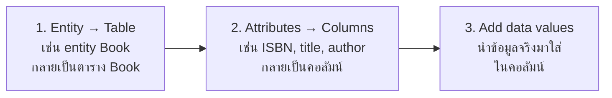

# Mapping Entities to Tables

`Tags: RDBMS, ERD, primary key, database design`

| Field             | Value                                            |
| ----------------- | ------------------------------------------------- |
| **Certificate**   | IBM Data Engineering Professional Certificate    |
| **Course**        | C04 Introduction to Relational Databases (RDBMS) |
| **Module**        | M01 Relational Database Concepts                 |
| **Lesson**        | L01 Fundamental Relational Database Concepts     |
| **Date studied**  | 2026-07-12                                       |

---

## Table of Contents

- [Overview](#overview)
- [From ERD to Relational Database](#from-erd-to-relational-database)
- [Steps for Mapping Entities to Tables](#steps-for-mapping-entities-to-tables)
- [Best Practices for Relational Database Design](#best-practices-for-relational-database-design)
- [📖 Key Terms & Glossary](#-key-terms--glossary)
- [❓ My Questions & Gaps](#-my-questions--gaps)
- [🔗 Resources](#-resources)

---

## Overview

วิดีโอนี้อธิบายขั้นตอนแปลง ERD ที่ออกแบบไว้ให้กลายเป็นตารางจริงในฐานข้อมูล ผ่าน 3 ขั้นตอนหลัก (entity → table, attribute → column, เติมข้อมูลจริง) พร้อมปิดท้ายด้วย best practice 5 ข้อที่ควรคำนึงถึงตอนออกแบบตาราง เช่น การกำหนด primary key, data validation และการใช้ view

---

## From ERD to Relational Database

ERD คือการนำเสนอเชิงภาพของ entity และความสัมพันธ์ระหว่างกันในฐานข้อมูล เป็นเทคนิคการสร้างโมเดลที่ใช้แสดงโครงสร้างของระบบฐานข้อมูลเชิงภาพ องค์ประกอบหลักได้แก่:

- **Entities** — วัตถุ แนวคิด หรือสิ่งของในโลกจริงที่จัดเก็บและจัดการข้อมูล แสดงเป็นสี่เหลี่ยม (เช่น `Book`)
- **Attributes** — คุณลักษณะที่เกี่ยวข้องกับ entity แสดงเป็นวงรีภายในสี่เหลี่ยมของ entity (เช่น ISBN, title, author, published year สำหรับ `Book`)
- **Relationships** — แสดงว่า entity สัมพันธ์กันอย่างไร แสดงเป็นเส้นเชื่อมระหว่างสี่เหลี่ยมของ entity (เช่น `Author` "writes" `Book`)

Relational database ให้กรอบโครงสร้างที่ชัดเจนสำหรับจัดการและปรับแต่ง structured data โดยจัดข้อมูลเป็นตาราง ซึ่งความสัมพันธ์ระหว่างตารางขึ้นอยู่กับ field ที่ใช้ร่วมกัน

---

## Steps for Mapping Entities to Tables

การออกแบบ relational database เริ่มจาก ERD แล้วจึงแปลงเป็นตาราง ทำซ้ำ 3 ขั้นตอนนี้กับทุก entity ใน ERD:

1. **Entity → Table** — entity กลายเป็นตารางที่มีชื่อเดียวกัน (เช่น entity `Book` กลายเป็นตาราง `Book`) ขั้นตอนนี้ให้เพียงโครงสร้างของแถว/คอลัมน์ ตารางยังว่างเปล่าอยู่
2. **Attributes → Columns** — attribute ของ entity กลายเป็นคอลัมน์ในตาราง (เช่น ISBN, title และ author กลายเป็นคอลัมน์ในตาราง `Book`)
3. **Add data values** — นำข้อมูลจริงมาใส่ในคอลัมน์ของตาราง เป็นการเปลี่ยนจาก entity เชิงแนวคิดให้กลายเป็นตารางที่จับต้องได้พร้อมข้อมูลจริง

(เช่น เปลี่ยน entity `Author` ให้กลายเป็นตาราง `Author` ด้วยขั้นตอนเดียวกัน)

---

## Best Practices for Relational Database Design

- **Primary key designation** — กำหนด primary key (เช่น `Book ID`) เพื่อระบุแต่ละ entry ในตารางอย่างไม่ซ้ำกัน
- **Data validation** — ตรวจสอบ data type, ช่วงค่า และรูปแบบ เพื่อความถูกต้องและความสอดคล้องของข้อมูล (เช่น กำหนดให้คอลัมน์ `published year` รับเฉพาะค่าตัวเลขในช่วงที่กำหนด)
- **Default values** — กำหนดค่าเริ่มต้นให้บางคอลัมน์เพื่อให้การกรอกข้อมูลสะดวกขึ้น (เช่น ตั้งค่า default ของคอลัมน์ `author` เป็น "Unknown" เมื่อไม่มีข้อมูลผู้แต่ง)
- **Use of views** — ใช้ view เพื่อนำเสนอมุมมองข้อมูลที่ปรับแต่งและเรียบง่ายขึ้น โดยเฉพาะสำหรับ query ที่ซับซ้อนหรือรายงาน (เช่น view ที่รวมตาราง `Book` และ `Author` เป็นรายการเดียวโดยไม่ต้องเปิดเผยความซับซ้อนเบื้องหลัง)
- **Concurrency control** — ใช้กลไกจัดการผู้ใช้หลายคนที่เข้าถึงและแก้ไขฐานข้อมูลพร้อมกัน เพื่อป้องกันความไม่สอดคล้องและความขัดแย้งของข้อมูล (เช่น คอลัมน์ "Last modified" ในตาราง `Book`)

---

## 📖 Key Terms & Glossary

| Term | Definition |
| --- | --- |
| Primary key | ตัวระบุเฉพาะที่กำหนดให้แต่ละ entry ในตาราง เพื่อระบุอย่างไม่ซ้ำกัน |
| Data validation | กลไกตรวจสอบ data type, ช่วงค่า และรูปแบบ เพื่อความถูกต้องและความสอดคล้องของข้อมูลที่ป้อนเข้ามา |
| Default value | ค่าที่กำหนดไว้ล่วงหน้าให้กับคอลัมน์ เพื่อให้การกรอกข้อมูลสะดวกขึ้นเมื่อไม่มีการระบุค่า |
| View | database object ที่เป็นมุมมองเสมือนสร้างจาก query บนตารางหนึ่งตัวหรือมากกว่า ไม่เก็บข้อมูลซ้ำจากตารางต้นฉบับ มักใช้เพื่อลดความซับซ้อนของ query หรือรายงาน |
| Concurrency control | กลไกจัดการผู้ใช้หลายคนที่เข้าถึงและแก้ไขฐานข้อมูลพร้อมกัน เพื่อป้องกันความไม่สอดคล้องและความขัดแย้ง |

---

## ❓ My Questions & Gaps

- [ ] ขั้นตอนที่เป็นรูปธรรมในการแปลง ER diagram เป็นตาราง relational มีอะไรบ้าง (นอกเหนือจาก entity → table, attribute → column) เช่น ความสัมพันธ์ถูกแปลงอย่างไร
- [ ] View มีปฏิสัมพันธ์กับ concurrency control อย่างไร — สะท้อนข้อมูลที่เปลี่ยนแปลงแบบ live หรือเป็นแค่ snapshot ณ เวลาที่ query

---

## 🔗 Resources

- ไม่มีลิงก์หรือเอกสารอ้างอิงภายนอกที่กล่าวถึงในวิดีโอนี้
