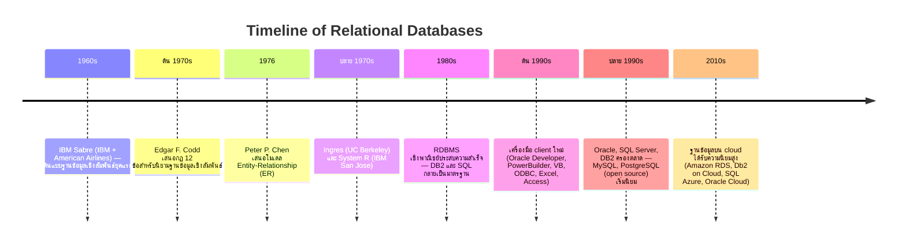

# Introduction to Relational Database Offerings

`Tags: RDBMS, history, open source, cloud database`

| Field            | Value                                            |
| ---------------- | ------------------------------------------------ |
| **Certificate**  | IBM Data Engineering Professional Certificate    |
| **Course**       | C04 Introduction to Relational Databases (RDBMS) |
| **Module**       | M01 Relational Database Concepts                 |
| **Lesson**       | L02 Introducing Relational Database Products     |
| **Date studied** | 2026-07-30                                       |

---

## Table of Contents

- [Overview](#overview)
- [History of Relational Databases](#history-of-relational-databases)
- [Commercial vs Open-source Licensing](#commercial-vs-open-source-licensing)
- [Cloud Database](#cloud-database)
- [📖 Key Terms & Glossary](#-key-terms--glossary)
- [❓ My Questions & Gaps](#-my-questions--gaps)
- [🔗 Resources](#-resources)

---

## Overview

วิดีโอนี้เดินผ่านประวัติของฐานข้อมูลเชิงสัมพันธ์ตั้งแต่ยุค 1960s จนถึงปัจจุบัน เปรียบเทียบ commercial licensing กับ open-source licensing และแนวโน้มที่ open source กำลังได้รับความนิยมเพิ่มขึ้นเรื่อย ๆ พร้อมปิดท้ายด้วยภาพรวมของ cloud database ซึ่งเป็นทิศทางหลักของอุตสาหกรรมในปัจจุบัน

---

## History of Relational Databases

- **1960s**: IBM และ American Airlines สร้าง IBM Sabre ระบบจองที่นั่งซึ่งถือเป็นต้นแบบฐานข้อมูลเชิงสัมพันธ์ยุคแรก
- **ต้นปี 1970s**: Edgar F. Codd เสนอกฎ 12 ข้อสำหรับนิยามฐานข้อมูลเชิงสัมพันธ์
- **1976**: Peter P. Chen เสนอโมเดล Entity-Relationship (ER)
- **ปลาย 1970s**: Ingres (UC Berkeley) และ System R (IBM San Jose) เริ่มใช้งาน
- **1980s**: RDBMS เชิงพาณิชย์ประสบความสำเร็จ DB2 กลายเป็นสินค้าเรือธงของ IBM และ SQL กลายเป็นภาษามาตรฐาน
- **ต้นปี 1990s**: เครื่องมือฝั่ง client ใหม่ ๆ เช่น Oracle Developer, PowerBuilder, VB และเครื่องมือส่วนบุคคลอย่าง ODBC, Excel, Access เริ่มเป็นที่นิยม
- **ปลาย 1990s**: อุตสาหกรรมฐานข้อมูลเติบโตแบบก้าวกระโดด ผู้เล่นรายใหญ่ ได้แก่ Oracle, Microsoft SQL Server, IBM DB2 ขณะที่ฐานข้อมูล open source อย่าง MySQL, PostgreSQL เริ่มได้รับความนิยม
- **2010s**: ฐานข้อมูลบน cloud ได้รับความนิยมสูงขึ้นมาก ผู้เล่นหลักคือ Amazon RDS, IBM Db2 on Cloud, Microsoft SQL Azure, Oracle Cloud

ฐานข้อมูลเชิงสัมพันธ์ยอดนิยม 10 อันดับ (ข้อมูล ณ กุมภาพันธ์ 2021): Oracle, MySQL, Microsoft SQL Server, PostgreSQL, MongoDB, Redis, Elasticsearch, IBM Db2, SQLite, Microsoft Access

---

## Commercial vs Open-source Licensing

RDBMS เชิงพาณิชย์ (Oracle, Microsoft SQL Server, IBM Db2) ยังคงได้รับความนิยมด้านความน่าเชื่อถือและ feature ที่ครบครัน ส่วน open-source licensing (เช่น MySQL, PostgreSQL, SQLite) อนุญาตให้ผู้ใช้ดู แก้ไข และแจกจ่าย source code ได้ฟรี ซึ่งได้รับความนิยมเพิ่มขึ้นต่อเนื่อง

จากข้อมูลของ **DB-Engines** (ผู้จัดอันดับความนิยมของฐานข้อมูลจากหลายปัจจัย เช่น การกล่าวถึงบน Google/Bing, Google Trends, Stack Overflow, ตำแหน่งงานบน Indeed/LinkedIn) พบว่าในปี 2023 ระบบ open source มีสัดส่วนคะแนนความนิยมถึง 55.3% เพิ่มขึ้นจาก 35.5% ในปี 2013

---

## Cloud Database

บริการฐานข้อมูลที่สร้างและเข้าถึงผ่าน cloud platform ได้รับความนิยมเพิ่มขึ้นกว่าเท่าตัวในช่วงสิบปีที่ผ่านมา คาดการณ์ว่าภายในปี 2025 ฐานข้อมูลกว่า 80% จะอยู่บนหรือย้ายไปยัง cloud แรงขับเคลื่อนหลักคือโมเดล SaaS ที่ช่วยเรื่อง scalability, การประมวลผลข้อมูลปริมาณมากสำหรับ analytics และระบบ backup/disaster recovery ในตัว ตัวอย่าง cloud database ชั้นนำ ได้แก่ Amazon DynamoDB, Microsoft Azure Cosmos DB, Microsoft Azure SQL DB, Google BigQuery, Amazon Redshift

---

## 📖 Key Terms & Glossary

| Term | Definition |
| --- | --- |
| DB-Engines Ranking | การจัดอันดับความนิยมของฐานข้อมูลโดยพิจารณาหลายปัจจัย เช่น การกล่าวถึงออนไลน์และตำแหน่งงาน |
| Open-source Licensing | รูปแบบ license ที่อนุญาตให้ดู แก้ไข และแจกจ่าย source code ได้อย่างเสรี |
| Cloud Database | บริการฐานข้อมูลที่สร้างและเข้าถึงผ่าน cloud platform |

---

## ❓ My Questions & Gaps

- [ ] แนวโน้ม open source แซง commercial licensing ในแง่ความนิยมแล้ว แต่ในองค์กรใหญ่ยังเลือกใช้ commercial RDBMS อยู่มากน้อยแค่ไหน และด้วยเหตุผลอะไร

---

## 🔗 Resources

- ไม่มีลิงก์อ้างอิงภายนอกในวิดีโอนี้ นอกจากชื่อผลิตภัณฑ์/บริการที่กล่าวถึง (DB-Engines, Amazon RDS, Amazon DynamoDB, Azure Cosmos DB, Google BigQuery, Amazon Redshift)
