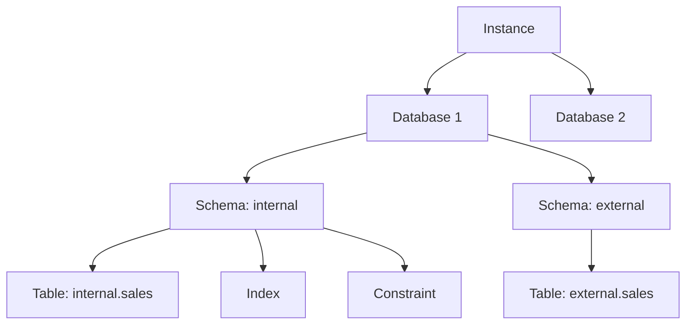

# Database Objects and Hierarchy (Including Schemas)

`Tags: RDBMS, schema, instance, database objects, constraints, indexes`

| Field             | Value                                    |
| ----------------- | ----------------------------------------- |
| **Certificate**   | IBM Data Engineering Professional Certificate |
| **Course**        | C04 Introduction to Relational Databases (RDBMS) |
| **Module**        | M02 Using Relational Databases            |
| **Lesson**        | L02 Designing Keys, Indexes, and Constraints |
| **Date studied**  | 2026-08-08                                |

---

## Table of Contents

- [Overview](#overview)
- [Instance and Database Hierarchy](#instance-and-database-hierarchy)
- [Schema: Logical Grouping of Database Objects](#schema-logical-grouping-of-database-objects)
- [Relational Database and Database Objects](#relational-database-and-database-objects)
- [Constraints, Indexes, Views, and Aliases](#constraints-indexes-views-and-aliases)
- [Database Partitioning](#database-partitioning)
- [📖 Key Terms & Glossary](#-key-terms--glossary)
- [❓ My Questions & Gaps](#-my-questions--gaps)
- [🔗 Resources](#-resources)

---

## Overview

บทเรียนนี้อธิบายโครงสร้างลำดับชั้น (hierarchy) ของ objects ต่าง ๆ ใน RDBMS ตั้งแต่ระดับ instance ลงไปจนถึง database, schema และ object ย่อยภายในนั้น เพื่อให้เข้าใจว่าทำไม database administrator ถึงต้องจัดระเบียบ object เหล่านี้อย่างเป็นระบบ การจัดลำดับชั้นแบบนี้ช่วยให้จัดการเรื่อง security, maintenance และ accessibility ได้ง่ายขึ้น นอกจากนี้ยังแนะนำ object หลักที่พบใน relational database เช่น tables, views, indexes, constraints และ aliases รวมถึงแนวคิดเรื่อง database partitioning สำหรับข้อมูลปริมาณมาก

---

## Instance and Database Hierarchy

- **Instance** คือขอบเขตเชิงตรรกะ (logical boundary) สำหรับ database หรือชุดของ database ที่ใช้จัดระเบียบ object ต่าง ๆ และตั้งค่า configuration parameters — หนึ่ง instance มีได้มากกว่าหนึ่ง database และแต่ละ database จะมี schema อยู่อย่างน้อยหนึ่งระดับในโครงสร้างลำดับชั้น
- แต่ละ database ภายใน instance จะมี**ชื่อไม่ซ้ำกัน** (unique name), มี **system catalog tables** ของตัวเองสำหรับติดตาม object ภายใน database, และมี **configuration files** แยกเฉพาะ
- สามารถสร้างหลาย instance บนเซิร์ฟเวอร์จริงเครื่องเดียวได้ โดยแต่ละ instance จะแยก database และ object ต่าง ๆ ออกจากกันโดยสมบูรณ์ (**isolated**)
- RDBMS บางตัวไม่ได้ใช้แนวคิด instance แต่เก็บข้อมูล configuration ไว้ใน database พิเศษแทน ส่วนใน **cloud-based RDBMS** คำว่า instance หมายถึง running copy ของ service ตัวหนึ่งโดยเฉพาะ

แผนภาพด้านล่างแสดงลำดับชั้นทั้งหมด โดยใช้ตัวอย่าง schema `internal` และ `external` ที่ทั้งคู่มีตาราง `sales` ของตัวเอง แต่ไม่ชนกันเพราะแยก schema:

---

## Schema: Logical Grouping of Database Objects

- **Schema** คือการจัดกลุ่มเชิงตรรกะ (logical grouping) ของ object ภายใน database ใช้กำหนดว่า object ต่าง ๆ จะถูกตั้งชื่ออย่างไร และป้องกันการอ้างอิงชื่อที่กำกวม (ambiguous references) — RDBMS บางตัวมอง schema เป็น parent object ของ database ในขณะที่บางตัวมอง schema เป็นเพียง database object อย่างหนึ่ง ภายใน schema จะมี object เช่น tables, views, nicknames, triggers, functions, packages และอื่น ๆ
- เมื่อสร้าง database object สามารถระบุชื่อ schema ที่ต้องการให้ object นั้นสังกัดได้โดยตรง แต่ถ้าไม่ระบุ object จะถูกกำหนดให้อยู่ใน **current schema** โดยปริยาย (implicit) ซึ่งใน RDBMS ส่วนใหญ่ default schema คือ user schema ของผู้ใช้ที่ login อยู่
- Schema ยังทำหน้าที่เป็น **naming context** — การใช้ชื่อ schema เป็นตัวกำกับชื่อ (name qualifier) ช่วยแยกแยะ object ที่มีชื่อซ้ำกันในต่างคนละ schema ได้ เช่น schema ชื่อ `internal` และ `external` ที่ต่างก็มีตาราง `sales` ทำให้แยกเป็น `internal.sales` และ `external.sales` ได้ (ดูแผนภาพด้านบน) ด้วยกลไกนี้หลาย application จึงเก็บข้อมูลใน database เดียวกันได้โดยไม่ชนกันในเรื่อง namespace
- RDBMS หลายตัวยังใช้ **system schema** พิเศษสำหรับเก็บ configuration และ metadata ของ database เช่น รายชื่อ user, สิทธิ์การเข้าถึง (access permissions), ข้อมูล index บนตาราง, รายละเอียด partition และ user-defined data types

---

## Relational Database and Database Objects

- **Relational database** คือชุดของ object ที่ออกแบบมาเพื่อจัดเก็บ จัดการ และดึงข้อมูล (storage, management, retrieval) — object เหล่านี้ได้แก่ tables, views, indexes, functions, triggers และ packages
- Database object แบ่งเป็นสองแบบ: **system built-in objects** (มากับระบบ) และ **user-defined objects** (ผู้ใช้สร้างขึ้นเอง) — database engineer มักสร้างความสัมพันธ์ (relationships) ระหว่างตารางเพื่อลดความซ้ำซ้อนของข้อมูล (redundant data) และเพิ่มความถูกต้องของข้อมูล (data integrity)

ตารางด้านล่างเทียบความแตกต่างระหว่าง relational database สองแบบที่กระจายข้อมูลออกไปหลายเครื่อง เพื่อไม่ให้สับสนกัน:

| ประเภท | คำอธิบาย |
| ------ | -------- |
| **Distributed relational database** | แชร์ตารางและ object ต่าง ๆ **ข้ามระบบคอมพิวเตอร์หลายเครื่องที่แยกกัน** แต่เชื่อมต่อถึงกัน |
| **Partitioned relational database** | ข้อมูล**ภายในระบบ relational database เดียวกัน** ถูกกระจายและจัดการข้าม partition หลายส่วน (รายละเอียดในหัวข้อ [Database Partitioning](#database-partitioning)) |

---

## Constraints, Indexes, Views, and Aliases

บทเรียนนี้แนะนำ database object พื้นฐาน 4 ประเภทที่พบบ่อยที่สุด:

| Object | คำอธิบาย |
| ------ | -------- |
| **Constraint** | ธุรกิจมักมีกฎหรือข้อจำกัดกับข้อมูล เช่น รหัสพนักงาน (employee number) ต้องไม่ซ้ำกัน (unique) constraint คือกลไกที่ใช้บังคับกฎเหล่านี้ |
| **Index** | ชุดของ pointer ที่ช่วยเพิ่มประสิทธิภาพการค้นหาข้อมูล (performance) และช่วยรับประกันความไม่ซ้ำกันของข้อมูล (uniqueness) |
| **View** | วิธีการนำเสนอข้อมูลจากตารางหนึ่งหรือหลายตารางในรูปแบบอื่น สิ่งสำคัญคือ view ไม่ใช่ตารางจริง และไม่ต้องการพื้นที่จัดเก็บถาวร (permanent storage) |
| **Alias** | ชื่อทางเลือก (alternative name) สำหรับ object เช่น ตาราง ใช้เพื่อให้มีชื่อที่สั้นและง่ายต่อการอ้างอิงมากขึ้น |

การสร้างและจัดการ database object เหล่านี้ทำได้ผ่าน graphical database management tools, scripting หรือเข้าถึง database ผ่าน API หากใช้ SQL จะใช้คำสั่งกลุ่ม **Data Definition Language (DDL)** เช่น `CREATE` หรือ `ALTER`

---

## Database Partitioning

- **Partitioned relational database** คือ database ที่ข้อมูลถูกกระจายและจัดการข้าม database partition หลายส่วนภายในระบบ relational database เดียวกัน — ตารางที่มีข้อมูลปริมาณมากสามารถถูกแบ่งเป็นหลาย logical partition โดยแต่ละ partition เก็บข้อมูลเพียงบางส่วนของข้อมูลทั้งหมด
- Database partitioning มักถูกใช้ในสถานการณ์ที่เกี่ยวข้องกับข้อมูลปริมาณมาก เช่น **data warehousing** และ data analysis สำหรับ **business intelligence (BI)**

---

## 📖 Key Terms & Glossary

| Term (ศัพท์) | คำอธิบาย (ภาษาไทย) |
| ------------- | -------------------- |
| Instance | ขอบเขตเชิงตรรกะสำหรับ database หรือชุด database ที่ใช้จัดระเบียบ object และตั้งค่า configuration |
| Database | ชุดของ object ที่เก็บข้อมูล มีชื่อไม่ซ้ำกัน มี system catalog และ configuration files ของตัวเอง |
| Schema | การจัดกลุ่มเชิงตรรกะของ object ภายใน database กำหนดการตั้งชื่อและป้องกันการอ้างอิงชื่อกำกวม |
| Relational Database | ชุดของ object ที่ใช้จัดเก็บ จัดการ และดึงข้อมูล เช่น tables, views, indexes |
| Database Object | สิ่งที่มีอยู่ภายใน database เช่น table, view, index, constraint, alias |
| Constraint | กฎหรือข้อจำกัดที่บังคับใช้กับข้อมูล เช่น ค่าต้องไม่ซ้ำกัน (unique) |
| Index | ชุด pointer ที่ช่วยเพิ่มประสิทธิภาพการค้นหาและรับประกันความไม่ซ้ำกันของข้อมูล |
| View | การนำเสนอข้อมูลจากตารางในรูปแบบอื่นโดยไม่ต้องเก็บข้อมูลถาวร |
| Alias | ชื่อทางเลือกที่ใช้อ้างอิง object แทนชื่อเดิมที่อาจยาวหรือซับซ้อน |
| Distributed Relational Database | database ที่แชร์ตารางและ object ข้ามระบบคอมพิวเตอร์หลายเครื่องที่เชื่อมต่อกัน |
| Partitioned Relational Database | database ที่ข้อมูลถูกกระจายและจัดการข้าม partition หลายส่วน |
| System Catalog | ชุดตารางระบบที่ติดตาม object ต่าง ๆ ภายใน database |
| DDL (Data Definition Language) | กลุ่มคำสั่ง SQL สำหรับสร้างหรือแก้ไข database object เช่น `CREATE`, `ALTER` |
| Namespace | ขอบเขตการตั้งชื่อที่ป้องกันไม่ให้ object ชื่อซ้ำกันชนกัน |

---

## ❓ My Questions & Gaps

- [ ] ใน RDBMS ที่ไม่มีแนวคิด instance (เช่นบางตัวที่ใช้ database พิเศษเก็บ configuration แทน) การจัดการ isolation ระหว่าง environment ทำอย่างไร
- [ ] schema เป็น parent ของ database หรือเป็นแค่ database object ขึ้นอยู่กับ RDBMS ตัวไหนบ้าง (ต้องเช็คตัวอย่างเทียบระหว่าง PostgreSQL, MySQL, Db2)
- [ ] database partitioning ต่างจาก sharding อย่างไร ทั้งสองแนวคิดดูใกล้เคียงกันในบริบทของการกระจายข้อมูล

---

## 🔗 Resources

- ไม่มีลิงก์หรือเอกสารอ้างอิงภายนอกที่กล่าวถึงในบทเรียนนี้
