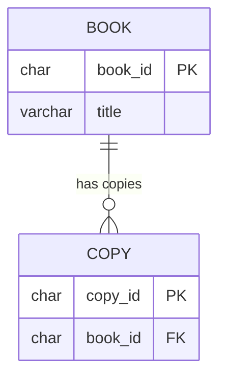

# Primary Keys and Foreign Keys

`Tags: SQL, primary key, foreign key, referential integrity, RDBMS`

| Field             | Value                                    |
| ----------------- | ----------------------------------------- |
| **Certificate**   | IBM Data Engineering Professional Certificate |
| **Course**        | C04 Introduction to Relational Databases (RDBMS) |
| **Module**        | M02 Using Relational Databases            |
| **Lesson**        | L02 Designing Keys, Indexes, and Constraints |
| **Date studied**  | 2026-08-08                                |

---

## Table of Contents

- [Overview](#overview)
- [Primary Key](#primary-key)
- [Foreign Key](#foreign-key)
- [Referential Actions on Parent Row Update or Delete](#referential-actions-on-parent-row-update-or-delete)
- [📖 Key Terms & Glossary](#-key-terms--glossary)
- [❓ My Questions & Gaps](#-my-questions--gaps)
- [🔗 Resources](#-resources)

---

## Overview

บทเรียนนี้อธิบาย primary key และ foreign key ซึ่งเป็นกลไกหลักในการระบุแถวข้อมูลแบบไม่ซ้ำกัน (uniquely identify) และสร้างความสัมพันธ์ระหว่างตารางใน relational database ครอบคลุมวิธีเลือก column ที่เหมาะสมมาเป็น primary key, ขั้นตอนการสร้าง primary key และ foreign key ทั้งตอนสร้างตารางใหม่และตารางที่มีอยู่แล้ว รวมถึงการกำหนดพฤติกรรมที่ควรเกิดขึ้นเมื่อแถวในตารางแม่ (parent table) ถูกแก้ไขหรือลบ

---

## Primary Key

- **Primary key** ใช้ระบุ (identify) ทุกแถวในตารางแบบไม่ซ้ำกัน บางตารางมี attribute ที่ unique อยู่แล้วตามธรรมชาติ เช่น `book_id` ของหนังสือ หรือ `employee_id` ของพนักงาน ทำให้เลือกเป็น primary key ได้ง่าย
- ถ้าตารางไม่มี attribute ที่ unique อยู่แล้ว สามารถ**เพิ่ม column ใหม่**ขึ้นมาทำหน้าที่เป็น primary key ได้ หรือถ้า column สอง column รวมกันแล้วระบุแต่ละแถวได้แบบไม่ซ้ำกัน ก็สามารถสร้าง **composite primary key** จากทั้งสอง column ได้ เช่น พนักงานที่มี unique identifier เฉพาะภายใน work site ของตัวเอง ก็ใช้ combination ของ `site_id` และ `employee_id` เป็น primary key ร่วมกัน
- **แต่ละตารางมี primary key ได้เพียงหนึ่งเดียวเท่านั้น** (composite key ก็ยังนับเป็น primary key เดียวที่ประกอบด้วยหลาย column)

```sql
-- Create a table with primary key specified at creation time
CREATE TABLE book (
    book_id CHAR(10) NOT NULL,
    title VARCHAR(100),
    PRIMARY KEY (book_id)
);

-- Create a table with a composite primary key (two columns together)
CREATE TABLE employee (
    site_id CHAR(4) NOT NULL,
    employee_id CHAR(6) NOT NULL,
    name VARCHAR(50),
    PRIMARY KEY (site_id, employee_id)
);

-- Add a primary key to an existing table instead
ALTER TABLE book
ADD PRIMARY KEY (book_id);
```

---

## Foreign Key

- **Foreign key** คือ column ในตารางหนึ่งที่เก็บค่าเดียวกันกับ primary key ของอีกตารางหนึ่ง ใช้เชื่อมความสัมพันธ์ระหว่างตาราง เช่น ตาราง `copy` ที่เก็บรายการสำเนาหนังสือทั้งหมดที่ห้องสมุดมี ค่า `book_id` ในตาราง copy ของแต่ละสำเนาจะต้องมีอยู่จริงในตาราง `book` เป็นหนังสือที่ valid เท่านั้น — ถ้าห้องสมุดมีหนังสือยอดนิยมหลายสำเนา `book_id` เดียวกันก็จะปรากฏซ้ำได้หลายแถวในตาราง copy
- เมื่อเพิ่มแถวใหม่ในตาราง copy สามารถกำหนดได้ว่า `book_id` ที่ใช้ต้องมีอยู่แล้วในตาราง book เท่านั้น (นี่คือแนวคิดของ **referential integrity**)
- การสร้าง foreign key ทำได้ตอนสร้างตารางโดยใช้ `CONSTRAINT name FOREIGN KEY` clause ระบุชื่อ column ที่จะเป็น foreign key แล้วอ้างอิงกลับไปยังตารางและ primary key column ที่ foreign key นั้นเชื่อมโยงถึง

แผนภาพด้านล่างแสดงความสัมพันธ์แบบ one-to-many ระหว่างตาราง `book` (parent, มี primary key `book_id`) กับตาราง `copy` (child, มี foreign key `book_id` อ้างอิงกลับไปที่ `book`):



```sql
-- Create the child table with a foreign key referencing the parent table's primary key
CREATE TABLE copy (
    copy_id CHAR(10) NOT NULL,
    book_id CHAR(10) NOT NULL,
    PRIMARY KEY (copy_id),
    CONSTRAINT fk_copy_book FOREIGN KEY (book_id)
        REFERENCES book (book_id)
);
```

---

## Referential Actions on Parent Row Update or Delete

เมื่อสร้าง foreign key สามารถใช้ **rule clause** กำหนดว่าควรเกิดอะไรขึ้นกับแถวในตารางลูก (child table) หาก แถวที่เกี่ยวข้องในตารางแม่ (parent table — ตารางที่มี primary key) ถูก update หรือ delete:

| Action | พฤติกรรม |
| ------ | -------- |
| **No action** | ไม่ทำอะไรกับแถวลูกโดยอัตโนมัติ — คำสั่ง update/delete บนตารางแม่อาจ**ล้มเหลว** ถ้ายังมีแถวลูกอ้างอิงอยู่ |
| **Cascade** (เฉพาะ delete) | ลบแถวลูกที่เกี่ยวข้องในตารางลูกไปพร้อมกันโดยอัตโนมัติ |
| **Set null** | ตั้งค่า foreign key column ในแถวลูกที่เกี่ยวข้องให้เป็น `NULL` แทนการลบแถว |

เวลาใช้ column หลายตัวร่วมกันเป็น primary key ให้คั่นชื่อ column ด้วยเครื่องหมายจุลภาค (comma) เหมือนตัวอย่าง composite key ด้านบน

---

## 📖 Key Terms & Glossary

| Term (ศัพท์) | คำอธิบาย (ภาษาไทย) |
| ------------- | -------------------- |
| Primary Key | column หรือชุด column ที่ใช้ระบุแต่ละแถวในตารางแบบไม่ซ้ำกัน มีได้เพียงหนึ่งเดียวต่อตาราง |
| Composite Primary Key | primary key ที่ประกอบจากมากกว่าหนึ่ง column รวมกัน |
| Foreign Key | column ในตารางหนึ่งที่เก็บค่าเดียวกับ primary key ของอีกตาราง ใช้เชื่อมความสัมพันธ์ |
| Referential Integrity | การรับประกันว่าค่าของ foreign key ต้องมีอยู่จริงในตารางแม่เสมอ |
| Parent Table | ตารางที่มี primary key ซึ่งถูกอ้างอิงโดย foreign key ของตารางอื่น |
| Child Table | ตารางที่มี foreign key อ้างอิงกลับไปยัง parent table |
| Cascade | referential action ที่ลบ/แก้ไขแถวลูกโดยอัตโนมัติตามการเปลี่ยนแปลงในตารางแม่ |
| Set Null | referential action ที่ตั้งค่า foreign key ในแถวลูกเป็น NULL เมื่อแถวแม่ถูกลบ/แก้ไข |
| No Action | referential action ที่ไม่แก้ไขแถวลูก และอาจทำให้คำสั่งบนตารางแม่ล้มเหลวถ้ายังมีการอ้างอิงอยู่ |

---

## ❓ My Questions & Gaps

- [ ] ถ้าไม่ระบุ rule clause เลยตอนสร้าง foreign key ค่า default ของแต่ละ RDBMS คืออะไร (No action เสมอไปหรือไม่)
- [ ] natural key (เช่น book_id ที่มีความหมายในตัวเอง) กับ surrogate key (เช่น auto-increment id ที่ไม่มีความหมาย) มีข้อดี-ข้อเสียต่างกันอย่างไรในการเลือกใช้เป็น primary key
- [ ] ตารางหนึ่งสามารถมี foreign key ได้กี่ตัว และแต่ละ foreign key อ้างอิงไปยังตารางแม่คนละตารางได้หรือไม่

---

## 🔗 Resources

- ไม่มีลิงก์หรือเอกสารอ้างอิงภายนอกที่กล่าวถึงในบทเรียนนี้
