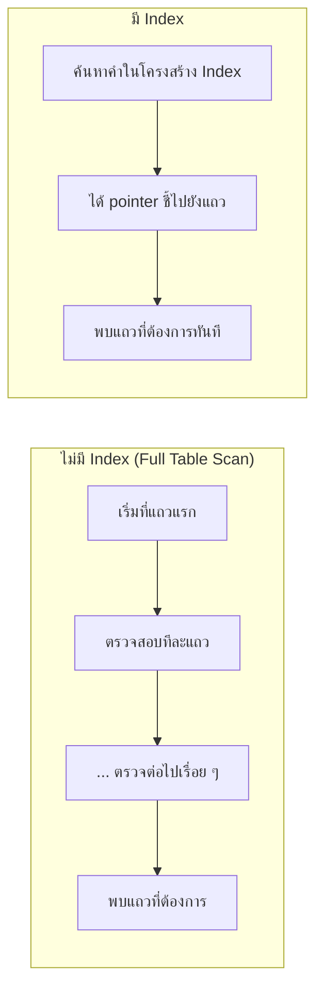

# Overview of Indexes

`Tags: SQL, index, performance, RDBMS`

| Field             | Value                                    |
| ----------------- | ----------------------------------------- |
| **Certificate**   | IBM Data Engineering Professional Certificate |
| **Course**        | C04 Introduction to Relational Databases (RDBMS) |
| **Module**        | M02 Using Relational Databases            |
| **Lesson**        | L02 Designing Keys, Indexes, and Constraints |
| **Date studied**  | 2026-08-08                                |

---

## Table of Contents

- [Overview](#overview)
- [What Is an Index](#what-is-an-index)
- [How an Index Helps Performance](#how-an-index-helps-performance)
- [How an Index Works](#how-an-index-works)
- [Advantages and Disadvantages of Using an Index](#advantages-and-disadvantages-of-using-an-index)
- [📖 Key Terms & Glossary](#-key-terms--glossary)
- [❓ My Questions & Gaps](#-my-questions--gaps)
- [🔗 Resources](#-resources)

---

## Overview

บทเรียนนี้อธิบายว่า index คืออะไร ทำงานอย่างไร และช่วยเพิ่มประสิทธิภาพการค้นหาข้อมูลในฐานข้อมูลได้อย่างไร โดยเปรียบเทียบกับการใช้ catalog ของห้องสมุดในการหาหนังสือแทนการเดินหาทีละชั้น พร้อมยกตัวอย่างการใช้งานจริง เช่น เว็บช้อปปิ้งออนไลน์ ระบบจองตั๋วเครื่องบิน และตู้ ATM รวมถึงชั่งน้ำหนักข้อดี-ข้อเสียของการสร้าง index เพื่อให้ตัดสินใจได้ว่าควรสร้าง index บน column ไหนบ้าง

---

## What Is an Index

- ลองจินตนาการว่ามีห้องสมุดที่เก็บหนังสือจำนวนมาก ถ้าต้องการหาหนังสือเล่มหนึ่งโดยเดินหาทีละชั้นจะช้าและไม่มีประสิทธิภาพ วิธีที่ดีกว่าคือใช้ **catalog** ของห้องสมุด ซึ่งเป็น index ของหนังสือทั้งหมด ระบุชื่อเรื่อง ผู้แต่ง และรายละเอียดอื่น ๆ
- การทำ index ตารางในฐานข้อมูลก็ทำงานคล้ายกัน **Index** คือ data structure ที่ช่วยค้นหาแถวข้อมูลที่ต้องการในตารางได้อย่างรวดเร็วตามเงื่อนไขที่กำหนด เช่น ถ้ามีตารางลูกค้า สามารถสร้าง index บน column ชื่อลูกค้า เพื่อค้นหาแถวของลูกค้าคนใดคนหนึ่งได้เร็วขึ้น
- ตัวอย่างการใช้งานจริง: เว็บช้อปปิ้งออนไลน์ใช้ index หาสินค้าที่ตรงกับคำค้นหาอย่างมีประสิทธิภาพ, เว็บสายการบินใช้ index หาเที่ยวบินที่ตรงเงื่อนไขได้เร็ว และตู้ ATM ใช้ index ดึงข้อมูลบัญชีของผู้ใช้ได้อย่างรวดเร็ว

---

## How an Index Helps Performance

โดยปกติเมื่อเพิ่มข้อมูลเข้าตาราง ข้อมูลจะถูกต่อท้ายตารางโดยไม่มีลำดับที่แน่นอน เมื่อ select แถวใดแถวหนึ่ง processor ต้องตรวจสอบทีละแถวไปเรื่อย ๆ จนกว่าจะเจอ ซึ่งบนตารางขนาดใหญ่จะทำให้ช้ามาก การสร้าง index บนตารางช่วยให้ค้นหาแถวหรือชุดแถวที่ต้องการได้เร็วขึ้นโดยไม่ต้องตรวจทุกแถว



---

## How an Index Works

- Index ทำงานโดย**เก็บ pointer ไปยังแต่ละแถวในตาราง** เมื่อ request แถวใดแถวหนึ่ง SQL processor จะใช้ index ในการหา pointer แล้วไปที่แถวนั้นได้ทันที คล้ายกับการใช้ index ท้ายเล่มหนังสือเพื่อหาหัวข้อที่ต้องการ
- unique key เป็นตัวกำหนดลำดับ (order) ของ index ที่ค่านั้นอิงอยู่
- เมื่อสร้าง **primary key** บนตาราง ระบบจะ**สร้าง index ให้อัตโนมัติ**บน key นั้น แต่ก็สามารถสร้าง index เพิ่มเองบน column ที่ถูกค้นหาบ่อย ๆ ได้เช่นกัน โดยใช้คำสั่ง `CREATE INDEX` ระบุชื่อ index, ความ unique, ตาราง และ column ที่จะสร้าง index ให้

```sql
-- Create a regular index on a frequently searched column
CREATE INDEX idx_customer_name
ON customer (last_name);

-- Create a unique index to guarantee no duplicate values in the column
CREATE UNIQUE INDEX idx_employee_email
ON employee (email);
```

---

## Advantages and Disadvantages of Using an Index

| ข้อดี | ข้อเสีย |
| ----- | ------- |
| เพิ่ม performance ของ `SELECT` เมื่อค้นหาบน column ที่มี index เพราะไม่ต้องตรวจทุกแถว | ใช้พื้นที่ disk เพิ่มขึ้น เหมือนหนังสือที่มีหน้าเพิ่มขึ้นจากการเพิ่ม index ท้ายเล่ม |
| ลดความจำเป็นในการ sort ข้อมูลหลัง retrieve ถ้าต้องการผลลัพธ์เรียงตามลำดับเดิมของ index อยู่แล้ว | ทำให้คำสั่ง `INSERT`, `UPDATE`, `DELETE` **ช้าลง** เพราะแถวในตารางที่มี index ต้องถูกจัดเรียงใหม่ตาม index ทุกครั้ง |
| รับประกันความไม่ซ้ำกันของข้อมูล (uniqueness) ถ้าใช้ `UNIQUE` ตอนสร้าง index ป้องกันไม่ให้ insert/update ค่าซ้ำได้ | |

ควรสร้าง index ก็ต่อเมื่อผลประโยชน์ที่ได้ (ข้อดี) มากกว่าต้นทุนที่ต้องเสีย (ข้อเสีย) เท่านั้น

---

## 📖 Key Terms & Glossary

| Term (ศัพท์) | คำอธิบาย (ภาษาไทย) |
| ------------- | -------------------- |
| Index | data structure ที่ช่วยค้นหาแถวข้อมูลในตารางได้รวดเร็วตามเงื่อนไขที่กำหนด |
| Pointer | ค่าที่ index เก็บไว้เพื่อชี้ตำแหน่งของแถวข้อมูลจริงในตาราง |
| Full Table Scan | การตรวจสอบข้อมูลทีละแถวจนกว่าจะพบแถวที่ต้องการ เมื่อไม่มี index ช่วย |
| Unique Index | index ที่บังคับว่าค่าของ column ที่ทำ index ต้องไม่ซ้ำกัน |
| CREATE INDEX | คำสั่ง SQL สำหรับสร้าง index บนตารางและ column ที่ระบุ |
| Auto-generated Index | index ที่ระบบสร้างให้อัตโนมัติเมื่อกำหนด primary key บนตาราง |

---

## ❓ My Questions & Gaps

- [ ] composite index (index จากหลาย column รวมกัน) ทำงานต่างจาก single-column index อย่างไร บทเรียนนี้ยังไม่ได้พูดถึง
- [ ] query optimizer ของแต่ละ RDBMS ตัดสินใจว่าจะใช้ index หรือไม่ใช้ (เลือกทำ full table scan แทน) ด้วยเกณฑ์อะไร
- [ ] ในทางปฏิบัติ ควรสร้าง index ได้มากที่สุดกี่ตัวต่อหนึ่งตารางก่อนที่ผลเสียต่อ insert/update/delete จะเริ่มมีนัยสำคัญ

---

## 🔗 Resources

- ไม่มีลิงก์หรือเอกสารอ้างอิงภายนอกที่กล่าวถึงในบทเรียนนี้
