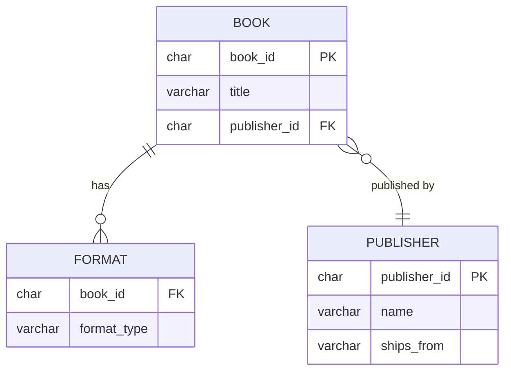

# Normalization

`Tags: SQL, normalization, 1NF, 2NF, 3NF, OLTP, OLAP`

| Field             | Value                                    |
| ----------------- | ----------------------------------------- |
| **Certificate**   | IBM Data Engineering Professional Certificate |
| **Course**        | C04 Introduction to Relational Databases (RDBMS) |
| **Module**        | M02 Using Relational Databases            |
| **Lesson**        | L02 Designing Keys, Indexes, and Constraints |
| **Date studied**  | 2026-08-08                                |

---

## Table of Contents

- [Overview](#overview)
- [Why Normalize Data](#why-normalize-data)
- [First Normal Form (1NF)](#first-normal-form-1nf)
- [Second Normal Form (2NF)](#second-normal-form-2nf)
- [Third Normal Form (3NF)](#third-normal-form-3nf)
- [Higher Normal Forms and Real-World Use in OLTP vs OLAP](#higher-normal-forms-and-real-world-use-in-oltp-vs-olap)
- [📖 Key Terms & Glossary](#-key-terms--glossary)
- [❓ My Questions & Gaps](#-my-questions--gaps)
- [🔗 Resources](#-resources)

---

## Overview

บทเรียนนี้อธิบายกระบวนการ normalization ซึ่งใช้จัดระเบียบข้อมูลเพื่อลดความซ้ำซ้อน (redundant data) โดยมักแบ่งตารางใหญ่ออกเป็นหลายตารางที่เชื่อมโยงกัน ครอบคลุมตั้งแต่ first normal form (1NF), second normal form (2NF), ไปจนถึง third normal form (3NF) พร้อมตัวอย่างการแปลงตารางหนังสือทีละขั้นตอน และปิดท้ายด้วยการเปรียบเทียบว่าระบบ OLTP กับ OLAP นิยม normalize ข้อมูลถึงระดับไหนต่างกันอย่างไร

---

## Why Normalize Data

- เมื่อเก็บข้อมูล เช่น รายการหนังสือในร้านหนังสือ มักเกิดความไม่สอดคล้องกัน (inconsistencies) และข้อมูลซ้ำซ้อน (duplicate information) ได้ ความซ้ำซ้อนนี้ทำให้เกิดงานเพิ่มและความไม่สอดคล้องเมื่อมีการอัปเดตข้อมูล เพราะต้องแก้ไขมากกว่าหนึ่งที่
- **Normalization** คือกระบวนการจัดระเบียบข้อมูลเพื่อลด redundant data มักทำโดยแบ่งตารางใหญ่ออกเป็นหลายตารางที่สัมพันธ์กัน (relatable tables) ช่วยให้ transaction เร็วขึ้นเพราะ update/insert/delete ทำเพียงจุดเดียว และเพิ่ม data integrity เพราะลดโอกาสที่การแก้ไขจะเกิดขึ้นที่จุดหนึ่งแต่ไม่เกิดขึ้นอีกจุดหนึ่ง
- การ normalize ทำทีละตารางจนกว่าจะถึงระดับ (normal form) ที่ต้องการ ผลลัพธ์มักได้ตารางเพิ่มขึ้น เมื่อทุกตาราง normalize แล้วจะได้ฐานข้อมูลที่ normalized

---

## First Normal Form (1NF)

เงื่อนไข: **แต่ละแถวต้องไม่ซ้ำกัน (unique)** และ**แต่ละ cell ต้องมีค่าเดียว** (ไม่ใช่ list ของหลายค่า)

ตัวอย่าง: ตาราง `book` เก็บ title, format และ author ของหนังสือ แต่ column `format` มีค่าหลายรายการอยู่ใน cell เดียว (เช่น "paperback, hardback") ซึ่งละเมิดกฎ 1NF

| book_id | title | format |
| ------- | ----- | ------ |
| 401 | Learning SQL | paperback, hardback |

วิธีแก้: แยกแต่ละ format ออกเป็นคนละแถว ทำให้แต่ละ cell มีค่าเดียวและตารางอยู่ใน **1NF**:

| book_id | title | format |
| ------- | ----- | ------ |
| 401 | Learning SQL | paperback |
| 401 | Learning SQL | hardback |

---

## Second Normal Form (2NF)

เงื่อนไข: ต้องอยู่ใน **1NF** อยู่แล้ว (แต่ละแถว unique, แต่ละ cell มีค่าเดียว) และต้อง**แยกกลุ่มค่าที่ซ้ำกันในหลายแถวออกเป็นตารางใหม่** (แก้ปัญหาที่ค่าบาง column ซ้ำกันในหลายแถวเพราะอ้างอิงกับข้อมูลเดียวกัน)

จากตัวอย่าง 1NF ด้านบน หนังสือ book 401 ยังต้องถูกระบุซ้ำสองแถว (หนึ่งแถวต่อหนึ่ง format) ทำให้ title ซ้ำซ้อนไปด้วย วิธีแก้คือแยกตาราง `book` (เก็บ title, author) ออกจากตาราง `format` (เก็บ book_id + format_type) โดยใช้ `book_id` เป็น primary key ของตาราง book และเป็น foreign key ในตาราง format เพื่อเชื่อมสองตารางเข้าด้วยกัน — ผลลัพธ์คือทั้งสองตารางอยู่ใน **2NF**

| book (1NF → 2NF) | | format (2NF) | |
| --- | --- | --- | --- |
| book_id (PK) | title | book_id (FK) | format_type |
| 401 | Learning SQL | 401 | paperback |
| | | 401 | hardback |

---

## Third Normal Form (3NF)

เงื่อนไข: ต้องอยู่ใน **1NF และ 2NF** อยู่แล้ว และต้อง**ตัด column ที่ไม่ได้ขึ้นอยู่กับ key ออก**

ตัวอย่าง: เพิ่มข้อมูล publisher และแหล่งที่จัดส่งหนังสือ (ships-from) เข้าไปในตาราง book — แต่ละ publisher จัดส่งจาก warehouse ในสถานที่ของตัวเอง ดังนั้น ships-from **ขึ้นอยู่กับ publisher ไม่ใช่ book_id** ทำให้ตาราง book ยังไม่อยู่ใน 3NF เพราะ ships-from ไม่ได้ขึ้นกับ primary key โดยตรง วิธีแก้คือแยกข้อมูล publisher และ ships-from ออกไปเป็นตาราง `publisher` โดยเฉพาะ

แผนภาพด้านล่างสรุปโครงสร้างตารางสุดท้ายหลัง normalize ถึง 3NF:

3NF เป็นระดับที่ relational database ส่วนใหญ่ทำถึงเป็นมาตรฐาน ยังมี normal form ที่สูงกว่านี้อีก เช่น Boyce-Codd normal form (BCNF) ซึ่งเป็นส่วนขยายของ 3NF รวมถึง fourth และ fifth normal form ที่ใช้เฉพาะบางสถานการณ์

---

## Higher Normal Forms and Real-World Use in OLTP vs OLAP

| ระบบ | ระดับ Normalization ที่นิยม | เหตุผล |
| ---- | --------------------------- | ------- |
| **OLTP** (Online Transaction Processing) | มัก normalize ถึง **3NF** | ระบบอ่าน-เขียนข้อมูลบ่อย ต้อง process และ store transaction แต่ละรายการอย่างมีประสิทธิภาพ 3NF ช่วยลด redundant data และรักษา integrity |
| **OLAP** (Online Analytical Processing) | มักมีการ **denormalize** ลงไปต่ำกว่า 3NF | ผู้ใช้ส่วนใหญ่แค่ read ข้อมูล จึงให้ความสำคัญกับ read performance มากกว่า write integrity เช่นใน data warehouse การมีตารางน้อยลง (join น้อยลง) ช่วยเรื่อง performance |

---

## 📖 Key Terms & Glossary

| Term (ศัพท์) | คำอธิบาย (ภาษาไทย) |
| ------------- | -------------------- |
| Normalization | กระบวนการจัดระเบียบข้อมูลเพื่อลด redundant data โดยแบ่งตารางใหญ่เป็นหลายตารางที่สัมพันธ์กัน |
| 1NF (First Normal Form) | แต่ละแถวต้อง unique และแต่ละ cell ต้องมีค่าเดียว |
| 2NF (Second Normal Form) | ต้องอยู่ใน 1NF และแยกกลุ่มค่าที่ซ้ำกันในหลายแถวออกเป็นตารางใหม่ |
| 3NF (Third Normal Form) | ต้องอยู่ใน 1NF และ 2NF และตัด column ที่ไม่ได้ขึ้นอยู่กับ key ออก |
| BCNF (Boyce-Codd Normal Form) | normal form ที่เป็นส่วนขยายของ 3NF สำหรับกรณีที่ 3NF ยังไม่ครอบคลุมพอ |
| Redundant Data | ข้อมูลที่ถูกเก็บซ้ำในหลายที่โดยไม่จำเป็น ทำให้เกิดความไม่สอดคล้องได้เมื่ออัปเดต |
| Data Integrity | ความถูกต้องและความสอดคล้องของข้อมูลในฐานข้อมูล |
| OLTP (Online Transaction Processing) | ระบบที่เน้นการอ่าน-เขียน transaction บ่อยครั้ง มักต้องการข้อมูลที่ normalize สูง |
| OLAP (Online Analytical Processing) | ระบบที่เน้นการวิเคราะห์และอ่านข้อมูล มักยอมรับข้อมูลที่ denormalize เพื่อ performance |
| Denormalization | การลดระดับ normalization ของข้อมูลลง เพื่อแลกกับ read performance ที่ดีขึ้น |

---

## ❓ My Questions & Gaps

- [ ] ความแตกต่างระหว่าง 3NF กับ BCNF ในทางปฏิบัติคืออะไร ต้องเจอ edge case แบบไหนถึงจะต้องขยับไปถึง BCNF
- [ ] การ denormalize ข้อมูลใน data warehouse ควร denormalize ลงไปถึงระดับไหน และมีความเสี่ยงเรื่อง data integrity อย่างไรบ้าง
- [ ] normalization กับการสร้าง index มีผลกระทบต่อกันอย่างไร เช่น ตารางที่ normalize มากขึ้น (join มากขึ้น) ต้องพึ่ง index บน foreign key มากแค่ไหนถึงจะยัง perform ได้ดี

---

## 🔗 Resources

- ไม่มีลิงก์หรือเอกสารอ้างอิงภายนอกที่กล่าวถึงในบทเรียนนี้
