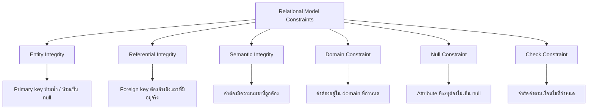

# Relational Model Constraints - Advanced

`Tags: SQL, constraints, data integrity, RDBMS`

| Field             | Value                                    |
| ----------------- | ----------------------------------------- |
| **Certificate**   | IBM Data Engineering Professional Certificate |
| **Course**        | C04 Introduction to Relational Databases (RDBMS) |
| **Module**        | M02 Using Relational Databases            |
| **Lesson**        | L02 Designing Keys, Indexes, and Constraints |
| **Date studied**  | 2026-08-08                                |

---

## Table of Contents

- [Overview](#overview)
- [Six Types of Relational Model Constraints](#six-types-of-relational-model-constraints)
- [Entity Integrity Constraint](#entity-integrity-constraint)
- [Referential Integrity Constraint](#referential-integrity-constraint)
- [Semantic Integrity Constraint](#semantic-integrity-constraint)
- [Domain Constraint](#domain-constraint)
- [Null Constraint](#null-constraint)
- [Check Constraint](#check-constraint)
- [📖 Key Terms & Glossary](#-key-terms--glossary)
- [❓ My Questions & Gaps](#-my-questions--gaps)
- [🔗 Resources](#-resources)

---

## Overview

บทเรียนนี้ต่อยอดจากเรื่อง primary key และ foreign key ([Primary Keys and Foreign Keys](V02_Primary-Keys-and-Foreign-Keys.md)) โดยแจกแจง constraint ทั้ง 6 ประเภทที่กำหนดไว้ใน relational database model ซึ่งใช้บังคับกฎและความถูกต้องของข้อมูล (data integrity) ในธุรกิจ ครอบคลุมทั้ง entity integrity, referential integrity, semantic integrity, domain constraint, null constraint และ check constraint พร้อมตัวอย่างจากตาราง author และ book

---

## Six Types of Relational Model Constraints



| Constraint | คำอธิบาย |
| ---------- | -------- |
| **Entity Integrity** | ค่า primary key ต้อง unique และห้ามเป็น null — ใช้ระบุแต่ละ tuple/row ในตาราง |
| **Referential Integrity** | บังคับความสัมพันธ์ระหว่างตาราง ผ่านการจับคู่ primary key และ foreign key |
| **Semantic Integrity** | บังคับความถูกต้องของ**ความหมาย**ของข้อมูล ไม่ใช่แค่รูปแบบ |
| **Domain Constraint** | ตรวจสอบว่าค่าที่ใส่อยู่ใน domain (ชุดค่าที่ยอมรับได้) ของ attribute นั้น ๆ |
| **Null Constraint** | บังคับว่า attribute ที่ระบุต้องไม่เป็นค่าว่าง (null) |
| **Check Constraint** | จำกัดค่าที่ attribute ยอมรับได้ตามเงื่อนไขที่กำหนด |

---

## Entity Integrity Constraint

ทุก relation ต้องมี primary key เพื่อระบุแต่ละ tuple แบบไม่ซ้ำกัน — นี่คือ entity integrity constraint (เรียกอีกชื่อว่า primary key constraint หรือ unique constraint) ป้องกันไม่ให้มีค่าซ้ำในตาราง โดยใช้ index เป็นกลไกช่วย implement และตามกฎนี้ **attribute ที่เป็นส่วนหนึ่งของ primary key ห้ามมีค่า null** เพราะ null หมายถึงค่าที่ไม่รู้จัก (unknown)

ตัวอย่าง: ในตาราง `author` ที่มี `author_id` เป็น primary key เช่น `A1` ชี้ไปยังผู้เขียน Raul Chong จาก Toronto — ถ้าแทนค่า `A1` ด้วย null ก็ยังพอระบุได้ว่าเป็น Raul Chong แต่ถ้ามีอีกแถวที่ `author_id` เป็น null ด้วย (เช่น A4) จะไม่สามารถบอกได้ว่า null แต่ละตัวคือ tuple ไหน

---

## Referential Integrity Constraint

ความสัมพันธ์ระหว่างตารางถูกกำหนดโดย referential integrity constraint ซึ่งบังคับความถูกต้องของข้อมูลผ่านการจับคู่ primary key และ foreign key ร่วมกัน (ดูรายละเอียดเพิ่มเติมใน [Primary Keys and Foreign Keys](V02_Primary-Keys-and-Foreign-Keys.md)) เช่น หนังสือทุกเล่มต้องมีอย่างน้อยหนึ่ง author เขียนอยู่เสมอ

---

## Semantic Integrity Constraint

ความถูกต้องของข้อมูลในตารางถูกบังคับด้วย semantic integrity constraint ซึ่งเกี่ยวข้องกับ**ความถูกต้องของความหมาย**ของข้อมูล ไม่ใช่แค่รูปแบบข้อมูลที่ถูกต้อง

ตัวอย่าง: ในตาราง `author` ถ้า column `city` มีค่าที่เป็น garbage value แทนที่จะเป็น "Toronto" ค่านั้นก็ไม่มีความหมายที่ถูกต้อง แม้ค่านั้นอาจจะเป็น string ที่ valid ตาม data type ก็ตาม

---

## Domain Constraint

**Domain constraint** ตรวจสอบว่าค่าที่ใส่ใน attribute นั้นถูกต้องตามชุดค่าที่ยอมรับได้ (valid domain) หรือไม่

ตัวอย่าง: ในตาราง `author` attribute `country` ต้องเป็นรหัสประเทศ 2 ตัวอักษร เช่น `CA` สำหรับแคนาดา หรือ `IN` สำหรับอินเดีย ถ้าใส่ค่า `34` (ตัวเลข) แทนที่จะเป็นรหัสประเทศ ค่านั้นจะไม่มีความหมายและละเมิด domain constraint

---

## Null Constraint

ตามที่กล่าวไว้ใน entity integrity constraint ว่า attribute ที่เป็นส่วนหนึ่งของ primary key ห้ามเป็น null แต่ **null constraint** เป็นกฎที่กว้างกว่านั้น คือบังคับว่า**ค่าของ attribute ที่ระบุต้องไม่เป็น null** ไม่จำกัดเฉพาะ primary key เท่านั้น

ตัวอย่าง: ในตาราง `author` ถ้า `last_name` หรือ `first_name` เป็น null จะระบุตัวตนของ author คนนั้นได้ยาก ดังนั้นทั้งสอง column นี้ต้องไม่เป็น null เพราะ author ต้องมีชื่อเสมอ

---

## Check Constraint

**Check constraint** บังคับ domain integrity โดยจำกัดค่าที่ attribute ยอมรับได้ตามเงื่อนไขที่กำหนด

ตัวอย่าง: ในตาราง `book` attribute `year` คือปีที่หนังสือถูกตีพิมพ์ การมีค่า `year` ที่มากกว่าปีปัจจุบันย่อมไม่สมเหตุสมผล check constraint จึงใช้จำกัดค่าที่ยอมรับได้ของ attribute `year` ไม่ให้เกินปีปัจจุบัน

```sql
-- Combine NOT NULL (null constraint) and CHECK constraint in one table
CREATE TABLE book (
    book_id CHAR(10) PRIMARY KEY NOT NULL,
    title VARCHAR(100) NOT NULL,
    year INT CHECK (year <= 2026)
);
```

---

## 📖 Key Terms & Glossary

| Term (ศัพท์) | คำอธิบาย (ภาษาไทย) |
| ------------- | -------------------- |
| Entity Integrity Constraint | กฎที่บังคับว่า primary key ต้อง unique และห้ามเป็น null |
| Referential Integrity Constraint | กฎที่บังคับความสัมพันธ์ระหว่างตารางผ่าน primary key และ foreign key |
| Semantic Integrity Constraint | กฎที่บังคับความถูกต้องของความหมายของข้อมูล ไม่ใช่แค่รูปแบบ |
| Domain Constraint | กฎที่ตรวจสอบว่าค่าของ attribute อยู่ใน domain (ชุดค่าที่ยอมรับได้) หรือไม่ |
| Null Constraint | กฎที่บังคับว่า attribute ที่ระบุต้องไม่เป็นค่า null |
| Check Constraint | กฎที่จำกัดค่าที่ attribute ยอมรับได้ตามเงื่อนไขที่กำหนด |
| Tuple | แถวหนึ่งแถวใน relation (ตาราง) |
| Attribute | คอลัมน์หนึ่งคอลัมน์ใน relation (ตาราง) |
| Relation | ชื่อเรียกเชิงทฤษฎีของ "ตาราง" ใน relational model |

---

## ❓ My Questions & Gaps

- [ ] semantic integrity constraint บังคับด้วยกลไกทางเทคนิคของ RDBMS ได้จริงหรือไม่ หรือในทางปฏิบัติต้องพึ่ง validation ที่ระดับ application/data governance เป็นหลัก เพราะฐานข้อมูลไม่รู้ "ความหมาย" ของค่าโดยตรง
- [ ] domain constraint กับ check constraint ดูมีขอบเขตที่ทับซ้อนกัน (ทั้งคู่จำกัดค่าที่ attribute ยอมรับได้) — ในทางปฏิบัติแยกกันใช้อย่างไร หรือ domain constraint มักถูก implement ด้วย check constraint นั่นเอง
- [ ] entity integrity, null constraint และ NOT NULL ใน SQL เกี่ยวข้องกันอย่างไร ทั้งสามดูเหมือนพูดถึงเรื่องเดียวกันจากมุมทฤษฎีกับมุม syntax จริง

---

## 🔗 Resources

- ไม่มีลิงก์หรือเอกสารอ้างอิงภายนอกที่กล่าวถึงในบทเรียนนี้
