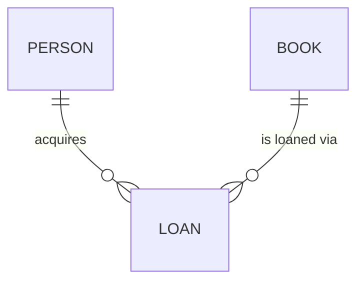

# Approach to Database Design (Including ERD)

`Tags: RDBMS, database-design, ERD, normalization, pgAdmin`

| Field            | Value                                            |
| ---------------- | ------------------------------------------------ |
| **Certificate**  | IBM Data Engineering Professional Certificate    |
| **Course**       | C04 Introduction to Relational Databases (RDBMS) |
| **Module**       | M04 Database Design                              |
| **Lesson**       | L01 Approach to Database Design (Including ERD)  |
| **Date studied** | 2026-08-09                                       |

---

## Table of Contents

- [Overview](#overview)
- [Why Good Database Design Matters](#why-good-database-design-matters)
- [The Three Phases of Database Design](#the-three-phases-of-database-design)
- [Requirements Analysis](#requirements-analysis)
- [Logical Design](#logical-design)
- [Resolving Many-to-Many Relationships](#resolving-many-to-many-relationships)
- [Normalization in Logical Design](#normalization-in-logical-design)
- [Physical Design](#physical-design)
- [📖 Key Terms & Glossary](#-key-terms--glossary)
- [❓ My Questions & Gaps](#-my-questions--gaps)
- [🔗 Resources](#-resources)

---

## Overview

วิดีโอนี้อธิบายภาพรวมของกระบวนการออกแบบฐานข้อมูล (database design process) ตั้งแต่เหตุผลว่าทำไมการออกแบบที่ดีถึงสำคัญ ไปจนถึงสามขั้นตอนหลัก ได้แก่ requirements analysis, logical design, และ physical design โดยใช้ตัวอย่างระบบยืมหนังสือในห้องสมุดประกอบการอธิบาย พร้อมแนะนำบทบาทของเครื่องมือ ERD (Entity Relationship Diagram) ในขั้นตอน physical design

---

## Why Good Database Design Matters

ฐานข้อมูลที่ออกแบบมาดีเป็นปัจจัยสำคัญต่อความสำเร็จของโปรเจกต์ที่ขับเคลื่อนด้วยข้อมูล การออกแบบที่ดีส่งผลต่อ:

- **Data integrity** — ความถูกต้องและสอดคล้องของข้อมูล
- **การลด redundant data** — ลดข้อมูลซ้ำซ้อน
- **Application performance** — ประสิทธิภาพของแอปพลิเคชัน
- **User satisfaction** — ความพึงพอใจของผู้ใช้

การลงทุนเวลาออกแบบฐานข้อมูลตั้งแต่ต้นช่วยหลีกเลี่ยงปัญหาที่มีค่าใช้จ่ายสูงในภายหลัง

---

## The Three Phases of Database Design

| Phase | สิ่งที่ทำ |
| --- | --- |
| **Requirements Analysis** | รวบรวมและวิเคราะห์ข้อมูลทางธุรกิจจริงร่วมกับ stakeholders ระบุ base object และความสัมพันธ์ |
| **Logical Design** | แปลงผลลัพธ์จาก requirements analysis ให้เป็น entities, attributes, และ relationships โดยยังไม่สนใจรายละเอียดทางเทคนิค |
| **Physical Design** | กำหนดหน้าตาจริงของฐานข้อมูล เช่น data type, naming rule, index, constraint ตาม database management system ที่เลือกใช้ |

---

## Requirements Analysis

ขั้นตอนนี้ทำงานร่วมกับ stakeholders อย่างใกล้ชิดเพื่อรวบรวมและวิเคราะห์ข้อมูลและ policy ทางธุรกิจในโลกจริง ต้องระบุ base object ในข้อมูลและความสัมพันธ์ระหว่าง object เหล่านั้น เช่น ในสถานการณ์ห้องสมุด "คนคนหนึ่งยืมหนังสือ" ต้องระบุข้อมูลที่เกี่ยวข้องกับหนังสือ (title, description, ISBN, authors) และข้อมูลของคน (name, address, contact details)

วิธีการเก็บข้อมูล (data acquisition methods) ที่ใช้ในขั้นตอนนี้ ได้แก่:

- ทบทวนแหล่งข้อมูลที่มีอยู่ ไม่ว่าจะเป็น electronic format หรือระบบกระดาษ — เมื่อทบทวนฐานข้อมูลปัจจุบัน ให้ใช้เป็น**แหล่งข้อมูล**ไม่ใช่ template ตั้งต้น
- สัมภาษณ์ผู้ใช้เพื่อดูวิธีใช้ข้อมูลในปัจจุบัน
- สัมภาษณ์ผู้ใช้ปัจจุบันและผู้ใช้ในอนาคตเพื่อหา insight สำหรับการปรับปรุง

ผลลัพธ์ของขั้นตอนนี้อาจเป็น report, data diagram, หรือ presentation เพื่อให้ stakeholder ตรวจสอบความถูกต้อง

---

## Logical Design

Logical design แปลงผลลัพธ์จาก requirements analysis ให้กลายเป็น entities, attributes และ relationships โดยยังไม่ลงรายละเอียดการ implement ทางเทคนิค object ที่ระบุไว้ก่อนหน้า เช่น book และ person จะกลายเป็น entity ที่แทน คน เหตุการณ์ สถานที่ หรือสิ่งของ

ประเด็นสำคัญในขั้นตอนนี้:

- ต้องตรวจสอบว่า object นั้นเป็น entity จริง ๆ ไม่ใช่แค่ characteristic ของ entity อื่น — characteristic ของ object จะกลายเป็น **attribute**
- เช่น ชื่อคนควรแยกเป็น attribute first name และ last name แยกกัน แทนที่จะเป็น attribute เดียว
- ที่อยู่ควรแตกเป็นส่วนย่อย เช่น street name, city, state, zip code เพื่อเพิ่มประสิทธิภาพการจัดเก็บข้อมูล

การวางแผนแบบนี้สร้าง conceptual blueprint ที่เป็นรากฐานให้กับการตัดสินใจในขั้นตอน physical design ต่อไป

---

## Resolving Many-to-Many Relationships

จากตัวอย่างห้องสมุด คนหนึ่งคนอาจยืมหนังสือได้หลายเล่ม และหนังสือหนึ่งเล่มอาจถูกยืมโดยหลายคน ความสัมพันธ์แบบนี้คือ **many-to-many relationship** ซึ่งอาจก่อให้เกิดความกำกวมในฐานข้อมูล

วิธีแก้ที่ง่ายที่สุดคือสร้าง **associative entity** เพื่อแยกเป็นสอง one-to-many relationship:

ในตัวอย่างนี้เพิ่ม entity ชื่อ **Loan** เข้ามา — คนหนึ่งคนสามารถมีได้หลาย loan และหนังสือหนึ่งเล่มก็สามารถเกิด loan ได้หลายครั้ง entity Loan จะมี attribute จาก book และ person รวมถึง attribute เฉพาะของ loan เอง

เนื่องจาก entity ที่ไม่มี attribute ที่ unique ทำให้การสร้างความสัมพันธ์เป็นเรื่องท้าทาย จึงมีแนวทางแก้ไข:

- ใช้ **ISBN** ที่ unique อยู่แล้วใน book entity เป็น primary key เพื่อให้ระบุตัวตนใน loan entity ได้ง่าย
- เพิ่ม attribute สำหรับระบุตัวตน (identifier) ให้กับ person entity ที่ไม่มี attribute unique อยู่แล้ว
- สร้าง **loan ID** ที่ unique ขึ้นใน loan entity เพื่อระบุตัวตนของแต่ละ loan

---

## Normalization in Logical Design

หลังจากระบุ entity และ attribute แล้ว ขั้นตอนถัดไปคือพิจารณา **normalization** ซึ่งเป็นส่วนหนึ่งของกระบวนการออกแบบฐานข้อมูลที่มีเป้าหมายเพื่อลด data redundancy

| ประเภทระบบ | แนวทาง normalization |
| --- | --- |
| **OLTP** (Online Transaction Processing) | มุ่งสู่ third normal form (3NF) เพื่อความมีประสิทธิภาพของธุรกรรม |
| **OLAP** (Online Analytical Processing) | เน้น denormalization เพื่อเพิ่มประสิทธิภาพการอ่านข้อมูล |

ตัวอย่างการ normalize ในสถานการณ์นี้:

- **First normal form** — ห้ามมีชื่อผู้เขียนหลายคนอยู่ใน attribute เดียวกัน
- **Second normal form** — ควรสร้าง author entity แยกต่างหาก แทนที่จะแยก attribute เป็น author1, author2 (ซึ่งละเมิด 2NF) แล้วสร้างความสัมพันธ์แบบ many-to-one ระหว่าง author entity กับ book entity

---

## Physical Design

เมื่อ normalize entity เสร็จแล้ว จึงเข้าสู่ physical design stage ซึ่งกำหนดว่าฐานข้อมูลจะมีหน้าตาอย่างไรจริง ๆ ต้องพิจารณาผลกระทบจาก database management system ที่เลือกใช้ เช่น data type ที่รองรับ, naming rule, index, และ constraint การกำหนด naming convention ที่ชัดเจนก็สำคัญ เพื่อให้ทุกคนที่ทำงานกับข้อมูลเข้าใจ schema ตรงกัน

ใน physical design entity จาก logical design (เช่น person entity) จะกลายเป็น **table** จริง แต่ละ attribute กลายเป็น column ที่มี data type และมีการกำหนด key

เครื่องมือ **ERD designer** มีประโยชน์อย่างมากในขั้นตอนนี้ — pgAdmin มีเครื่องมือ ERD ในตัว ที่ช่วยออกแบบ ERD แล้ว generate SQL script สำหรับสร้างฐานข้อมูลและ object ตามที่ออกแบบไว้ได้โดยตรง

---

## 📖 Key Terms & Glossary

| Term | Definition |
| --- | --- |
| Entity | สิ่งที่แทนคน เหตุการณ์ สถานที่ หรือสิ่งของในฐานข้อมูล แปลงมาจาก object ที่ระบุในขั้น requirements analysis |
| Attribute | คุณลักษณะของ entity ที่แปลงมาจาก characteristic ของ object |
| Associative entity | Entity ที่สร้างขึ้นมาเพื่อแก้ปัญหา many-to-many relationship โดยแยกเป็นสอง one-to-many relationship |
| Primary key | Attribute ที่ unique ใช้ระบุตัวตนของแต่ละ record ใน entity/table |
| OLTP | Online Transaction Processing ระบบที่เน้นประมวลผลธุรกรรม เหมาะกับ normalized schema (3NF) |
| OLAP | Online Analytical Processing ระบบที่เน้นการวิเคราะห์ข้อมูล เหมาะกับ denormalized schema |
| Normal form (1NF, 2NF, 3NF) | ระดับของ normalization ที่ใช้ลด data redundancy และรักษาความสอดคล้องของข้อมูล |
| ERD (Entity Relationship Diagram) | แผนภาพแสดง entity และความสัมพันธ์ระหว่าง entity ในฐานข้อมูล |
| ERD designer | เครื่องมือสำหรับสร้าง ERD เช่น ERD tool ใน pgAdmin ที่ generate SQL script ได้ |

---

## ❓ My Questions & Gaps

- [x] **ควร normalize ไปถึงระดับไหนก่อน denormalize?**
  - ยึด 3NF เป็นมาตรฐานขั้นต่ำสำหรับ OLTP
  - BCNF พิจารณาเฉพาะเมื่อมี candidate key ซ้อนกันจน 3NF ยังเหลือ anomaly
  - Denormalize เฉพาะจุดที่วัด performance จริงแล้วว่าจำเป็น ไม่เดาล่วงหน้า
- [x] **ERD tool ของ pgAdmin ต่างจาก dbdiagram.io/Lucidchart อย่างไร?**
  - pgAdmin: round-trip กับฐานข้อมูลจริง — reverse-engineer ERD จาก schema ที่มีอยู่ และ generate SQL กลับเข้าฐานข้อมูลได้ในเครื่องมือเดียว
  - dbdiagram.io/Lucidchart: standalone design-first เน้นวาด diagram/documentation แล้ว export SQL แยกต่างหาก ไม่เชื่อมฐานข้อมูลจริง
- [x] **เมื่อไหร่ใช้ surrogate key แทน natural key?**
  - ใช้ surrogate key เมื่อ natural key เปลี่ยนแปลงได้, เป็น composite ที่ซับซ้อน, หรือไม่มั่นใจว่า unique จริง
  - ใช้ natural key (เช่น ISBN) เมื่อค่านั้น unique/immutable แน่นอนตาม domain
  - หลายทีมเลือก surrogate key เป็นมาตรฐานเสมอ แล้วเก็บ natural key เป็น unique constraint แยก

---

## 🔗 Resources

- [pgAdmin Documentation — ERD Tool](https://www.pgadmin.org/docs/)
