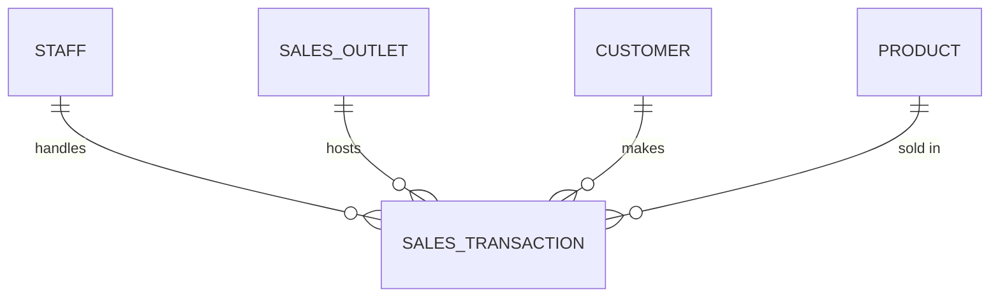
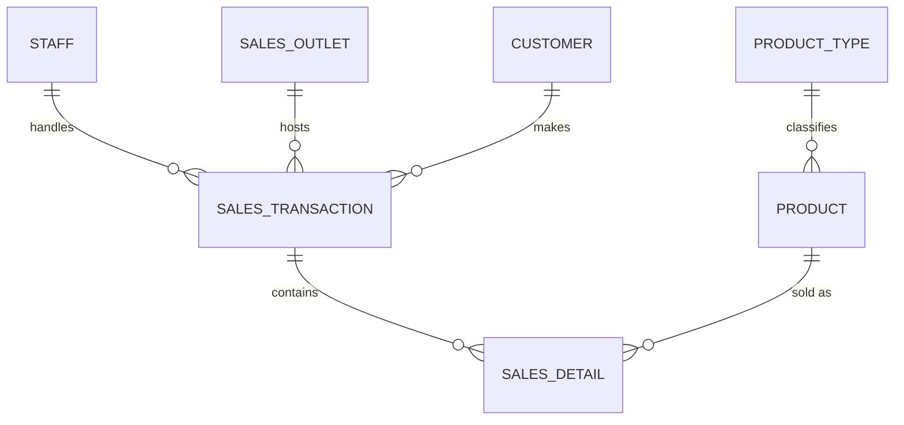

# Coffee Shop Database — Entities and Attributes

`Tags: RDBMS, ERD, database design, final project, normalization`

| Field            | Value                                            |
| ---------------- | ------------------------------------------------ |
| **Certificate**  | IBM Data Engineering Professional Certificate    |
| **Course**       | C04 Introduction to Relational Databases (RDBMS) |
| **Module**       | M05 Final Project                                |
| **Lesson**       | Final Project                                    |
| **Date studied** | 2026-08-09                                       |

---

## Table of Contents

- [Overview](#overview)
- [Entities](#entities)
- [Entities and Attributes](#entities-and-attributes)
- [Entity Relationships](#entity-relationships)
- [Key Terms & Glossary](#key-terms--glossary)
- [My Questions & Gaps](#my-questions--gaps)
- [Resources](#resources)
- [Final Project Submission Draft](#final-project-submission-draft)

---

## Overview

This note documents the entities and attributes identified for the Final Project scenario: a New York-based coffee shop chain expanding nationally and consolidating its data (accounting software, supplier databases, POS systems, and spreadsheets) into a single relational database. Based on the generated SQL script (`GeneratedScript.sql`), seven entities were identified, already normalized to remove repeating groups and redundant data (2NF): `staff`, `sales_outlet`, `customer`, `sales_transaction`, `sales_detail`, `product`, and `product_type`. `sales_detail` and `product_type` exist specifically to split out data that would otherwise repeat within `sales_transaction` and `product`.

---

## Entities

**Before Normalization** (5 entities)

- Staff
- Sales Outlet
- Customer
- Sales Transaction
- Product

**After Normalization** (7 entities)

- Staff
- Sales Outlet
- Customer
- Sales Transaction
- Sales Detail
- Product
- Product Type

---

## Entities and Attributes

### staff

Employees working at each sales outlet.

| Attribute  | Data Type   | Key / Notes                       |
| ---------- | ----------- | --------------------------------- |
| staff_id   | integer     | Primary Key                       |
| first_name | varchar(50) |                                   |
| last_name  | varchar(50) |                                   |
| position   | varchar(50) | quoted identifier (reserved word) |
| start_date | date        |                                   |
| location   | varchar(5)  | references a sales outlet         |

### sales_outlet

Physical store locations where sales occur.

| Attribute         | Data Type   | Key / Notes                               |
| ----------------- | ----------- | ----------------------------------------- |
| sales_outlet_id   | integer     | Primary Key                               |
| sales_outlet_type | varchar(20) |                                           |
| address           | varchar(50) |                                           |
| city              | varchar(40) |                                           |
| telephone         | varchar(15) |                                           |
| postal_code       | integer     |                                           |
| manager           | integer     | intended FK to staff, not enforced in DDL |

### customer

Customers registered with the coffee shop's loyalty/CRM system.

| Attribute     | Data Type   | Key / Notes |
| ------------- | ----------- | ----------- |
| customer_id   | integer     | Primary Key |
| customer_name | varchar(50) |             |
| email         | varchar(50) |             |
| reg_date      | date        |             |
| card_number   | varchar(15) |             |
| date_of_birth | date        |             |
| gender        | char(1)     |             |

### Before Normalization

The initial ERD held `sales_transaction` and `product` as single tables, each with repeating or redundant data.

#### sales_transaction (unnormalized)

One row per product purchased, so `transaction_id` repeats whenever a transaction includes more than one product.

| Attribute        | Data Type              | Key / Notes                   |
| ---------------- | ---------------------- | ----------------------------- |
| transaction_id   | integer                | not unique — repeats per line |
| transaction_date | date                   |                               |
| transaction_time | time without time zone |                               |
| sales_outlet_id  | integer                | Foreign Key → sales_outlet    |
| staff_id         | integer                | Foreign Key → staff           |
| customer_id      | integer                | Foreign Key → customer        |
| product_id       | integer                | Foreign Key → product         |
| quantity         | integer                | repeating group               |
| price            | double precision       | repeating group               |

#### product (unnormalized)

Category and type text is repeated on every product row that shares the same type.

| Attribute        | Data Type        | Key / Notes        |
| ---------------- | ---------------- | ------------------ |
| product_id       | integer          | Primary Key        |
| product_name     | varchar(100)     |                    |
| description      | varchar(250)     |                    |
| product_price    | double precision |                    |
| product_type     | varchar(50)      | redundant, repeats |
| product_category | varchar(50)      | redundant, repeats |

---

### After Normalization

#### sales_transaction

A single POS transaction — one row per transaction (header-level data). `product_id`, `quantity`, and `price` moved to the new `sales_detail` table.

| Attribute        | Data Type              | Key / Notes                |
| ---------------- | ---------------------- | -------------------------- |
| transaction_id   | integer                | Primary Key                |
| transaction_date | date                   |                            |
| transaction_time | time without time zone |                            |
| sales_outlet_id  | integer                | Foreign Key → sales_outlet |
| staff_id         | integer                | Foreign Key → staff        |
| customer_id      | integer                | Foreign Key → customer     |

#### sales_detail

Line items within a transaction — split out from `sales_transaction` to reach 2NF, since one transaction can include multiple products.

| Attribute       | Data Type        | Key / Notes                     |
| --------------- | ---------------- | ------------------------------- |
| sales_detail_id | integer          | Primary Key                     |
| transaction_id  | integer          | Foreign Key → sales_transaction |
| product_id      | integer          | Foreign Key → product           |
| quantity        | integer          |                                 |
| price           | double precision |                                 |

#### product

Products sold across all outlets. `product_type` and `product_category` moved to the new `product_type` table.

| Attribute       | Data Type        | Key / Notes                |
| --------------- | ---------------- | -------------------------- |
| product_id      | integer          | Primary Key                |
| product_name    | varchar(100)     |                            |
| description     | varchar(250)     |                            |
| product_price   | double precision |                            |
| product_type_id | integer          | Foreign Key → product_type |

#### product_type

Product classification — split out from `product` to remove redundant category/type data.

| Attribute        | Data Type   | Key / Notes |
| ---------------- | ----------- | ----------- |
| product_type_id  | integer     | Primary Key |
| product_type     | varchar(50) |             |
| product_category | varchar(50) |             |

---

## Entity Relationships

### Before Normalization

`sales_transaction` holds the product line directly, so it relates straight to `product` — no `sales_detail` or `product_type` yet.



### After Normalization

`sales_detail` sits between `sales_transaction` and `product` to allow multiple products per transaction; `product_type` sits above `product` to remove redundant category data.



---

## Key Terms & Glossary

| Term                              | Definition                                                                                                  |
| --------------------------------- | ----------------------------------------------------------------------------------------------------------- |
| Entity                            | A distinct object or concept the database tracks (e.g. a customer, a product)                               |
| Attribute                         | A property or column describing an entity (e.g. `customer_name`, `price`)                                   |
| Primary Key (PK)                  | A column (or set of columns) that uniquely identifies each row in a table                                   |
| Foreign Key (FK)                  | A column referencing the primary key of another table, establishing a relationship                          |
| Second Normal Form (2NF)          | A normalization rule requiring that repeating groups and partial dependencies be moved into separate tables |
| ERD (Entity Relationship Diagram) | A visual diagram of entities, their attributes, and their relationships                                     |

---

## My Questions & Gaps

- [ ] `sales_outlet.manager` is typed as `integer` and clearly meant to reference `staff.staff_id`, but no `FOREIGN KEY` constraint is defined in the DDL — was this intentional, or an oversight in the generated script?
- [ ] `staff.location` is `varchar(5)` while `sales_outlet_id` is `integer` — worth checking whether `location` is meant to store the outlet ID (type mismatch) or a separate location code.

---

## Resources

- [`lab-instructions.md`](lab-instructions.md) — Final Project task instructions (same folder)

---

## Final Project Submission Draft

Draft answer for the graded rich-text submission (entities, 3NF schema, relationships, SQL). Table/column names here follow the assignment's required field names (`location` instead of `sales_outlet`, `transaction_timestamp`, `payment_method`, `total_amount`, `unit_price`), which differ slightly from the ERD-generated names used earlier in this note.

### Section 1 — Entities & Business Rules

**Entities modeled (7):**

| # | Entity              | Covers requirement                  |
| - | -------------------- | -------------------------------------- |
| 1 | `sales_transaction`     | Sales receipt / header                  |
| 2 | `sales_detail`          | Line items on a receipt                 |
| 3 | `product`               | Product catalog                         |
| 4 | `product_type`          | Product category/type                   |
| 5 | `staff`                 | Employees                               |
| 6 | `location`              | Store locations                         |
| 7 | `customer` *(optional)* | Loyalty/CRM — supports repeat-customer reporting |

**Business rules enforced:**

1. Each `sales_transaction` has one or more `sales_detail` line items (a receipt is never empty).
2. Each `sales_detail` line item references exactly one `product`.
3. Each `product` belongs to exactly one `product_type` (category/type).
4. Each `sales_transaction` is handled by exactly one `staff` member, at exactly one `location`.
5. Each `staff` member is assigned to exactly one `location`.

### Section 2 — Normalized Logical Schema (3NF target)

**location**

| Column        | Type          | Constraint  |
| -------------- | -------------- | ------------- |
| location_id      | INT             | PK              |
| location_name    | VARCHAR(100)    | NOT NULL        |
| address           | VARCHAR(200)    | NOT NULL        |
| city               | VARCHAR(50)     |                  |
| state              | VARCHAR(20)     |                  |

**staff**

| Column       | Type         | Constraint                      |
| ------------- | ------------- | ---------------------------------- |
| staff_id        | INT            | PK                                   |
| staff_name      | VARCHAR(100)   | NOT NULL                             |
| location_id     | INT            | FK → location.location_id, NOT NULL  |

**product_type**

| Column        | Type         | Constraint |
| -------------- | ------------- | ------------ |
| product_type_id  | INT            | PK             |
| category          | VARCHAR(50)    | NOT NULL       |
| type              | VARCHAR(50)    | NOT NULL       |

**product**

| Column          | Type           | Constraint                                |
| ---------------- | --------------- | -------------------------------------------- |
| product_id          | INT              | PK                                              |
| product              | VARCHAR(100)     | NOT NULL                                        |
| description          | VARCHAR(250)     |                                                  |
| price                | DECIMAL(10,2)    | NOT NULL, CHECK (price >= 0)                     |
| product_type_id      | INT              | FK → product_type.product_type_id, NOT NULL      |

**sales_transaction**

| Column              | Type           | Constraint                                                |
| --------------------- | --------------- | -------------------------------------------------------------- |
| transaction_id            | INT              | PK                                                                |
| transaction_timestamp     | TIMESTAMP        | NOT NULL                                                          |
| staff_id                  | INT              | FK → staff.staff_id, NOT NULL                                     |
| location_id               | INT              | FK → location.location_id, NOT NULL                               |
| payment_method             | VARCHAR(20)      | NOT NULL, CHECK (payment_method IN ('cash','card','mobile'))       |
| total_amount               | DECIMAL(10,2)    | NOT NULL, CHECK (total_amount >= 0)                                |

**sales_detail**

| Column           | Type           | Constraint                                             |
| ------------------ | --------------- | ----------------------------------------------------------- |
| sales_detail_id        | INT              | PK                                                             |
| transaction_id          | INT              | FK → sales_transaction.transaction_id, NOT NULL                |
| product_id              | INT              | FK → product.product_id, NOT NULL                              |
| line_number             | INT              | NOT NULL                                                        |
| quantity                | INT              | NOT NULL, CHECK (quantity > 0)                                  |
| unit_price               | DECIMAL(10,2)    | NOT NULL, CHECK (unit_price >= 0)                                |
| UNIQUE (transaction_id, line_number) | | prevents duplicate line numbers on the same receipt |

### Section 3 — Relationship Definitions

- **`sales_detail` ↔ `sales_transaction`** — many-to-one. Each transaction can have many line items; each line item belongs to exactly one transaction. FK `sales_detail.transaction_id → sales_transaction.transaction_id`, `NOT NULL`.
- **`sales_detail` ↔ `product`** — many-to-one. Each product can appear on many line items across many transactions; each line item references exactly one product. FK `sales_detail.product_id → product.product_id`, `NOT NULL`.
- **`product` ↔ `product_type`** — many-to-one. Each type/category groups many products; each product has exactly one type. FK `product.product_type_id → product_type.product_type_id`, `NOT NULL`.
- **Staff-to-location report path** — `staff` has a direct many-to-one FK to `location` (`staff.location_id → location.location_id`), so each staff member is tied to one location. This FK is what a staff-locations report joins on: `staff JOIN location ON staff.location_id = location.location_id`.

### Section 4 — SQL Implementation + Reporting Objects

```sql
CREATE TABLE location (
    location_id     INT PRIMARY KEY,
    location_name   VARCHAR(100) NOT NULL,
    address         VARCHAR(200) NOT NULL,
    city            VARCHAR(50),
    state           VARCHAR(20)
);

CREATE TABLE staff (
    staff_id        INT PRIMARY KEY,
    staff_name      VARCHAR(100) NOT NULL,
    location_id     INT NOT NULL,
    FOREIGN KEY (location_id) REFERENCES location(location_id)
);

CREATE TABLE product_type (
    product_type_id INT PRIMARY KEY,
    category        VARCHAR(50) NOT NULL,
    type            VARCHAR(50) NOT NULL
);

CREATE TABLE product (
    product_id       INT PRIMARY KEY,
    product          VARCHAR(100) NOT NULL,
    description      VARCHAR(250),
    price            DECIMAL(10,2) NOT NULL CHECK (price >= 0),
    product_type_id  INT NOT NULL,
    FOREIGN KEY (product_type_id) REFERENCES product_type(product_type_id)
);

CREATE TABLE sales_transaction (
    transaction_id        INT PRIMARY KEY,
    transaction_timestamp TIMESTAMP NOT NULL,
    staff_id              INT NOT NULL,
    location_id           INT NOT NULL,
    payment_method        VARCHAR(20) NOT NULL
        CHECK (payment_method IN ('cash', 'card', 'mobile')),
    total_amount          DECIMAL(10,2) NOT NULL CHECK (total_amount >= 0),
    FOREIGN KEY (staff_id) REFERENCES staff(staff_id),
    FOREIGN KEY (location_id) REFERENCES location(location_id)
);

CREATE TABLE sales_detail (
    sales_detail_id  INT PRIMARY KEY,
    transaction_id   INT NOT NULL,
    product_id       INT NOT NULL,
    line_number      INT NOT NULL,
    quantity         INT NOT NULL CHECK (quantity > 0),
    unit_price       DECIMAL(10,2) NOT NULL CHECK (unit_price >= 0),
    FOREIGN KEY (transaction_id) REFERENCES sales_transaction(transaction_id),
    FOREIGN KEY (product_id) REFERENCES product(product_id),
    UNIQUE (transaction_id, line_number)
);

-- Staff + their location, for the payroll/HR report
CREATE VIEW staff_locations_view AS
SELECT
    s.staff_id,
    s.staff_name,
    l.location_name,
    l.address
FROM staff s
JOIN location l ON s.location_id = l.location_id;

-- Product catalog with category/type and price, refreshed on demand
CREATE MATERIALIZED VIEW product_info_mview AS
SELECT
    p.product_id,
    p.product,
    pt.category,
    pt.type,
    p.price
FROM product p
JOIN product_type pt ON p.product_type_id = pt.product_type_id;
```

**Design notes:**

- **Normalization choice:** `product_type` (category/type) was split out of `product` into its own table rather than storing category/type text on every product row. This removes the repeating-data problem — updating a category name touches one row instead of every product row that shares it — and satisfies 3NF by removing a transitive dependency (category/type describes the type, not the individual product).
- **Integrity constraint:** `sales_detail` has `UNIQUE (transaction_id, line_number)`, so the same receipt can't have two line items claiming the same line number. This protects the line-item ordering that a receipt/report depends on, since without it a bad insert could silently duplicate or skip a line.
