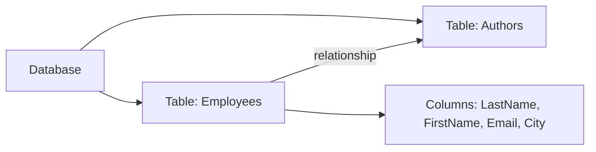

# Introduction to Databases

`Tags: SQL, database, RDBMS`

| Field             | Value                                    |
| ----------------- | ----------------------------------------- |
| **Certificate**   | IBM Data Engineering Professional Certificate |
| **Course**        | C05 Databases and SQL for Data Science with Python |
| **Module**        | M01 Getting Started with SQL              |
| **Lesson**        | L01 Introduction to Databases             |
| **Date studied**  | 2026-08-10                                |

---

## Table of Contents

- [Overview](#overview)
- [What is SQL](#what-is-sql)
- [Data and Databases](#data-and-databases)
- [Relational Databases and Tables](#relational-databases-and-tables)
- [DBMS and RDBMS](#dbms-and-rdbms)
- [Basic SQL Commands](#basic-sql-commands)
- [Key Terms & Glossary](#-key-terms--glossary)
- [My Questions & Gaps](#-my-questions--gaps)
- [Resources](#-resources)

---

## Overview

วิดีโอนี้เป็นการปูพื้นฐานก่อนเริ่มเรียน SQL โดยอธิบายว่า SQL คืออะไร ทำไมข้อมูล (data) ถึงสำคัญ และ database ทำหน้าที่อะไรในการจัดเก็บข้อมูลเหล่านั้น จากนั้นเชื่อมโยงไปสู่แนวคิดของ relational database ที่จัดเก็บข้อมูลเป็นตาราง และปิดท้ายด้วยภาพรวมของ RDBMS พร้อมคำสั่ง SQL พื้นฐาน 5 คำสั่งที่ใช้กันมากที่สุด

---

## What is SQL

SQL (Structured Query Language) เป็นภาษาที่ใช้กับ relational database เพื่อ query หรือดึงข้อมูลออกมาจาก database

---

## Data and Databases

Data คือชุดของข้อเท็จจริง (facts) ที่อยู่ในรูปคำ ตัวเลข หรือแม้แต่รูปภาพ ถือเป็นสินทรัพย์ที่สำคัญที่สุดอย่างหนึ่งขององค์กร ถูกเก็บรวบรวมอยู่แทบทุกที่ เช่น ธนาคารเก็บชื่อ ที่อยู่ เบอร์โทร และเลขบัญชีของเรา หรือบริษัทบัตรเครดิตและ PayPal ก็เก็บข้อมูลของเราเช่นกัน เพราะข้อมูลสำคัญ จึงต้องถูกเก็บอย่างปลอดภัยและสามารถเข้าถึงได้อย่างรวดเร็ว — คำตอบคือ database

Database คือ repository ของข้อมูล เป็นโปรแกรมที่ทำหน้าที่จัดเก็บข้อมูล พร้อมทั้งมีฟังก์ชันสำหรับเพิ่ม (add) แก้ไข (modify) และ query ข้อมูลนั้น database มีหลายประเภทตามความต้องการที่แตกต่างกัน และข้อมูลสามารถถูกจัดเก็บได้หลายรูปแบบ

---

## Relational Databases and Tables

เมื่อข้อมูลถูกเก็บในรูปแบบตาราง (tabular form) คือจัดเรียงเป็น columns และ rows เหมือนสเปรดชีต นั่นคือลักษณะของ relational database คอลัมน์แต่ละคอลัมน์เก็บคุณสมบัติ (properties) ของรายการนั้น เช่น LastName, FirstName, e-mail address, city ส่วนตาราง (table) คือกลุ่มของสิ่งที่เกี่ยวข้องกัน เช่น รายชื่อพนักงาน หรือรายชื่อผู้เขียนหนังสือ ใน relational database เราสามารถสร้างความสัมพันธ์ (relationships) ระหว่างตารางต่างๆ ได้

---

## DBMS and RDBMS

ชุดของ software tools ที่ใช้จัดการข้อมูลใน database เรียกว่า database management system หรือ DBMS โดยคำว่า database, database server, database system, data server และ database management system มักถูกใช้แทนกันได้ สำหรับ relational database จะเรียกชุดเครื่องมือนี้ว่า relational database management system หรือ RDBMS ซึ่งทำหน้าที่ควบคุมข้อมูล ทั้งเรื่อง access, organization และ storage RDBMS เป็นแกนหลัก (backbone) ของแอปพลิเคชันในหลายอุตสาหกรรม เช่น banking, transportation, health ตัวอย่าง RDBMS ที่ใช้กันทั่วไป ได้แก่ MySQL, Oracle database, DB2 Warehouse และ DB2 on Cloud

---

## Basic SQL Commands

สำหรับผู้ใช้งาน database ส่วนใหญ่ มีคำสั่งพื้นฐาน 5 คำสั่งที่ใช้บ่อยที่สุด:

| คำสั่ง | หน้าที่ |
| ------ | ------- |
| Create | สร้างตาราง |
| Insert | เพิ่มข้อมูลเข้าตาราง |
| Select | ดึงข้อมูลจากตาราง |
| Update | แก้ไขข้อมูลในตาราง |
| Delete | ลบข้อมูลออกจากตาราง |

---

## 📖 Key Terms & Glossary

| Term (ศัพท์) | คำอธิบาย (ภาษาไทย) |
| ------------- | -------------------- |
| SQL | ภาษาที่ใช้ query ข้อมูลจาก relational database ย่อมาจาก Structured Query Language |
| Data | ชุดข้อเท็จจริงในรูปคำ ตัวเลข หรือรูปภาพ |
| Database | repository ที่เก็บข้อมูล พร้อมฟังก์ชันเพิ่ม/แก้ไข/query ข้อมูล |
| Relational database | database ที่เก็บข้อมูลในรูปตาราง (columns และ rows) และสามารถสร้างความสัมพันธ์ระหว่างตารางได้ |
| Table | กลุ่มของสิ่งที่เกี่ยวข้องกัน จัดเก็บเป็น columns และ rows |
| DBMS | ชุด software tools สำหรับจัดการข้อมูลใน database (Database Management System) |
| RDBMS | DBMS สำหรับ relational database ควบคุม access, organization และ storage ของข้อมูล (Relational Database Management System) |

---

## ❓ My Questions & Gaps

- [ ] RDBMS แต่ละเจ้า (MySQL, Oracle, DB2) ต่างกันอย่างไรในทางปฏิบัติ เหมาะกับงานแบบไหน
- [ ] ความสัมพันธ์ (relationship) ระหว่างตารางสร้างขึ้นด้วยกลไกอะไร (เช่น primary/foreign key) — วิดีโอยังไม่ได้ลงรายละเอียด

---

## 🔗 Resources

- ไม่มีลิงก์หรือเอกสารอ้างอิงที่กล่าวถึงในวิดีโอนี้
