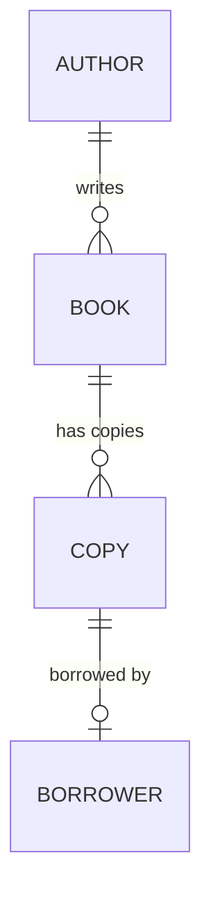
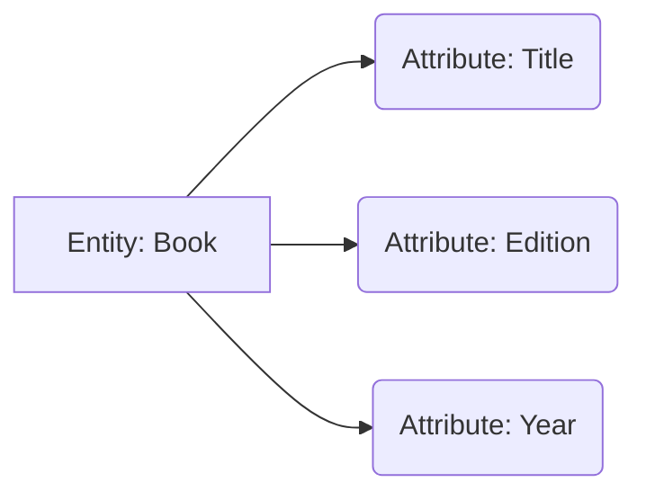

# Relational Database Concepts

`Tags: RDBMS, ER-model, database-design, primary-key`

| Field             | Value                                    |
| ----------------- | ----------------------------------------- |
| **Certificate**   | IBM Data Engineering Professional Certificate |
| **Course**        | C05 Databases and SQL with Python         |
| **Module**        | M02 Intro to RDBMS and Tables             |
| **Lesson**        | L01 Relational Database Concepts          |
| **Date studied**  | 2026-08-10                                |

---

## Table of Contents

- [Overview](#overview)
- [The Relational Model](#the-relational-model)
- [Entity Relationship (ER) Model](#entity-relationship-er-model)
- [Entities and Attributes](#entities-and-attributes)
- [Mapping Entities to Tables](#mapping-entities-to-tables)
- [Common Data Types](#common-data-types)
- [Primary Keys and Foreign Keys](#primary-keys-and-foreign-keys)
- [Key Terms & Glossary](#-key-terms--glossary)
- [My Questions & Gaps](#-my-questions--gaps)
- [Resources](#-resources)

---

## Overview

วิดีโอนี้เป็นการปูพื้นฐานเรื่อง relational model ซึ่งเป็น data model ที่ใช้กันมากที่สุดสำหรับฐานข้อมูล เพราะให้ data independence ทั้งในระดับ logical, physical และ storage เนื้อหาจะพาไปดูว่า ER model ใช้เป็นเครื่องมือออกแบบฐานข้อมูลเชิงสัมพันธ์อย่างไร ผ่านตัวอย่างระบบห้องสมุดจำลอง ตั้งแต่การแทน entity ด้วย attribute ไปจนถึงการแปลง entity ให้กลายเป็น table จริงที่มี column และ data type พร้อมทั้งบทบาทของ primary key และ foreign key ในการเชื่อมโยงตารางเข้าด้วยกัน

---

## The Relational Model

Relational model เป็น data model ที่ใช้มากที่สุดสำหรับฐานข้อมูล เพราะข้อมูลถูกเก็บในโครงสร้างที่เรียบง่ายคือ table ซึ่งข้อดีหลักคือ data independence 3 ระดับ:

| ระดับ Data Independence | ความหมาย |
| --- | --- |
| Logical data independence | เปลี่ยนโครงสร้าง logical ของข้อมูลได้โดยไม่กระทบ application ที่ใช้งานอยู่ |
| Physical data independence | เปลี่ยนวิธีจัดเก็บข้อมูลจริงได้โดยไม่กระทบ logical schema |
| Physical storage independence | เปลี่ยนอุปกรณ์หรือตำแหน่งจัดเก็บข้อมูลได้โดยไม่กระทบการเข้าถึงข้อมูล |

---

## Entity Relationship (ER) Model

ER model (หรือ ER data model) เป็นทางเลือกอีกแบบของ relational data model โดยเสนอแนวคิดให้มองฐานข้อมูลเป็นกลุ่มของ entity แทนที่จะมองเป็น table ตรง ๆ ในทางปฏิบัติ ER model ไม่ได้ถูกใช้เป็น model เดี่ยว ๆ แต่ใช้เป็นเครื่องมือ (tool) สำหรับออกแบบ relational database ก่อนที่จะแปลงไปเป็นตารางจริง

ตัวอย่างระบบห้องสมุดจำลอง (library database) แสดงความสัมพันธ์ระหว่าง entity ดังนี้:

ความสัมพันธ์ในตัวอย่าง:
- หนังสือ 1 เล่ม (book) เขียนโดยผู้เขียนได้ตั้งแต่ 1 คนขึ้นไป (one or many authors)
- ห้องสมุดมีสำเนา (copy) ของหนังสือได้ตั้งแต่ 1 ชุดขึ้นไป
- สำเนาแต่ละชุดถูกยืมโดยผู้ยืม (borrower) ได้ครั้งละ 1 คนเท่านั้น

---

## Entities and Attributes

ส่วนประกอบพื้นฐานของ ER diagram คือ entity และ attribute:
- **Entity** คือ noun (คน สถานที่ หรือสิ่งของ) ที่ดำรงอยู่โดยอิสระจาก entity อื่นในฐานข้อมูล ใน ER diagram วาดแทนด้วยสี่เหลี่ยมผืนผ้า
- **Attribute** คือ data element ที่บอกลักษณะของ entity นั้น ใน ER diagram วาดแทนด้วยวงรี attribute แต่ละตัวเชื่อมโยงกับ entity ได้เพียง 1 entity เท่านั้น

ตัวอย่าง: entity `Book` มี attribute เช่น book title, edition, year ที่เขียน เป็นต้น

---

## Mapping Entities to Tables

เมื่อแปลง entity ไปเป็นฐานข้อมูลจริง entity จะกลายเป็น table และ attribute จะกลายเป็น column ของ table นั้น table คือการรวมกันของ row และ column แต่ในขั้นตอนการ mapping ช่วงแรก table ยังไม่มีรูปแบบ row/column ที่สมบูรณ์ — attribute จะถูกแปลงเป็น column ก่อน แล้วจึงเพิ่มค่าข้อมูล (data values) ลงในแต่ละ column ทีหลัง ซึ่งขั้นตอนนี้เองที่ทำให้ table มีรูปแบบสมบูรณ์

จากตัวอย่างห้องสมุด สามารถสร้าง table เพิ่มเติมจาก entity อื่น ๆ ได้แก่ `Author`, `Author List`, `Borrower`, `Loan`, และ `Copy` โดย attribute ของแต่ละ entity จะกลายเป็น column ของ table นั้น

---

## Common Data Types

Attribute แต่ละตัวเก็บค่าข้อมูลในรูปแบบที่แตกต่างกัน เช่น character, number, date, currency โดยตัวอย่างจาก table `Book`:

| Column | Data Type | เหตุผลที่เลือกใช้ |
| --- | --- | --- |
| Title | VARCHAR | ความยาวของชื่อหนังสือไม่แน่นอน จึงใช้ variable character |
| (คอลัมน์ที่ความยาวคงที่) | CHAR | ใช้เมื่อความยาวข้อมูลคงที่เสมอ |
| Edition | Numeric | เป็นตัวเลข |
| Year | Numeric | เป็นตัวเลข |
| ISBN | CHAR | มีทั้งตัวเลขและเครื่องหมายขีด (dash) ปนกัน จึงเก็บเป็น character |

---

## Primary Keys and Foreign Keys

**Primary key** ของ table เชิงสัมพันธ์ทำหน้าที่ระบุแต่ละ tuple หรือ row ในตารางแบบไม่ซ้ำกัน (uniquely identify) ช่วยป้องกันข้อมูลซ้ำซ้อน (duplication) และเป็นตัวกลางในการกำหนดความสัมพันธ์ระหว่างตาราง

**Foreign key** คือ primary key ของอีกตารางหนึ่งที่ถูกนำมาใส่ไว้ใน table ปัจจุบัน เพื่อสร้างการเชื่อมโยง (link) ระหว่างสองตารางเข้าด้วยกัน

---

## 📖 Key Terms & Glossary

| Term (ศัพท์) | คำอธิบาย (ภาษาไทย) |
| ------------- | -------------------- |
| Relational model | data model ที่เก็บข้อมูลในรูปแบบ table ให้ data independence ทั้ง logical, physical, storage |
| Data independence | ความสามารถในการเปลี่ยนโครงสร้างหรือตำแหน่งจัดเก็บข้อมูลโดยไม่กระทบ layer อื่น |
| ER model (Entity Relationship model) | แนวคิด/เครื่องมือที่มองฐานข้อมูลเป็นกลุ่มของ entity ใช้ช่วยออกแบบ relational database |
| ERD (Entity Relationship Diagram) | แผนภาพที่แสดง entity และความสัมพันธ์ระหว่างกัน |
| Entity | noun (คน สถานที่ สิ่งของ) ที่ดำรงอยู่อิสระ วาดเป็นสี่เหลี่ยมผืนผ้าใน ERD |
| Attribute | คุณสมบัติที่บอกรายละเอียดของ entity วาดเป็นวงรีใน ERD |
| Table | โครงสร้างข้อมูลที่ประกอบด้วย row และ column ซึ่ง entity ถูกแปลงมาเป็น |
| Row (Tuple) | ข้อมูลหนึ่งรายการในตาราง |
| Column | ค่า attribute หนึ่งตัวในตาราง มาจากการแปลง attribute |
| VARCHAR | data type สำหรับข้อความที่ความยาวไม่แน่นอน |
| CHAR | data type สำหรับข้อความที่ความยาวคงที่ |
| Primary key | column (หรือกลุ่ม column) ที่ระบุแต่ละ row ในตารางแบบไม่ซ้ำกัน |
| Foreign key | primary key ของอีกตารางที่ถูกนำมาอ้างอิงใน table ปัจจุบันเพื่อเชื่อมความสัมพันธ์ |

---

## ❓ My Questions & Gaps

- [ ] Primary key แบบ composite key (ใช้หลาย column ร่วมกันเป็น key) ต่างจาก primary key ปกติอย่างไร
- [ ] ในทางปฏิบัติ ควรเลือกใช้ CHAR กับ VARCHAR อย่างไรให้เหมาะกับ performance และการจัดเก็บ
- [ ] ตาราง `Author List` ในตัวอย่างห้องสมุด มีไว้เพื่อรองรับความสัมพันธ์แบบ many-to-many ระหว่าง Book กับ Author ใช่หรือไม่ (junction table)

---

## 🔗 Resources

- ไม่มีลิงก์หรือเอกสารเพิ่มเติมที่กล่าวถึงในวิดีโอนี้
