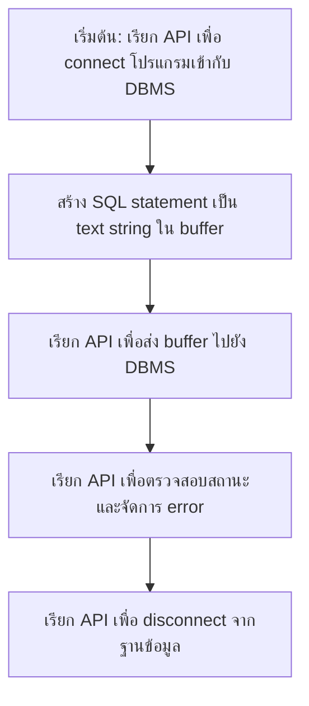

# How to Access Databases Using Python

`Tags: Python, SQL API, DB API, Jupyter Notebook, DBMS`

| Field             | Value                                    |
| ----------------- | ----------------------------------------- |
| **Certificate**   | IBM Data Engineering Professional Certificate |
| **Course**        | C05 Databases and SQL with Python         |
| **Module**        | M04 Accessing DB using Python              |
| **Lesson**        | L01 How to Access Databases Using Python   |
| **Date studied**  | 2026-08-12                                |

---

## Table of Contents

- [Overview](#overview)
- [Why Use Python to Access Databases](#why-use-python-to-access-databases)
- [Jupyter Notebooks](#jupyter-notebooks)
- [SQL API and Python DB API](#sql-api-and-python-db-api)
- [Proprietary APIs by DBMS](#proprietary-apis-by-dbms)
- [Key Terms & Glossary](#-key-terms--glossary)
- [My Questions & Gaps](#-my-questions--gaps)
- [Resources](#-resources)

---

## Overview

วิดีโอนี้เป็นบทนำของโมดูล M04 ที่อธิบายแนวคิดพื้นฐานของการเชื่อมต่อ Python เข้ากับฐานข้อมูล (database) เนื้อหาครอบคลุม 4 เรื่องหลัก ได้แก่ เหตุผลที่ควรใช้ Python ในงาน data science, การใช้งาน Jupyter notebook เป็นเครื่องมือหลัก, กลไกการสื่อสารระหว่างโปรแกรม Python กับ DBMS ผ่าน SQL API และ Python DB API, และตัวอย่าง proprietary API ของแต่ละ DBMS ยอดนิยม เนื้อหานี้เป็นพื้นฐานสำคัญก่อนที่จะลงมือสร้างตาราง โหลดข้อมูล และ query ข้อมูลจริงในโมดูลถัดไป

---

## Why Use Python to Access Databases

Python เป็นภาษาที่ได้รับความนิยมสูงในงาน data science เพราะมี ecosystem ที่หลากหลาย เช่น

- NumPy
- Pandas
- matplotlib
- SciPy

นอกจากนี้ Python ยังเรียนรู้ง่ายและมี syntax ที่ไม่ซับซ้อน เพราะเป็น open-source จึงถูก port ไปใช้งานได้บนหลายแพลตฟอร์ม โปรแกรม Python ส่วนใหญ่จึงทำงานข้ามแพลตฟอร์มได้โดยไม่ต้องแก้ไขโค้ด ตราบใดที่หลีกเลี่ยงฟีเจอร์ที่ผูกติดกับระบบใดระบบหนึ่งโดยเฉพาะ

Python รองรับการเชื่อมต่อกับ relational database system ผ่าน Python database API (เรียกย่อว่า DB API) ซึ่งมีเอกสารประกอบการใช้งานที่หาอ่านได้ง่าย

---

## Jupyter Notebooks

Notebook interface เป็นสภาพแวดล้อมเสมือนสำหรับเขียนโปรแกรมที่รวม live code, สมการ, การแสดงผลข้อมูล (visualization) และคำอธิบายไว้ในเอกสารเดียวกัน ตัวอย่าง notebook interface อื่น ๆ ได้แก่

- Mathematica notebook
- Maple worksheet
- Matlab notebook
- R Markdown
- Apache Zeppelin
- Apache Spark notebook
- Databricks cloud

แต่ในโมดูลนี้จะใช้ **Jupyter notebook** เป็นหลัก

Jupyter notebook คือ web application แบบ open-source ที่ให้ผู้ใช้สร้างและแชร์เอกสารที่มี live code, สมการ, visualization และข้อความอธิบายรวมอยู่ด้วยกัน

| ข้อดีของ Jupyter Notebook | รายละเอียด |
| --- | --- |
| รองรับหลายภาษา | มากกว่า 40 ภาษา รวมถึง Python, R, Julia, Scala |
| แชร์ได้ง่าย | ผ่าน email, Dropbox, GitHub, Jupyter notebook viewer |
| แสดงผลได้หลากหลายรูปแบบ | HTML, รูปภาพ, วิดีโอ, LaTeX, และ custom output types |
| เชื่อมกับเครื่องมือ big data ได้ | ใช้ Apache Spark ร่วมกับ Python, R, Scala และสำรวจข้อมูลด้วย pandas, scikit-learn, ggplot2, TensorFlow |

---

## SQL API and Python DB API

Application programming interface (API) คือชุดของฟังก์ชันที่เรียกใช้เพื่อเข้าถึงบริการบางอย่าง ในกรณีนี้ **SQL API** คือชุด library function ที่ทำหน้าที่เป็น API ให้กับ DBMS โปรแกรม application จะเรียกฟังก์ชันใน API เพื่อส่ง SQL statement ไปยัง DBMS จากนั้นเรียกฟังก์ชันอื่นเพื่อดึงผลลัพธ์ query กลับมา และตรวจสอบสถานะการทำงาน

ขั้นตอนการทำงานโดยทั่วไปของ SQL API มีดังนี้

---

## Proprietary APIs by DBMS

แต่ละระบบฐานข้อมูล (DBMS) มี library หรือ proprietary API ของตัวเองสำหรับให้ Python (หรือภาษาอื่น) เชื่อมต่อเข้าไปใช้งาน

| DBMS / Platform | API |
| --- | --- |
| MySQL | MySQL C API — เข้าถึง MySQL client server protocol ระดับ low-level สำหรับโปรแกรม C |
| PostgreSQL | psycopg2 — เชื่อมต่อ Python application เข้ากับ PostgreSQL |
| IBM DB2 | IBM_DB API — เชื่อมต่อ Python application เข้ากับ IBM DB2 |
| SQL Server | dblib API |
| Microsoft Windows OS | ODBC |
| Oracle | OCI |
| Java applications | JDBC |

---

## 📖 Key Terms & Glossary

| Term (ศัพท์) | คำอธิบาย (ภาษาไทย) |
| ------------- | -------------------- |
| API (Application Programming Interface) | ชุดฟังก์ชันที่เรียกใช้เพื่อเข้าถึงบริการของระบบอื่น |
| SQL API | library function calls ที่ทำหน้าที่เป็น API สำหรับส่งและรับข้อมูลกับ DBMS |
| DB API | Python database API มาตรฐานสำหรับเชื่อมต่อ Python เข้ากับฐานข้อมูล relational |
| DBMS (Database Management System) | ระบบจัดการฐานข้อมูล |
| Notebook interface | สภาพแวดล้อมเสมือนสำหรับเขียนโปรแกรมที่รวม code, สมการ, และคำอธิบายไว้ด้วยกัน |
| Jupyter notebook | web application แบบ open-source สำหรับสร้างเอกสารที่มี live code และ narrative text |
| buffer | พื้นที่หน่วยความจำชั่วคราวที่โปรแกรมใช้เก็บ SQL statement ก่อนส่งไปยัง DBMS |
| ODBC | มาตรฐานการเข้าถึงฐานข้อมูลบน Microsoft Windows |
| OCI | API ที่ใช้เชื่อมต่อกับฐานข้อมูล Oracle |
| JDBC | API ที่ใช้เชื่อมต่อฐานข้อมูลสำหรับโปรแกรม Java |

---

## ❓ My Questions & Gaps

- [x] SQL API กับ Python DB API ต่างกันอย่างไรในทางปฏิบัติ — DB API เป็น wrapper ที่ครอบ SQL API ของแต่ละ DBMS ไว้ให้เขียนโค้ดแบบเดียวกันได้หรือไม่
  - **คำตอบ**: ใช่ SQL API คือชุดฟังก์ชัน low-level ที่ผูกติดกับ DBMS แต่ละตัวโดยตรง (เช่น MySQL C API, OCI ของ Oracle) ส่วน Python DB API เป็นมาตรฐาน (specification) ระดับภาษา Python ที่กำหนดรูปแบบฟังก์ชัน/method กลาง (เช่น `connect()`, `cursor()`, `execute()`, `fetchall()`) ให้ library ของแต่ละ DBMS (เช่น ibm_db, psycopg2, mysql-connector) นำไปทำ implementation ตามมาตรฐานนี้ ทำให้นักพัฒนาเขียนโค้ด Python ในรูปแบบเดียวกันได้ไม่ว่าจะเชื่อมต่อ DBMS ใด เพียงแค่เปลี่ยน library/connection string ที่ใช้
- [x] การจัดการ error และ connection status ผ่าน API call มีรูปแบบมาตรฐานอย่างไรใน Python DB API (เช่น exception handling)
  - **คำตอบ**: Python DB API กำหนด exception class มาตรฐานไว้ เช่น `Error`, `InterfaceError`, `DatabaseError`, `DataError`, `OperationalError`, `IntegrityError`, `ProgrammingError` โดยทุก library ที่ implement ตามมาตรฐานนี้ต้องโยน exception เหล่านี้เมื่อเกิดปัญหา นักพัฒนาจึงใช้ `try/except` ครอบ `connect()`/`execute()` เพื่อดักจับ error ได้ในรูปแบบเดียวกัน ไม่ต้องเขียน error handling แยกตาม DBMS
- [x] ในโมดูลถัดไปจะได้ลองใช้ library ใดใน Python (เช่น ibm_db, psycopg2) เพื่อเชื่อมต่อฐานข้อมูลจริงบน Cloud
  - **คำตอบ**: ในโมดูลนี้ (M04) จะใช้ library **ibm_db** เพื่อเชื่อมต่อกับ IBM DB2 บน IBM Cloud เป็นหลัก ตามเนื้อหาของ certificate

---

## 🔗 Resources

- ไม่มีลิงก์หรือเอกสารอ้างอิงเพิ่มเติมที่กล่าวถึงในวิดีโอนี้
