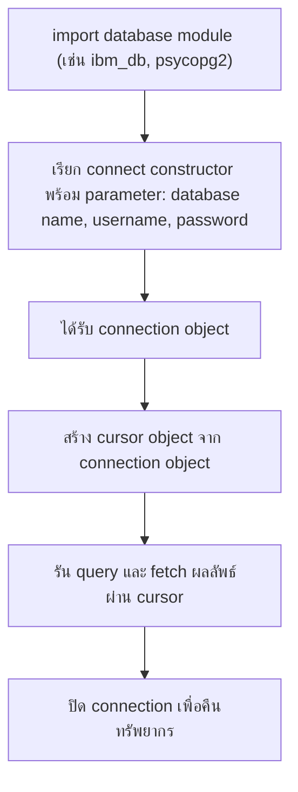

# Writing Code Using DB-API

`Tags: Python, DB-API, cursor, connection object, SQL`

| Field             | Value                                    |
| ----------------- | ----------------------------------------- |
| **Certificate**   | IBM Data Engineering Professional Certificate |
| **Course**        | C05 Databases and SQL with Python         |
| **Module**        | M04 Accessing DB using Python              |
| **Lesson**        | L02 Writing Code Using DB-API              |
| **Date studied**  | 2026-08-12                                |

---

## Table of Contents

- [Overview](#overview)
- [What is DB-API](#what-is-db-api)
- [DB-API Libraries by Database](#db-api-libraries-by-database)
- [Connection Objects and Cursor Objects](#connection-objects-and-cursor-objects)
- [Connection Methods](#connection-methods)
- [Cursor Behavior and Isolation](#cursor-behavior-and-isolation)
- [Writing a DB-API Program](#writing-a-db-api-program)
- [Key Terms & Glossary](#-key-terms--glossary)
- [My Questions & Gaps](#-my-questions--gaps)
- [Resources](#-resources)

---

## Overview

วิดีโอนี้อธิบายแนวคิดพื้นฐานของ Python DB-API และ database cursor พร้อมสาธิตวิธีเขียนโค้ดเพื่อเชื่อมต่อและ query ฐานข้อมูลด้วย DB-API เนื้อหาครอบคลุมตั้งแต่ข้อดีของ DB-API, ตัวอย่าง library ของแต่ละฐานข้อมูล, แนวคิดของ connection object และ cursor object, ไปจนถึงขั้นตอนการเขียนโปรแกรม Python เพื่อ query ฐานข้อมูลจริง เนื้อหานี้ต่อยอดจาก [L01_How-to-Access-Databases-Using-Python](L01_How-to-Access-Databases-Using-Python.md) ที่แนะนำ SQL API และ DB API ไว้แล้ว

---

## What is DB-API

DB-API คือ Python standard API สำหรับเข้าถึง relational database เป็นมาตรฐานที่ทำให้เขียนโปรแกรมเดียวใช้งานได้กับฐานข้อมูลหลายชนิด โดยไม่ต้องเขียนโปรแกรมแยกสำหรับแต่ละฐานข้อมูล เมื่อเข้าใจฟังก์ชันของ DB-API แล้ว ก็สามารถนำความรู้นั้นไปใช้กับฐานข้อมูลใดก็ได้ใน Python

ข้อดีของการใช้ DB-API มีดังนี้

- เขียนและทำความเข้าใจได้ง่าย
- ส่งเสริมความคล้ายคลึงกันระหว่าง Python module ที่ใช้เข้าถึงฐานข้อมูลต่าง ๆ
- ให้ความสอดคล้อง (consistency) ทำให้ module เข้าใจง่ายขึ้น
- โค้ดพกพาข้ามฐานข้อมูล (portable) ได้ดีกว่า
- เชื่อมต่อฐานข้อมูลจาก Python ได้กว้างขวางกว่า

---

## DB-API Libraries by Database

แต่ละฐานข้อมูลมี library ของตัวเองสำหรับเชื่อมต่อกับ Python ผ่าน DB-API

| Database | DB-API Library |
| --- | --- |
| IBM DB2 | ibm_db |
| MySQL | mysql-connector-python |
| PostgreSQL | psycopg2 |
| MongoDB | PyMongo |

---

## Connection Objects and Cursor Objects

แนวคิดหลัก 2 อย่างของ Python DB-API คือ **connection object** และ **cursor object**

- **Connection object** ใช้เชื่อมต่อกับฐานข้อมูลและจัดการ transaction
- **Cursor object** ใช้รัน query โดยเปิด cursor object ขึ้นมาก่อน แล้วจึงรัน query ผ่าน cursor นั้น

cursor ทำงานคล้ายกับ cursor ในโปรแกรมประมวลผลข้อความ (text processing system) ที่ให้เลื่อนดูผลลัพธ์ทีละแถวและดึงข้อมูลเข้าสู่ application ได้ กล่าวคือ cursor ใช้สำหรับ scan ผ่านผลลัพธ์ของฐานข้อมูล

---

## Connection Methods

DB-API มี **connect constructor** สำหรับสร้าง connection ไปยังฐานข้อมูล ซึ่งจะคืนค่าเป็น connection object ให้นำไปใช้กับ connection method ต่าง ๆ ดังนี้

| Method | หน้าที่ |
| --- | --- |
| `cursor()` | คืนค่า cursor object ใหม่จาก connection |
| `commit()` | commit transaction ที่ค้างอยู่เข้าสู่ฐานข้อมูล |
| `rollback()` | rollback ฐานข้อมูลกลับไปจุดเริ่มต้นของ transaction ที่ค้างอยู่ |
| `close()` | ปิดการเชื่อมต่อฐานข้อมูล |

---

## Cursor Behavior and Isolation

cursor คือ control structure ที่ใช้ traverse (เลื่อนผ่าน) record ต่าง ๆ ในฐานข้อมูล มีพฤติกรรมคล้ายกับ file handle ในภาษาโปรแกรม กล่าวคือ

- โปรแกรมเปิดไฟล์เพื่อเข้าถึงเนื้อหา เช่นเดียวกับที่เปิด cursor เพื่อเข้าถึงผลลัพธ์ query
- โปรแกรมปิดไฟล์เพื่อจบการเข้าถึง เช่นเดียวกับที่ปิด cursor เพื่อจบการเข้าถึงผลลัพธ์ query
- file handle จดจำตำแหน่งปัจจุบันในไฟล์ที่เปิดอยู่ เช่นเดียวกับที่ cursor จดจำตำแหน่งปัจจุบันในผลลัพธ์ query

เรื่องการ isolation ของ cursor มีจุดที่ควรทราบ

- cursor ที่สร้างจาก connection เดียวกัน **ไม่แยกจากกัน** (not isolated) การเปลี่ยนแปลงข้อมูลโดย cursor หนึ่งจะมองเห็นได้ทันทีจาก cursor อื่นที่ใช้ connection เดียวกัน
- cursor ที่สร้างจากคนละ connection อาจ isolated หรือไม่ก็ได้ ขึ้นอยู่กับว่าระบบรองรับ transaction อย่างไร

---

## Writing a DB-API Program

ขั้นตอนการเขียนโปรแกรม Python เพื่อ query ฐานข้อมูลด้วย DB-API มีดังนี้



การปิด connection ทุกครั้งหลังใช้งานเสร็จเป็นเรื่องสำคัญ เพราะ connection ที่ไม่ได้ใช้แต่ยังเปิดค้างไว้จะกินทรัพยากรระบบโดยไม่จำเป็น

```python
# ตัวอย่างโครงสร้างการเขียนโปรแกรมด้วย DB-API (pseudocode ตามขั้นตอนในวิดีโอ)
import ibm_db  # import database module

# เปิด connection ด้วย connect constructor
connection = ibm_db.connect("DATABASE=mydb", "username", "password")

# สร้าง cursor object จาก connection
cursor = connection.cursor()

# รัน query และ fetch ผลลัพธ์
cursor.execute("SELECT * FROM MY_TABLE")
results = cursor.fetchall()

# ปิด connection เพื่อคืนทรัพยากร
connection.close()
```

---

## 📖 Key Terms & Glossary

| Term (ศัพท์) | คำอธิบาย (ภาษาไทย) |
| ------------- | -------------------- |
| DB-API | Python standard API สำหรับเข้าถึง relational database |
| Connection object | object ที่ใช้เชื่อมต่อฐานข้อมูลและจัดการ transaction |
| Cursor object | object ที่ใช้รัน query และเลื่อนดูผลลัพธ์ query |
| Connect constructor | ฟังก์ชันใน DB-API ที่ใช้สร้าง connection object |
| commit() | เมธอดที่ commit transaction ที่ค้างอยู่เข้าสู่ฐานข้อมูล |
| rollback() | เมธอดที่ยกเลิก transaction กลับไปจุดเริ่มต้น |
| Isolation (ของ cursor) | ระดับที่การเปลี่ยนแปลงจาก cursor หนึ่งมองเห็นได้จาก cursor อื่นหรือไม่ |
| ibm_db | library สำหรับเชื่อมต่อ Python กับ IBM DB2 |
| psycopg2 | library สำหรับเชื่อมต่อ Python กับ PostgreSQL |
| PyMongo | library สำหรับเชื่อมต่อ Python กับ MongoDB |

---

## ❓ My Questions & Gaps

- [x] connection object กับ cursor object สัมพันธ์กันอย่างไรเมื่อเปิดหลาย cursor พร้อมกันบน connection เดียว — มีผลต่อ performance หรือไม่
  - **คำตอบ**: connection หนึ่งตัวสามารถสร้าง cursor ได้หลายตัวพร้อมกัน แต่ละ cursor จะเลื่อนดูผลลัพธ์ query ของตัวเองอย่างอิสระ อย่างไรก็ตาม เพราะ cursor ที่มาจาก connection เดียวกัน **ไม่ isolated** จากกัน การเปลี่ยนแปลงข้อมูล (INSERT/UPDATE/DELETE) โดย cursor ใดจะมองเห็นได้ทันทีจาก cursor อื่นในทันที ในแง่ performance การเปิดหลาย cursor เองไม่ได้กินทรัพยากรมากเท่า connection ใหม่ แต่ถ้าใช้งานพร้อมกันจำนวนมากบน connection เดียวควรระวังเรื่อง contention และการจัดการ transaction ร่วมกัน (เช่น cursor หนึ่ง rollback จะกระทบ transaction ที่ cursor อื่นกำลังใช้ด้วย)
- [x] เมื่อไรควรเรียก `commit()` ด้วยตนเอง เทียบกับกรณีที่ library ทำ auto-commit ให้อยู่แล้ว
  - **คำตอบ**: ขึ้นอยู่กับ default ของแต่ละ library — บาง library (เช่น psycopg2) เปิด transaction แบบ manual-commit เป็นค่าเริ่มต้น จึงต้องเรียก `commit()` เองทุกครั้งหลังคำสั่งที่แก้ไขข้อมูล มิฉะนั้นการเปลี่ยนแปลงจะไม่ถูกบันทึกถาวร ส่วนบาง library/การตั้งค่า (เช่น `set_autocommit(True)` หรือ connection ที่เปิดโหมด autocommit) จะ commit ให้อัตโนมัติหลังทุกคำสั่ง โดยทั่วไปควร commit เองอย่างชัดเจนเมื่อทำหลายคำสั่งที่ต้องสำเร็จพร้อมกันเป็น atomic unit (เช่น โอนเงินระหว่างบัญชี) เพื่อควบคุมจุดที่ transaction จบสมบูรณ์ได้แม่นยำ
- [x] transaction isolation ระหว่างคนละ connection ขึ้นกับการตั้งค่าอะไรบ้างในแต่ละ DBMS (เช่น isolation level)
  - **คำตอบ**: ขึ้นอยู่กับ **isolation level** ที่ DBMS หรือ connection กำหนดไว้ ซึ่งมาตรฐาน SQL กำหนดระดับหลัก ๆ ไว้ 4 ระดับ (จากหลวมไปเข้ม): Read Uncommitted, Read Committed, Repeatable Read, และ Serializable แต่ละระดับควบคุมว่า transaction หนึ่งจะเห็นการเปลี่ยนแปลงที่ transaction อื่น (ที่ยังไม่ commit หรือ commit ไปแล้ว) ได้มากน้อยแค่ไหน ค่า default แตกต่างกันไปตาม DBMS (เช่น PostgreSQL ใช้ Read Committed เป็น default, MySQL InnoDB ใช้ Repeatable Read เป็น default) และสามารถตั้งค่าระดับนี้ได้ผ่าน connection หรือ session ก่อนเริ่ม transaction

---

## 🔗 Resources

- ไม่มีลิงก์หรือเอกสารอ้างอิงเพิ่มเติมที่กล่าวถึงในวิดีโอนี้
