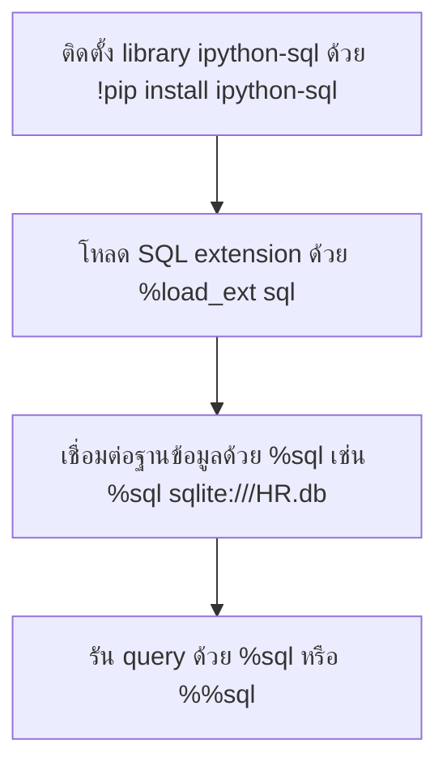

# Accessing Databases with SQL Magic

`Tags: Jupyter Notebook, magic statements, line magic, cell magic, SQL Magic, SQLite`

| Field             | Value                                    |
| ----------------- | ----------------------------------------- |
| **Certificate**   | IBM Data Engineering Professional Certificate |
| **Course**        | C05 Databases and SQL with Python         |
| **Module**        | M04 Accessing DB using Python              |
| **Lesson**        | L03 Accessing Databases with SQL Magic     |
| **Date studied**  | 2026-08-15                                |

---

## Table of Contents

- [Overview](#overview)
- [What are Magic Statements](#what-are-magic-statements)
- [Line Magics](#line-magics)
- [Cell Magics](#cell-magics)
- [Cell Magics for Other Languages](#cell-magics-for-other-languages)
- [Setting Up SQL Magic](#setting-up-sql-magic)
- [Using SQL Magic to Query a Database](#using-sql-magic-to-query-a-database)
- [Key Terms & Glossary](#-key-terms--glossary)
- [My Questions & Gaps](#-my-questions--gaps)
- [Resources](#-resources)

---

## Overview

วิดีโอนี้แนะนำ magic statements ใน Jupyter Notebook ซึ่งเป็นคำสั่งพิเศษที่ไม่ใช่ Python code ปกติ แต่ช่วยแก้ปัญหาที่พบบ่อยในงาน data analysis เนื้อหาครอบคลุมความแตกต่างระหว่าง line magic กับ cell magic ตัวอย่าง magic statement ที่ใช้บ่อย และปิดท้ายด้วยการติดตั้งและใช้งาน SQL Magic เพื่อเชื่อมต่อและ query ฐานข้อมูลโดยตรงจากใน notebook

---

## What are Magic Statements

Magic commands หรือ magic functions คือคำสั่งพิเศษใน Jupyter Notebook ที่ให้ความสามารถเพิ่มเติมนอกเหนือจาก Python code ปกติ ไม่ใช่ Python syntax ที่ถูกต้อง แต่ส่งผลต่อพฤติกรรมของ notebook เอง ถูกออกแบบมาเพื่อแก้ปัญหาที่พบบ่อยใน standard data analysis

magic statements แบ่งเป็น 2 ประเภทคือ **line magic** และ **cell magic**

---

## Line Magics

Line magic ใช้ prefix เป็นเครื่องหมาย `%` ตัวเดียว และทำงานกับ input เพียงบรรทัดเดียว มีลักษณะคล้ายกับคำสั่งใน command line ของ terminal shell

| Command | หน้าที่ |
| --- | --- |
| `%pwd` | แสดง current working directory |
| `%ls` | แสดงรายการไฟล์ทั้งหมดใน directory ปัจจุบัน |
| `%history` | แสดงประวัติคำสั่งที่รันมาแล้ว |
| `%reset` | reset namespace โดยลบชื่อตัวแปรที่ผู้ใช้กำหนดทั้งหมด |
| `%who` | แสดงรายการตัวแปรทั้งหมดใน namespace |
| `%whos` | แสดงรายละเอียดของตัวแปรทั้งหมดใน namespace แบบละเอียดกว่า `%who` |
| `%matplotlib inline` | ทำให้กราฟจาก matplotlib แสดงผลภายใน notebook |
| `%timeit` | จับเวลาการทำงานของ statement เดียว |

การขอรายการ line magic ทั้งหมดที่มีให้ใช้งาน ทำได้ด้วยคำสั่ง `%lsmagic` สามารถใช้ line magic หลายคำสั่งในเซลล์เดียวกันได้ โดยแต่ละคำสั่งต้องอยู่คนละบรรทัด เช่น `%pwd` ตามด้วย `%ls` ในเซลล์เดียวกัน จะพิมพ์ current working directory แล้วตามด้วยรายการไฟล์

```python
# แสดง current working directory แล้วตามด้วยรายการไฟล์ในโฟลเดอร์นั้น
%pwd
%ls
```

---

## Cell Magics

Cell magic ใช้ prefix เป็นเครื่องหมาย `%%` สองตัว และทำงานกับ input หลายบรรทัด สามารถแปลง (transform) เนื้อหาทั้งเซลล์ หรือรัน cell นั้นด้วยภาษาโปรแกรมอื่นก็ได้

magic statement บางตัวใช้ได้ทั้งแบบ line และ cell แต่พฤติกรรมจะเปลี่ยนไปตามรูปแบบที่ใช้

| Form | พฤติกรรม |
| --- | --- |
| `%timeit` | จับเวลาการทำงานของ statement เดียว |
| `%%timeit` | จับเวลาการทำงานของทั้งเซลล์ |

อีกตัวอย่างที่ cell magic ทำได้เฉพาะตัวคือ `%%writefile` เช่น `%%writefile myfile.txt` จะเขียนเนื้อหาทั้งเซลล์ลงไฟล์ `myfile.txt`

```python
# เขียนเนื้อหาทั้งเซลล์ลงไฟล์ myfile.txt
%%writefile myfile.txt
Hello world
```

---

## Cell Magics for Other Languages

Cell magic ไม่ได้จำกัดอยู่แค่ Python เท่านั้น แต่สามารถรันโค้ดภาษาอื่นภายในเซลล์ได้ด้วย

- `%%HTML` — เขียนโค้ด HTML ในเซลล์ แล้ว render ผลลัพธ์ให้เลย
- `%%javascript` หรือ `%%JS` — เขียนโค้ด JavaScript ในเซลล์
- `%%bash` — เขียนคำสั่ง bash ในเซลล์ เสมือนรันในเทอร์มินัล

---

## Setting Up SQL Magic

ก่อนใช้ SQL Magic ต้องติดตั้ง dependency และโหลด extension ก่อน ตามลำดับดังนี้



```python
# ติดตั้ง library สำหรับ SQL magic
!pip install ipython-sql

# โหลด SQL extension เข้าสู่ notebook
%load_ext sql

# เชื่อมต่อกับฐานข้อมูล SQLite ชื่อ HR.db
%sql sqlite:///HR.db
```

---

## Using SQL Magic to Query a Database

หลังเชื่อมต่อฐานข้อมูลสำเร็จแล้ว สามารถรัน SQL query ได้โดยใช้ `%sql` สำหรับ query บรรทัดเดียว (line magic) หรือ `%%sql` สำหรับ query หลายบรรทัด (cell magic) ขึ้นอยู่กับความยาวของ query

```python
# query ข้อมูลทั้งหมดในตาราง employee ด้วย SQL magic (line magic)
%sql SELECT * FROM employee
```

---

## 📖 Key Terms & Glossary

| Term (ศัพท์) | คำอธิบาย (ภาษาไทย) |
| ------------- | -------------------- |
| Magic statement (Magic command) | คำสั่งพิเศษใน Jupyter Notebook ที่ไม่ใช่ Python syntax ปกติ แต่ส่งผลต่อพฤติกรรมของ notebook |
| Line magic | magic statement ที่ใช้ prefix `%` ตัวเดียว ทำงานกับ input บรรทัดเดียว |
| Cell magic | magic statement ที่ใช้ prefix `%%` สองตัว ทำงานกับ input หลายบรรทัดหรือทั้งเซลล์ |
| %pwd | line magic แสดง current working directory |
| %ls | line magic แสดงรายการไฟล์ในโฟลเดอร์ปัจจุบัน |
| %lsmagic | line magic แสดงรายการ magic command ทั้งหมดที่มี |
| %timeit / %%timeit | จับเวลาการทำงานของ statement เดียว (line) หรือทั้งเซลล์ (cell) |
| %%writefile | cell magic เขียนเนื้อหาทั้งเซลล์ลงไฟล์ที่ระบุ |
| SQL Magic | ชุด magic command (`%sql`, `%%sql`) สำหรับรัน SQL query ใน Jupyter Notebook ผ่าน library ipython-sql |
| ipython-sql | Python library ที่เปิดใช้งาน SQL magic ใน Jupyter Notebook |
| %load_ext | line magic ใช้โหลด extension เข้าสู่ notebook เช่น โหลด extension sql |

---

## ❓ My Questions & Gaps

- [x] `%sql` กับ `%%sql` ต่างกันในแง่การจัดการ connection หรือไม่ เช่น connection ที่เปิดค้างไว้จะถูกใช้ซ้ำในทุก query หรือไม่
  - **คำตอบ**: connection ไม่ได้ถูกเปิดใหม่ทุกครั้งที่รัน query ipython-sql จะเก็บ connection ที่เชื่อมต่อล่าสุดไว้เป็น default connection ภายใน session ของ notebook ดังนั้นเมื่อเชื่อมต่อด้วย `%sql sqlite:///HR.db` แล้ว ทั้ง `%sql` และ `%%sql` ที่ตามมา (ไม่ว่าจะ query ครั้งเดียวหรือหลายครั้ง) จะใช้ connection เดิมซ้ำโดยอัตโนมัติ จนกว่าจะเชื่อมต่อไปยังฐานข้อมูลอื่นหรือ restart kernel
- [x] SQL Magic รองรับการ parametrize query ด้วยตัวแปร Python ได้หรือไม่ (เช่นเดียวกับ DB-API ที่เคยเรียนใน [L02_Writing-Code-Using-DB-API](L02_Writing-Code-Using-DB-API.md))
  - **คำตอบ**: รองรับ โดยใช้ syntax `:variable_name` (bind parameter นำหน้าด้วย `:`) ในคำสั่ง SQL magic เช่น
    ```python
    country = "Canada"
    %sql SELECT * FROM INTERNATIONAL_STUDENT_TEST_SCORES WHERE country = :country
    ```
    ipython-sql จะดึงค่าตัวแปร `country` จาก Python namespace มาแทนที่ `:country` ให้อัตโนมัติก่อนรัน query ต่างจาก DB-API ที่ใช้ placeholder เฉพาะของแต่ละ library (เช่น `?` หรือ `%s`) ผ่าน `cursor.execute()`

---

## 🔗 Resources

- ไม่มีลิงก์หรือเอกสารอ้างอิงเพิ่มเติมที่กล่าวถึงในวิดีโอนี้
