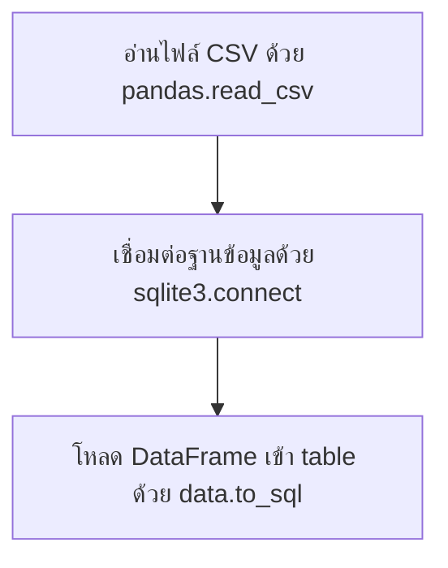

# Analyzing Data with Python

`Tags: Pandas, SQLite, EDA, Seaborn, data visualization`

| Field             | Value                                    |
| ----------------- | ----------------------------------------- |
| **Certificate**   | IBM Data Engineering Professional Certificate |
| **Course**        | C05 Databases and SQL with Python         |
| **Module**        | M04 Accessing DB using Python              |
| **Lesson**        | L04 Analyzing Data with Python             |
| **Date studied**  | 2026-08-15                                |

---

## Table of Contents

- [Overview](#overview)
- [Loading a CSV into SQLite](#loading-a-csv-into-sqlite)
- [Retrieving Data with Pandas](#retrieving-data-with-pandas)
- [Exploring Data with describe](#exploring-data-with-describe)
- [Finding the Row with Maximum Sodium](#finding-the-row-with-maximum-sodium)
- [Visualizing Data with Seaborn](#visualizing-data-with-seaborn)
- [Key Terms & Glossary](#-key-terms--glossary)
- [My Questions & Gaps](#-my-questions--gaps)
- [Resources](#-resources)

---

## Overview

วิดีโอนี้สาธิตการทำ exploratory data analysis (EDA) แบบครบวงจรด้วย Python โดยใช้ McDonald's menu nutrition dataset เป็นตัวอย่าง ครอบคลุมตั้งแต่การโหลดไฟล์ CSV เข้าสู่ฐานข้อมูล SQLite ด้วย Pandas การดึงข้อมูลกลับมาเป็น DataFrame การสำรวจสถิติเบื้องต้นด้วย `describe()` การหาค่าผิดปกติ (outlier) ในข้อมูลจริง ไปจนถึงการสร้าง visualization ด้วย Seaborn เพื่อดูความสัมพันธ์และการกระจายตัวของข้อมูล

---

## Loading a CSV into SQLite

SQLite 3 เป็น in-process Python library ที่ implement self-contained, serverless, zero-configuration transactional SQL database engine ใช้งานง่ายเพราะไม่ต้องตั้งค่า server แยกต่างหาก



```python
import pandas as pd
import sqlite3

# อ่านไฟล์ CSV เข้าสู่ DataFrame ชื่อ data
data = pd.read_csv("mcdonalds_nutrition.csv")

# เชื่อมต่อ (หรือสร้าง) ฐานข้อมูล SQLite ชื่อ mcdonalds.db
conn = sqlite3.connect("mcdonalds.db")

# โหลดข้อมูลจาก DataFrame เข้าเป็น table mcdonalds_nutrition ในฐานข้อมูล
data.to_sql("mcdonalds_nutrition", conn)
```

---

## Retrieving Data with Pandas

หลังจากข้อมูลอยู่ใน table แล้ว สามารถดึงกลับมาเป็น DataFrame ได้ด้วย `pandas.read_sql` โดยส่ง SQL select query และ connection object เป็น parameter

```python
# ดึงข้อมูลทั้งหมดจาก table mcdonalds_nutrition กลับมาเป็น DataFrame df
df = pd.read_sql("SELECT * FROM mcdonalds_nutrition", conn)

# แสดงแถวแรกๆ ของ DataFrame เพื่อดูตัวอย่างข้อมูล
df.head()
```

---

## Exploring Data with describe

`describe()` เป็น method ของ Pandas ที่คำนวณสถิติสรุปเบื้องต้น เช่น count, mean, std, min, max ให้ทุกคอลัมน์ตัวเลขในครั้งเดียว จากตัวอย่างพบว่ามี 260 food items และ 9 unique categories โดยค่า total fat สูงสุดอยู่ที่ 118

```python
# แสดงสถิติสรุปของทุกคอลัมน์ใน DataFrame
df.describe()
```

Sodium เป็นตัวอย่างของ nutrient ที่ควรระวัง เพราะร่างกายต้องการโซเดียมน้อยกว่าที่คนอเมริกันเฉลี่ยบริโภคจริงถึง 20 เท่า เป้าหมายทั่วไปคือบริโภคไม่เกิน 2,000 มิลลิกรัมต่อวัน การสำรวจ dataset นี้พบค่า sodium สูงสุดถึง 3,600 ซึ่งเป็นจุดที่น่าสงสัยว่าเป็น outlier หรือไม่

---

## Finding the Row with Maximum Sodium

เมื่อพบค่าผิดปกติจาก visualization แล้ว ขั้นตอนถัดไปคือสืบหาว่า record ไหนคือต้นเหตุ โดยใช้ `idxmax()` เพื่อหา index ของแถวที่มีค่าสูงสุด แล้วใช้ `.at[]` เพื่อดึงค่าคอลัมน์อื่นของแถวนั้น

```python
# ดูสถิติสรุปเฉพาะคอลัมน์ sodium (พบค่า max = 3600)
df["Sodium"].describe()

# หา index ของแถวที่มีค่า sodium สูงสุด
max_sodium_index = df["Sodium"].idxmax()

# ดึงชื่อ item ของแถวที่มี index นั้น
df.at[max_sodium_index, "Item"]
```

จากผลลัพธ์พบว่าเมนูที่มี sodium สูงสุดคือ Chicken McNuggets (40 ชิ้น)

---

## Visualizing Data with Seaborn

Visualization ช่วยให้เห็นความสัมพันธ์ pattern และ outlier ในข้อมูลได้ง่ายกว่าดูตัวเลขดิบ วิดีโอนี้สาธิต 3 รูปแบบหลัก

| Plot type | ฟังก์ชัน Seaborn | ใช้ทำอะไร |
| --- | --- | --- |
| Categorical scatter plot | `swarmplot()` | ดูการกระจายค่าตัวเลข (เช่น sodium) แยกตาม category |
| Scatter plot พร้อม histogram คู่ | `jointplot()` | ดูความสัมพันธ์ (correlation) ระหว่างสองตัวแปรต่อเนื่อง |
| Box plot | `boxplot()` | ดูการกระจายตัวและ outlier ของตัวแปรเดียว |

```python
import seaborn as sns

# scatter plot แบบ categorical แสดง sodium แยกตาม category
sns.swarmplot(x="Category", y="Sodium", data=df)

# scatter plot พร้อม histogram สองแกน แสดงความสัมพันธ์ระหว่าง protein กับ total fat
sns.jointplot(x="Protein", y="Total Fat", data=df)

# box plot แสดงการกระจายตัวของ sugars
sns.boxplot(x=df["Sugars"])
```

จาก `jointplot()` ระหว่าง protein กับ total fat พบค่า Pearson correlation อยู่ที่ 0.81 ซึ่งเป็นค่าบวกสูง แสดงว่าทั้งสองตัวแปรมีความสัมพันธ์กันในทิศทางเดียวกันอย่างชัดเจน (ยิ่ง protein สูง total fat ก็มีแนวโน้มสูงตาม) และยังสังเกตเห็นจุดหนึ่งที่หลุดออกจาก pattern หลัก ซึ่งเป็น possible outlier

จาก `boxplot()` ของ sugars พบว่าค่าเฉลี่ยอยู่ราว 30 กรัม แต่มี outlier บางรายการสูงถึงประมาณ 128 กรัม ซึ่งน่าจะเป็นกลุ่มเมนูประเภทขนมหวาน (candies)

---

## 📖 Key Terms & Glossary

| Term (ศัพท์) | คำอธิบาย (ภาษาไทย) |
| ------------- | -------------------- |
| Exploratory Data Analysis (EDA) | กระบวนการสำรวจข้อมูลเบื้องต้นเพื่อทำความเข้าใจลักษณะ pattern และความผิดปกติของข้อมูล |
| to_sql() | method ของ Pandas DataFrame ใช้บันทึกข้อมูลใน DataFrame ลงเป็น table ในฐานข้อมูล |
| read_sql() | ฟังก์ชันของ Pandas ใช้รัน SQL query แล้วคืนผลลัพธ์เป็น DataFrame |
| describe() | method ของ Pandas ที่แสดงสถิติสรุป เช่น count, mean, std, min, max ของทุกคอลัมน์ตัวเลข |
| idxmax() | method ของ Pandas ที่คืนค่า index ของแถวที่มีค่าสูงสุดในคอลัมน์ที่ระบุ |
| .at[] | accessor ของ Pandas ใช้ดึงค่าเดี่ยวจาก DataFrame โดยระบุ index และชื่อคอลัมน์ |
| swarmplot() | ฟังก์ชันของ Seaborn สร้าง categorical scatter plot แสดงการกระจายค่าตัวเลขแยกตาม category |
| jointplot() | ฟังก์ชันของ Seaborn สร้าง scatter plot ของสองตัวแปรพร้อม histogram ของแต่ละตัวแปร |
| boxplot() | ฟังก์ชันของ Seaborn สร้าง box plot แสดงการกระจายตัวและ outlier ของตัวแปร |
| Correlation | ค่าวัดความสัมพันธ์ระหว่างสองตัวแปร มีค่าอยู่ระหว่าง -1 ถึง +1 |
| Outlier | ค่าที่ผิดปกติหรือหลุดออกจาก pattern หลักของข้อมูล |

---

## ❓ My Questions & Gaps

- [ ] `to_sql()` มี parameter `if_exists` ที่ควบคุมพฤติกรรมเมื่อ table มีอยู่แล้ว (เช่น `fail`, `replace`, `append`) ต่างกันอย่างไร และควรเลือกใช้แบบไหนในสถานการณ์ไหน
- [ ] `jointplot()` รองรับการปรับ `kind` เป็นรูปแบบอื่น (เช่น `kind="reg"` เพื่อวาดเส้น regression) ได้หรือไม่ และมีผลต่อการตีความ correlation อย่างไร

---

## 🔗 Resources

- Dataset: Nutrition facts for McDonald's Menu (Kaggle)
