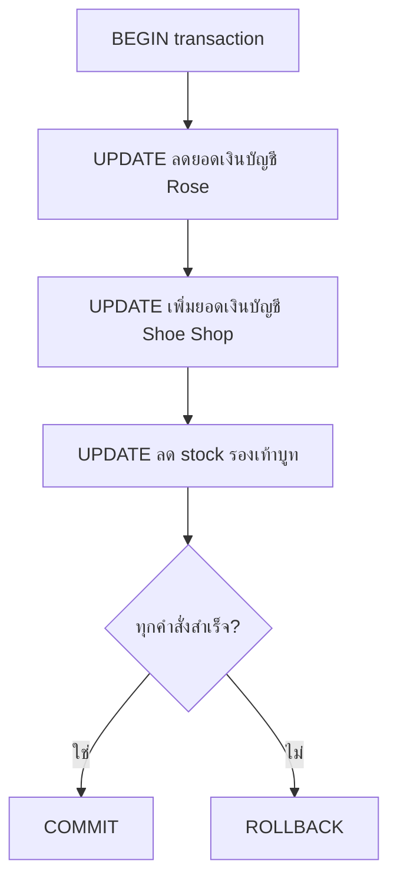

# ACID Transactions

`Tags: SQL, transaction, ACID, COMMIT, ROLLBACK`

| Field             | Value                                    |
| ----------------- | ----------------------------------------- |
| **Certificate**   | IBM Data Engineering Professional Certificate |
| **Course**        | C05 Databases and SQL with Python         |
| **Module**        | M06 Advance SQL                           |
| **Lesson**        | L01 Views, Stored Procedures and Transactions |
| **Date studied**  | 2026-08-16                                |

---

## Table of Contents

- [Overview](#overview)
- [What a Transaction Is](#what-a-transaction-is)
- [ACID Properties](#acid-properties)
- [Managing Transactions with BEGIN, COMMIT, ROLLBACK](#managing-transactions-with-begin-commit-rollback)
- [Calling SQL from Other Languages](#calling-sql-from-other-languages)
- [Key Terms & Glossary](#-key-terms--glossary)
- [My Questions & Gaps](#-my-questions--gaps)
- [Resources](#-resources)

---

## Overview

วิดีโอนี้อธิบายเรื่อง ACID transaction ซึ่งเป็นแนวคิดสำคัญของฐานข้อมูลที่รับประกันว่ากลุ่มของ SQL statement จะสำเร็จทั้งหมดหรือไม่สำเร็จเลย เนื้อหาครอบคลุมความหมายของ transaction ตัวอย่างการใช้งานจริง คุณสมบัติทั้งสี่ของ ACID และวิธีจัดการ transaction ด้วยคำสั่ง BEGIN, COMMIT, ROLLBACK รวมถึงการเรียก SQL จากภาษาอื่น

---

## What a Transaction Is

Transaction คือ indivisible unit of work ที่ประกอบด้วย SQL statement หนึ่งคำสั่งหรือมากกว่า โดยจะถือว่าสำเร็จก็ต่อเมื่อทุก statement รันสำเร็จทั้งหมด ทำให้ฐานข้อมูลอยู่ในสถานะใหม่ที่ stable หรือไม่สำเร็จเลยแม้แต่คำสั่งเดียว ซึ่งจะทำให้ฐานข้อมูลกลับไปอยู่ในสถานะเดิมก่อน transaction เริ่ม

ตัวอย่างเช่น การซื้อของด้วยบัตรธนาคาร ต้องมีหลายอย่างเกิดขึ้นพร้อมกัน ได้แก่ การเพิ่มสินค้าเข้า cart การประมวลผล payment การหักเงินจากบัญชีลูกค้าในจำนวนที่ถูกต้องและเพิ่มเงินเข้าบัญชีร้านค้า รวมถึงการลด inventory ของสินค้านั้นตามจำนวนที่ซื้อ

ตัวอย่างในรายละเอียด: ถ้า Rose ซื้อรองเท้าบูทราคา $200 จะต้องใช้ `UPDATE` เพื่อลดยอดเงินในบัญชีของ Rose อีก `UPDATE` เพื่อเพิ่ม $200 เข้าบัญชี Shoe Shop และอีก `UPDATE` เพื่อลด stock ของรองเท้าบูทลง 1 คู่ หากคำสั่ง `UPDATE` ใดคำสั่งหนึ่งล้มเหลว ทั้ง transaction ต้องล้มเหลวทั้งหมด เพื่อรักษาความสอดคล้องของข้อมูล



---

## ACID Properties

Transaction ประเภทนี้เรียกว่า ACID transaction โดย ACID ย่อมาจาก:

| ตัวอักษร | ความหมาย | คำอธิบาย |
| --- | --- | --- |
| A — Atomic | Atomicity | การเปลี่ยนแปลงทั้งหมดต้องสำเร็จหรือไม่สำเร็จเลยแม้แต่ส่วนเดียว |
| C — Consistent | Consistency | ข้อมูลต้องอยู่ในสถานะที่สอดคล้อง (consistent) ทั้งก่อนและหลัง transaction |
| I — Isolated | Isolation | ไม่มี process อื่นสามารถเปลี่ยนแปลงข้อมูลได้ในขณะที่ transaction กำลังรันอยู่ |
| D — Durable | Durability | การเปลี่ยนแปลงที่ transaction ทำสำเร็จแล้วต้องคงอยู่ถาวร |

---

## Managing Transactions with BEGIN, COMMIT, ROLLBACK

การเริ่ม ACID transaction ใช้คำสั่ง `BEGIN` (ใน DB2 on Cloud คำสั่งนี้เป็น implicit ไม่ต้องเขียนออกมา) คำสั่งใด ๆ ที่ตามมาหลังจากนั้นจะถือเป็นส่วนหนึ่งของ transaction จนกว่าจะเจอ `COMMIT` หรือ `ROLLBACK`

ถ้าทุกคำสั่งสำเร็จ ให้ใช้ `COMMIT` เพื่อบันทึกการเปลี่ยนแปลงทั้งหมดลงฐานข้อมูลให้อยู่ในสถานะที่สอดคล้องและ stable แต่ถ้าคำสั่งใดล้มเหลว เช่น บัญชีของ Rose มีเงินไม่พอสำหรับจ่าย ให้ใช้ `ROLLBACK` เพื่อ undo การเปลี่ยนแปลงทั้งหมดและคืนฐานข้อมูลกลับไปสู่สถานะ stable ก่อนหน้า

```sql
-- เริ่ม transaction (ใน DB2 on Cloud คำสั่ง BEGIN เป็น implicit)
BEGIN;

UPDATE accounts SET balance = balance - 200 WHERE customer = 'Rose';
UPDATE accounts SET balance = balance + 200 WHERE customer = 'Shoe Shop';
UPDATE inventory SET stock = stock - 1 WHERE item = 'Boots';

-- ถ้าทุกคำสั่งสำเร็จ ให้ commit เพื่อบันทึกการเปลี่ยนแปลง
COMMIT;

-- ถ้ามีคำสั่งใดล้มเหลว ให้ rollback เพื่อยกเลิกการเปลี่ยนแปลงทั้งหมด
ROLLBACK;
```

---

## Calling SQL from Other Languages

SQL statement สามารถถูกเรียกจากภาษาอื่นได้ เช่น Java, C, R, และ Python ซึ่งต้องใช้ database-specific access API เช่น Java Database Connectivity (JDBC) สำหรับ Java หรือ connector เฉพาะอย่าง `ibm_db` สำหรับ Python

ภาษาส่วนใหญ่ใช้คำสั่ง `EXEC SQL` เพื่อเรียกใช้ SQL command รวมถึง `COMMIT` และ `ROLLBACK` (ไม่ต้องเรียก `BEGIN` เพราะเป็น implicit) การนำ SQL command เข้าไปฝังในโค้ด application ทำให้สามารถสร้าง error-checking routine ที่คอยควบคุมว่า transaction ควรจะ commit หรือ rollback ได้

```sql
-- ตัวอย่างการเรียก SQL command จากภาษา host ผ่าน EXEC SQL
EXEC SQL COMMIT;
EXEC SQL ROLLBACK;
```

---

## 📖 Key Terms & Glossary

| Term (ศัพท์) | คำอธิบาย (ภาษาไทย) |
| ------------- | -------------------- |
| Transaction | indivisible unit of work ที่ประกอบด้วย SQL statement หนึ่งคำสั่งหรือมากกว่า ต้องสำเร็จทั้งหมดหรือไม่สำเร็จเลย |
| ACID | ย่อมาจาก Atomic, Consistent, Isolated, Durable — การรับประกันสำหรับ transaction ของฐานข้อมูล |
| BEGIN | คำสั่งเริ่มต้น transaction ในบาง database engine เป็น implicit ไม่ต้องเขียนออกมา |
| COMMIT | คำสั่งบันทึกการเปลี่ยนแปลงทั้งหมดของ transaction ลงฐานข้อมูลอย่างถาวร |
| ROLLBACK | คำสั่งยกเลิกการเปลี่ยนแปลงทั้งหมดของ transaction และคืนฐานข้อมูลกลับสู่สถานะก่อนหน้า |
| JDBC (Java Database Connectivity) | database-specific access API ที่ใช้เชื่อมต่อฐานข้อมูลสำหรับโปรแกรม Java |
| ibm_db | database connector สำหรับเชื่อมต่อ Python กับฐานข้อมูล IBM DB2 |
| EXEC SQL | คำสั่งที่ภาษา host (เช่น C, R, Python) ใช้เพื่อเรียกใช้งาน SQL command จากภายในโค้ด |

---

## ❓ My Questions & Gaps

- [ ] Isolation level (เช่น READ COMMITTED, SERIALIZABLE) ต่างกันอย่างไร และมีผลต่อ concurrency อย่างไรบ้าง
- [ ] ในภาษาที่ไม่ได้ implicit BEGIN transaction จะต้อง handle การเริ่ม transaction เองอย่างไร
- [ ] savepoint ต่างจาก rollback ทั้ง transaction อย่างไร ใช้เมื่อไหร่

---

## 🔗 Resources

- ไม่มีลิงก์หรือเอกสารอ้างอิงเพิ่มเติมที่กล่าวถึงในวิดีโอนี้
