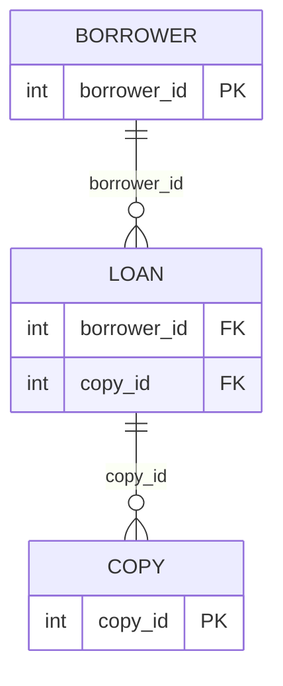

# Join Overview

`Tags: SQL, JOIN, primary key, foreign key, entity relationship diagram`

| Field             | Value                                    |
| ----------------- | ----------------------------------------- |
| **Certificate**   | IBM Data Engineering Professional Certificate |
| **Course**        | C05 Databases and SQL with Python         |
| **Module**        | M06 Advance SQL                           |
| **Lesson**        | L02 Join Statements                       |
| **Date studied**  | 2026-08-16                                |

---

## Table of Contents

- [Overview](#overview)
- [What a Join Is](#what-a-join-is)
- [Identifying the Relationship Between Tables](#identifying-the-relationship-between-tables)
- [Joining More Than Two Tables](#joining-more-than-two-tables)
- [Types of Joins](#types-of-joins)
- [Key Terms & Glossary](#-key-terms--glossary)
- [My Questions & Gaps](#-my-questions--gaps)
- [Resources](#-resources)

---

## Overview

วิดีโอนี้แนะนำ JOIN operator ซึ่งใช้ดึงข้อมูลจากหลายตารางพร้อมกัน โดยยกตัวอย่างจากฐานข้อมูลห้องสมุด (library database) ที่มี entity หลายตัว เช่น author, book, borrower, loan, copy เนื้อหาครอบคลุมว่า JOIN คืออะไร ทำไมต้องอาศัย primary key และ foreign key ในการเชื่อมตาราง และภาพรวมของประเภท JOIN ที่ SQL รองรับ

---

## What a Join Is

Select statement แบบพื้นฐานดึงข้อมูลจากคอลัมน์เดียวหรือหลายคอลัมน์ในตารางเดียว แต่เมื่อต้องดึงข้อมูลจากสองตารางขึ้นไป จะมีความเป็นไปได้หลายแบบว่าผลลัพธ์ (result set) จะถูกสร้างขึ้นอย่างไร JOIN operator คือคำสั่งที่ใช้รวมแถว (rows) จากสองตารางขึ้นไป โดยอาศัยความสัมพันธ์ระหว่างคอลัมน์บางคอลัมน์ในตารางเหล่านั้น

ตัวอย่างเช่น หากต้องการทราบว่า borrower คนไหนยืม copy ของหนังสือเล่มไหนอยู่ ต้องรวบรวมข้อมูลจากสามตาราง ได้แก่ borrower, loan และ copy ซึ่งเป็นสถานการณ์ที่ต้องใช้ JOIN operator

---

## Identifying the Relationship Between Tables

ก่อนใช้ JOIN ต้องระบุความสัมพันธ์ระหว่างตารางก่อน นั่นคือคอลัมน์ (หรือกลุ่มคอลัมน์) ที่จะใช้เป็นตัวเชื่อมระหว่างตาราง ใน entity relationship diagram (ERD) ของตัวอย่างนี้ author ID, book ID, borrower ID และ copy ID มีสัญลักษณ์ primary key กำกับอยู่ ซึ่ง primary key คือคอลัมน์ที่ใช้ระบุแต่ละแถวในตารางแบบไม่ซ้ำกัน

บาง attribute จะมี FK กำกับอยู่ในวงเล็บ ซึ่งหมายถึง foreign key คือชุดคอลัมน์ที่อ้างอิงกลับไปยัง primary key ของอีก entity หนึ่ง เช่น loan entity มี attribute borrower ID ที่เป็น foreign key อ้างอิงกลับไปยัง primary key ของ borrower entity ดังนั้นหากต้องการทราบว่า borrower คนไหนมีหนังสือยืมอยู่ ต้องรวบรวมข้อมูลจากตาราง borrower และ loan โดยใช้ borrower ID จากทั้งสองตารางเป็นตัวเชื่อม

---

## Joining More Than Two Tables

หากต้องการรวมข้อมูลจากตารางมากกว่าสองตาราง เพียงเพิ่มตารางใหม่เข้าไปใน join ต่อ ๆ กัน เช่น หากต้องการทราบว่า borrower คนไหนมีหนังสือยืมอยู่ และยืม copy เล่มไหน ขั้นแรกต้อง join ข้อมูลจากตาราง borrower และ loan โดยจับคู่ borrower ID จากนั้น join ข้อมูลจากตาราง loan และ copy โดยจับคู่ copy ID

---

## Types of Joins

SQL รองรับ JOIN หลายแบบ ตั้งแต่ดึงเฉพาะส่วนที่ตัดกัน (intersection) ของสองตาราง ไปจนถึงดึงข้อมูลรวมทั้งหมดจากทั้งสองตาราง

| ประเภท JOIN | ลักษณะผลลัพธ์ |
| --- | --- |
| Inner join | แสดงเฉพาะแถวจากสองตารางที่มีค่าตรงกันในคอลัมน์ร่วม (มักเป็น primary key ของตารางหนึ่งที่ปรากฏเป็น foreign key ในอีกตาราง) — เป็น JOIN ที่ใช้บ่อยที่สุด |
| Outer join | คืนแถวที่ตรงกัน รวมถึงแถวจากตารางใดตารางหนึ่งที่ไม่มีคู่ตรงกันด้วย — มีหลายรูปแบบย่อยให้เลือกใช้ตามความต้องการ |

---

## 📖 Key Terms & Glossary

| Term (ศัพท์) | คำอธิบาย (ภาษาไทย) |
| ------------- | -------------------- |
| JOIN | operator ที่รวมแถวจากสองตารางขึ้นไป โดยอาศัยความสัมพันธ์ระหว่างคอลัมน์บางคอลัมน์ในตารางเหล่านั้น |
| Primary Key | คอลัมน์ที่ใช้ระบุแต่ละแถวในตารางแบบไม่ซ้ำกัน |
| Foreign Key | ชุดคอลัมน์ที่อ้างอิงกลับไปยัง primary key ของอีก entity หนึ่ง |
| Entity Relationship Diagram (ERD) | แผนภาพที่แสดงโครงสร้างข้อมูลเชิงสัมพันธ์และความสัมพันธ์ระหว่าง entity ต่าง ๆ |
| Inner Join | JOIN ที่แสดงเฉพาะแถวที่มีค่าตรงกันในคอลัมน์ร่วมของทั้งสองตาราง |
| Outer Join | JOIN ที่คืนทั้งแถวที่ตรงกันและแถวที่ไม่มีคู่ตรงกันจากตารางใดตารางหนึ่ง |

---

## ❓ My Questions & Gaps

- [ ] ในฐานข้อมูลที่ไม่มี foreign key constraint กำหนดไว้จริง จะ join ตารางที่มีความสัมพันธ์เชิง logic กันได้หรือไม่
- [ ] performance ของการ join ตารางหลาย ๆ ตารางพร้อมกัน (3 ตารางขึ้นไป) ต่างจากการ join สองตารางอย่างไร

---

## 🔗 Resources

- ไม่มีลิงก์หรือเอกสารอ้างอิงเพิ่มเติมที่กล่าวถึงในวิดีโอนี้
