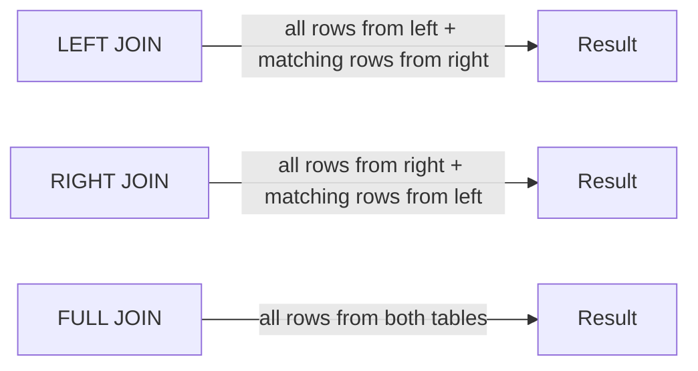

# Outer Join

`Tags: SQL, JOIN, LEFT JOIN, RIGHT JOIN, FULL JOIN`

| Field             | Value                                    |
| ----------------- | ----------------------------------------- |
| **Certificate**   | IBM Data Engineering Professional Certificate |
| **Course**        | C05 Databases and SQL with Python         |
| **Module**        | M06 Advance SQL                           |
| **Lesson**        | L02 Join Statements                       |
| **Date studied**  | 2026-08-16                                |

---

## Table of Contents

- [Overview](#overview)
- [What an Outer Join Is](#what-an-outer-join-is)
- [Left Outer Join](#left-outer-join)
- [Right Outer Join](#right-outer-join)
- [Full Outer Join](#full-outer-join)
- [Key Terms & Glossary](#-key-terms--glossary)
- [My Questions & Gaps](#-my-questions--gaps)
- [Resources](#-resources)

---

## Overview

วิดีโอนี้อธิบาย outer join ซึ่งต่างจาก inner join ตรงที่นอกจากจะคืนแถวที่ตรงกันแล้ว ยังคืนแถวที่ไม่มีคู่ตรงกันด้วย เนื้อหาครอบคลุมทั้งสามรูปแบบของ outer join ได้แก่ left outer join, right outer join และ full outer join พร้อม syntax และตัวอย่างผลลัพธ์ของแต่ละแบบ

---

## What an Outer Join Is

Outer join เหมือนกับ inner join ตรงที่คืนแถวจากแต่ละตารางที่มีค่าตรงกันใน join column แต่ต่างกันตรงที่ outer join จะคืนแถวที่ไม่มีคู่ตรงกันระหว่างสองตารางด้วย SQL มี outer join สามประเภท ได้แก่ left outer join, right outer join และ full outer join



---

## Left Outer Join

ใน left outer join แถวทั้งหมดจากตารางแรก (left table ฝั่งซ้ายของ join predicate) จะถูกรวมไว้ทั้งหมด และรวมกับเฉพาะแถวที่ตรงกันจากตารางที่สอง (right table ฝั่งขวาของ join predicate)

ตัวอย่าง: ตาราง Borrower เป็นตารางแรกที่ระบุใน FROM clause จึงเป็น LEFT table ส่วนตาราง Loan เป็น RIGHT table เนื่องจาก Borrower อยู่ทางซ้ายของ join operator จึงเลือกแถวทั้งหมดจากตาราง Borrower มารวมกับข้อมูลจากตาราง Loan ตามเงื่อนไขที่ระบุ (ในที่นี้คือคอลัมน์ BORROWER ID)

```sql
-- ดึงทุกแถวจาก Borrower พร้อมวันที่ยืม (ถ้ามี) จาก Loan
SELECT B.BORROWER_ID, B.LASTNAME, B.COUNTRY, L.BORROWER_ID, L.LOAN_DATE
FROM BORROWER B
LEFT JOIN LOAN L
ON B.BORROWER_ID = L.BORROWER_ID;
```

ผลลัพธ์จะแสดง Borrower ID ทุกแถวจากตาราง Borrower พร้อม loan date ที่สอดคล้องกัน หากบาง borrower ไม่มีการยืมหนังสือเลย คอลัมน์ borrower ID และ loan date จากฝั่ง Loan จะเป็นค่า null

---

## Right Outer Join

ใน right outer join แถวทั้งหมดจากตารางที่สอง (right table) จะถูกรวมไว้ทั้งหมด และรวมกับเฉพาะแถวที่ตรงกันจากตารางแรก (left table)

ตัวอย่าง: ยังคงใช้ Borrower เป็น LEFT table และ Loan เป็น RIGHT table เนื่องจาก Loan อยู่ทางขวาของ join operator จึงเลือกแถวทั้งหมดจากตาราง Loan มารวมกับข้อมูลจากตาราง Borrower ตามเงื่อนไข BORROWER_ID

```sql
-- ดึงทุกแถวจาก Loan พร้อมข้อมูลผู้ยืม (ถ้ามี) จาก Borrower
SELECT L.BORROWER_ID, L.LOAN_DATE, B.BORROWER_ID, B.LASTNAME, B.COUNTRY
FROM BORROWER B
RIGHT JOIN LOAN L
ON B.BORROWER_ID = L.BORROWER_ID;
```

ผลลัพธ์จะแสดงทุกแถวจากตาราง Loan พร้อม loan date สำหรับ borrower ที่มีข้อมูลตรงกันในตาราง Borrower หากมีแถวใน Loan ที่ borrower ID ไม่ตรงกับตาราง Borrower เลย คอลัมน์ borrower ID, lastname และ country จะเป็นค่า null ซึ่งกรณีนี้อาจบ่งบอกถึงปัญหาของห้องสมุด เช่น มีหนังสือถูกยืมโดยบุคคลที่ไม่รู้จัก

---

## Full Outer Join

Full join คืนแถวทั้งหมดจากทั้งตารางซ้ายและตารางขวา จึงอาจได้ result set ที่มีขนาดใหญ่มาก

```sql
-- ดึงทุกแถวจากทั้ง Borrower และ Loan
SELECT B.BORROWER_ID, B.LASTNAME, B.COUNTRY, L.BORROWER_ID, L.LOAN_DATE
FROM BORROWER B
FULL JOIN LOAN L
ON B.BORROWER_ID = L.BORROWER_ID;
```

ตัวอย่างผลลัพธ์แสดงทุกแถวจากตาราง Borrower พร้อมข้อมูลที่สอดคล้องกันจากตาราง Loan บาง borrower (เช่น Peters, Li, Wong) ไม่เคยยืมหนังสือเลยจึงได้ค่า null ในฝั่ง Loan ในขณะที่บางแถวจากตาราง Loan ก็ไม่มีข้อมูลตรงกันในตาราง Borrower จึงได้ค่า null ในฝั่ง Borrower แทน ซึ่งหมายความว่าไม่ทราบว่าใครเป็นผู้ยืมหนังสือเล่มนั้น

---

## 📖 Key Terms & Glossary

| Term (ศัพท์) | คำอธิบาย (ภาษาไทย) |
| ------------- | -------------------- |
| Outer Join | JOIN ที่คืนทั้งแถวที่ตรงกันและแถวจากตารางใดตารางหนึ่งที่ไม่มีคู่ตรงกัน |
| Left Outer Join (LEFT JOIN) | คืนแถวทั้งหมดจากตารางซ้าย และเฉพาะแถวที่ตรงกันจากตารางขวา แถวที่ไม่ตรงกันจะได้ค่า null ในฝั่งขวา |
| Right Outer Join (RIGHT JOIN) | คืนแถวทั้งหมดจากตารางขวา และเฉพาะแถวที่ตรงกันจากตารางซ้าย แถวที่ไม่ตรงกันจะได้ค่า null ในฝั่งซ้าย |
| Full Outer Join (FULL JOIN) | คืนแถวทั้งหมดจากทั้งตารางซ้ายและตารางขวา รวมถึงแถวที่ไม่มีคู่ตรงกันจากทั้งสองฝั่ง |
| Right Table | ตารางที่ระบุอยู่ทางขวาของ JOIN clause ใน FROM clause |

---

## ❓ My Questions & Gaps

- [ ] LEFT JOIN กับ RIGHT JOIN ให้ผลลัพธ์เหมือนกันได้หรือไม่ถ้าสลับลำดับตารางในคำสั่ง
- [ ] FULL JOIN มี syntax หรือพฤติกรรมต่างกันหรือไม่ในแต่ละ database engine (เช่น MySQL ไม่รองรับ FULL JOIN โดยตรง)

---

## 🔗 Resources

- ไม่มีลิงก์หรือเอกสารอ้างอิงเพิ่มเติมที่กล่าวถึงในวิดีโอนี้
