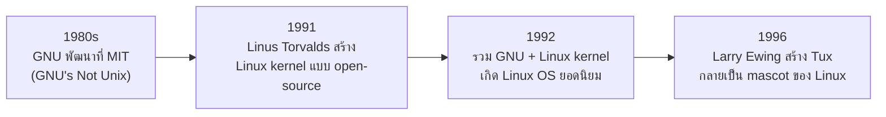

# Introducing Linux and Unix

`Tags: Linux, Unix, operating-system, open-source, kernel`

| Field            | Value                                         |
| ---------------- | --------------------------------------------- |
| **Certificate**  | IBM Data Engineering Professional Certificate |
| **Course**       | C06 Linux Commands and Shell Scripting        |
| **Module**       | M01 Introduction to Linux                     |
| **Lesson**       | L01 Introducing Linux and Unix                |
| **Date studied** | 2026-08-16                                    |

---

## Table of Contents

- [Overview](#overview)
- [What is an Operating System](#what-is-an-operating-system)
- [Unix Origins and Family](#unix-origins-and-family)
- [Key Linux Features](#key-linux-features)
- [History of Linux](#history-of-linux)
- [Common Use Cases of Linux Today](#common-use-cases-of-linux-today)
- [Key Terms & Glossary](#-key-terms--glossary)
- [My Questions & Gaps](#-my-questions--gaps)
- [Resources](#-resources)

---

## Overview

วิดีโอนี้ปูพื้นฐานว่า operating system (OS) คืออะไร แล้วเจาะลึกไปที่ที่มาของ Unix และ Linux ตั้งแต่ยุค 1960s จนถึงปัจจุบัน พร้อมสรุปคุณสมบัติเด่นของ Linux อย่าง free/open-source, multi-user, multitasking และ portable รวมถึงตัวอย่างการใช้งานจริงของ Linux ในอุปกรณ์และระบบต่าง ๆ ทั่วโลก

---

## What is an Operating System

Operating system (OS) คือซอฟต์แวร์ที่ทำหน้าที่จัดการ hardware และทรัพยากรของคอมพิวเตอร์ และเป็นตัวกลางที่ทำให้ผู้ใช้สามารถโต้ตอบกับ hardware เพื่อทำงานต่าง ๆ ได้

---

## Unix Origins and Family

Unix ไม่ใช่ OS ตัวเดียว แต่เป็น "ตระกูล" ของ operating system หลายตัว ตัวอย่าง Unix-based OS ที่นิยม ได้แก่ Oracle Solaris, OpenSolaris, FreeBSD, HPUX, IBM AIX และ Apple macOS ซึ่งเป็นหนึ่งใน desktop OS ที่นิยมที่สุดในปัจจุบัน

| ช่วงเวลา   | เหตุการณ์สำคัญ                                                                                                 |
| ---------- | -------------------------------------------------------------------------------------------------------------- |
| 1960s      | Unix ตัวดั้งเดิมถูกสร้างขึ้นที่ AT&T Bell Labs สำหรับเครื่อง PDP-7 โดยเฉพาะ                                    |
| 1970s      | Unix ถูกเขียนใหม่ด้วยภาษา C ทำให้ portable ไปยัง hardware architecture อื่น ๆ ได้                              |
| ปลาย 1970s | UC Berkeley พัฒนา Berkeley Software Distribution (BSD) เป็นส่วนเสริมของ Unix; macOS รุ่นหลังพัฒนาต่อยอดจาก BSD |

---

## Key Linux Features

Linux คือตระกูลของ operating system ที่คล้าย Unix (Unix-like) เมื่อพูดถึง "Linux" มักหมายถึง distribution หรือ flavor เฉพาะตัวหนึ่ง Linux เกิดขึ้นจากความพยายามสร้างเวอร์ชัน free และ open-source ของ Unix OS

- **Free and open-source** — ใครก็ตามสามารถดู source code ได้ ทำให้มีคนช่วยตรวจสอบจำนวนมาก ส่งผลให้ Linux กลายเป็นหนึ่งใน OS ที่ปลอดภัยที่สุด
- **Multi-user** — ออกแบบมาให้รองรับผู้ใช้หลายคนเข้าใช้งานระบบพร้อมกันได้
- **Multitasking** — รันหลายงาน (jobs) และแอปพลิเคชันพร้อมกันได้
- **Portable** — ถูก port ไปใช้งานบนอุปกรณ์และ hardware platform ที่หลากหลาย ตั้งแต่ desktop, server ไปจนถึง appliance

---

## History of Linux

Kernel คือ core component ของ OS ที่ทำให้ส่วนต่าง ๆ ของระบบสื่อสารกับ hardware ของเครื่องได้ Linus Torvalds เคยโพสต์แชร์ความคืบหน้าการสร้าง Unix-like kernel ของตัวเอง โดยอ้างอิงถึง Minix ซึ่งเป็นอีกหนึ่ง Unix-like kernel ในยุคนั้น ปัจจุบัน macOS ที่พัฒนาต่อจาก BSD ถูกใช้งานบนอุปกรณ์นับล้านทั่วโลก ขณะที่ Linux ถูกใช้งานบน server นับพันล้านเครื่องที่รองรับ modern web และ distro อย่าง Ubuntu ก็เริ่มได้รับความนิยมมากขึ้นในฝั่ง PC โดยเฉพาะในกลุ่มนักพัฒนา

---

## Common Use Cases of Linux Today

- Smartphone นับพันล้านเครื่องทั่วโลก ผ่าน Android OS ที่ใช้ Linux-based kernel
- Supercomputer ที่ใช้ Linux-powered server จำนวนมากทำงานร่วมกันแบบ cluster สำหรับงาน high-performance computing
- Enterprise และ cloud data center ที่ใช้ Linux บน server นับล้านเครื่อง เพื่อรัน web server, database และแอปพลิเคชันต่าง ๆ
- Personal computer — หลายคนติดตั้ง Linux เพื่อการเรียนรู้หรือใช้เป็น daily driver

---

## 📖 Key Terms & Glossary

| Term (ศัพท์)                         | คำอธิบาย (ภาษาไทย)                                                                                                       |
| ------------------------------------ | ------------------------------------------------------------------------------------------------------------------------ |
| Operating System (OS)                | ซอฟต์แวร์ที่จัดการ hardware และทรัพยากรของคอมพิวเตอร์ และเป็นตัวกลางให้ผู้ใช้โต้ตอบกับ hardware ได้                      |
| Unix                                 | ตระกูลของ operating system ที่มีต้นกำเนิดจากยุค 1960s ที่ AT&T Bell Labs                                                 |
| BSD (Berkeley Software Distribution) | ส่วนเสริมของ Unix ที่พัฒนาโดย UC Berkeley เพิ่มซอฟต์แวร์และความสามารถให้ Unix; เป็นต้นทางของ macOS                       |
| Linux                                | ตระกูลของ operating system แบบ Unix-like ที่เป็น free และ open-source                                                    |
| Kernel                               | core component ของ OS ที่ทำให้ส่วนต่าง ๆ ของระบบสื่อสารกับ hardware ของเครื่องได้                                        |
| GNU                                  | โปรเจกต์ที่พัฒนาที่ MIT ในยุค 1980s เพื่อสร้างชุดเครื่องมือของ Unix แบบ free และ open-source (ย่อมาจาก "GNU's Not Unix") |
| Open-source                          | ซอฟต์แวร์ที่เปิดให้ทุกคนดู source code ได้                                                                               |
| Multi-user                           | คุณสมบัติของระบบที่รองรับผู้ใช้หลายคนเข้าใช้งานพร้อมกันได้                                                               |
| Multitasking                         | คุณสมบัติของระบบที่รันหลายงานหรือแอปพลิเคชันพร้อมกันได้                                                                  |
| Portable (software)                  | คุณสมบัติของซอฟต์แวร์ที่สามารถนำไปใช้งานบน hardware หรืออุปกรณ์ที่หลากหลายได้                                            |
| Tux                                  | เพนกวินที่เป็น mascot อย่างเป็นทางการของ Linux สร้างโดย Larry Ewing ในปี 1996                                            |

---

## ❓ My Questions & Gaps

- [x] ความแตกต่างระหว่าง "Linux" (kernel) กับ "Linux distribution" (OS ที่สมบูรณ์) ในทางปฏิบัติต่างกันอย่างไร
  - **คำตอบ:** "Linux" อย่างเคร่งครัดหมายถึงแค่ **kernel** ซึ่งเป็น core component ที่ทำให้ software สื่อสารกับ hardware ได้เท่านั้น ยังไม่ใช่ OS ที่ใช้งานได้ครบสมบูรณ์ ส่วน **Linux distribution** (distro) คือการนำ Linux kernel มารวมกับ GNU tools, package manager, desktop environment และแอปพลิเคชันอื่น ๆ จนกลายเป็น OS ที่สมบูรณ์พร้อมใช้งาน เช่น Ubuntu, Fedora, Debian, RHEL แต่ละ distro ใช้ kernel ตัวเดียวกันเป็นแกนกลาง ต่างกันที่ tools, package manager และการตั้งค่าที่ห่อหุ้มรอบ kernel นั้น
- [x] macOS ยังถือว่าเป็น Unix-based หรือ BSD-based ในระดับใดในปัจจุบัน (หลัง Darwin/XNU kernel)
  - **คำตอบ:** macOS ยังนับเป็น Unix-based อยู่ในระดับที่ผ่านการรับรองอย่างเป็นทางการ (Apple ได้ certification ว่า macOS เป็น UNIX 03 compliant ตามมาตรฐาน Single UNIX Specification) รากฐานของ macOS คือ **Darwin** ซึ่งใช้ **XNU kernel** (ผสมระหว่าง Mach microkernel กับส่วนประกอบที่มาจาก BSD) และ userland tools จำนวนมากของ macOS ก็สืบทอดมาจาก BSD โดยตรง ดังนั้น macOS จึงถือเป็นทั้ง Unix-based (ในเชิง certification/มาตรฐาน) และ BSD-based (ในเชิงที่มาของ kernel และ tools) ไปพร้อมกัน
- [x] Unix กับ Linux ต่างกันอย่างไร?
  - **คำตอบ:** Unix คือตระกูล OS ดั้งเดิมที่ถือกำเนิดในยุค 1960s ที่ AT&T Bell Labs ส่วนใหญ่เป็น proprietary (มีเจ้าของ/ปิด source code) และต้องซื้อ license เช่น Oracle Solaris, IBM AIX, HPUX ส่วน Linux คือ OS แบบ Unix-like ที่ถูกสร้างขึ้นภายหลัง (1991 โดย Linus Torvalds) เพื่อเป็นเวอร์ชัน free และ open-source ของ Unix โดย Linux ไม่ได้ใช้ source code ของ Unix โดยตรง แต่เลียนแบบพฤติกรรมและมาตรฐานของ Unix (POSIX-compliant) ความแตกต่างหลักคือ **ownership/licensing** (Unix ปิด vs Linux เปิด) และ **cost** (Unix ส่วนใหญ่ต้องซื้อ vs Linux ใช้ฟรี)

---

## 🔗 Resources

- [Operating System Tutorial](https://www.geeksforgeeks.org/operating-systems/operating-systems/)
