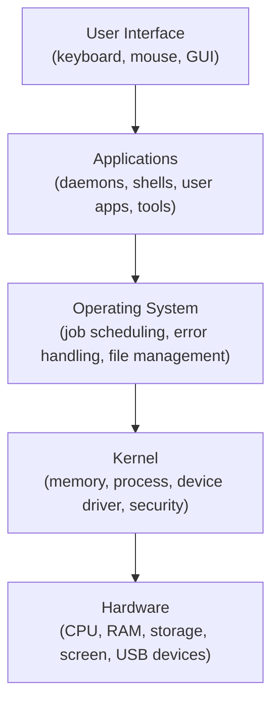

# Overview of Linux Architecture

`Tags: Linux, architecture, kernel, filesystem`

| Field             | Value                                    |
| ----------------- | ----------------------------------------- |
| **Certificate**   | IBM Data Engineering Professional Certificate |
| **Course**        | C06 Linux Commands and Shell Scripting    |
| **Module**        | M01 Introduction to Linux                 |
| **Lesson**        | L03 Overview of Linux Architecture        |
| **Date studied**  | 2026-08-16                                |

---

## Table of Contents

- [Overview](#overview)
- [Layers of a Linux System](#layers-of-a-linux-system)
- [User Interface](#user-interface)
- [Applications](#applications)
- [Operating System Layer](#operating-system-layer)
- [The Kernel](#the-kernel)
- [Hardware](#hardware)
- [The Linux Filesystem](#the-linux-filesystem)
- [Key Terms & Glossary](#-key-terms--glossary)
- [My Questions & Gaps](#-my-questions--gaps)
- [Resources](#-resources)

---

## Overview

วิดีโอนี้แจกแจงโครงสร้างของระบบ Linux ออกเป็น 5 layer ตั้งแต่ user interface ไปจนถึง hardware พร้อมอธิบายบทบาทของแต่ละ layer และปิดท้ายด้วยโครงสร้างของ Linux filesystem ที่จัดเก็บไฟล์และไดเรกทอรีทั้งหมดในระบบแบบ tree-like เพื่อให้เข้าใจภาพรวมว่าคำสั่งหรือแอปพลิเคชันที่เราใช้งานสื่อสารกับ hardware ผ่านชั้นใดบ้าง

---

## Layers of a Linux System

ระบบ Linux ประกอบด้วย 5 layer เรียงจากชั้นนอกสุดไปชั้นในสุด

---

## User Interface

Layer ชั้นนอกสุดของ Linux architecture คือ user interface (UI) ซึ่งเปิดให้ผู้ใช้โต้ตอบกับระบบผ่าน keyboard หรือ mouse Linux เวอร์ชัน desktop จะมี Graphical User Interface (GUI) เพิ่มเข้ามา ทำงานคล้ายกับ Microsoft Windows และขยายความสามารถของ UI ให้รองรับอุปกรณ์ควบคุมอื่น เช่น mouse ตัวอย่างการใช้งาน เช่น เปิดเว็บเบราว์เซอร์ส่งอีเมล หรือเปิดโปรแกรมเล่นเพลง

---

## Applications

Application layer ประกอบด้วย system daemons, shells, user apps และ tools ที่ใช้ทำงานต่าง ๆ ในระบบ Linux แอปพลิเคชันเหล่านี้สื่อสารกับ operating system เพื่อให้งานสำเร็จ

- **System tools** เช่น compiler
- **Programming languages**
- **Shells** — แอปพลิเคชันพิเศษที่มักเป็นส่วนหนึ่งของ OS เอง
- **User apps** — แอปพลิเคชันทั่วไป เช่น browser, text editor, เกม

---

## Operating System Layer

Operating system ทำหน้าที่ควบคุม job และโปรแกรมที่จำเป็นต่อความเสถียรของระบบ (system stability) เช่น job scheduling และการติดตามเวลา รวมถึง:

- assign ซอฟต์แวร์ให้ผู้ใช้
- ตรวจจับ error และป้องกันไม่ให้ระบบล่มทั้งหมด
- จัดการไฟล์ (file management)

OS layer วางอยู่บน Linux kernel ซึ่งทำหน้าที่ระดับล่างที่สำคัญที่สุดของระบบ

---

## The Kernel

Kernel คือซอฟต์แวร์ระดับล่างที่สุดของระบบ Linux และมีอำนาจควบคุมระบบทั้งหมด kernel เริ่มทำงานทันทีที่เครื่องบูตและอยู่ใน memory ตลอดเวลาที่ระบบทำงาน ทำหน้าที่เป็นสะพานเชื่อมระหว่างแอปพลิเคชันกับ hardware ของเครื่อง โดยสื่อสารกันผ่าน "system calls"

Kernel มีหน้าที่หลัก 4 อย่าง:

- Memory management
- Process management
- จัดการ device driver เพื่อรองรับ hardware อย่างถูกต้อง
- ดูแลความปลอดภัยของระบบ (security)

Kernel ยังเป็นตัวเชื่อมต่อกับ hardware layer ซึ่งประกอบด้วยอุปกรณ์ทางกายภาพและอิเล็กทรอนิกส์ในเครื่อง เช่น processor, memory module, input device และ storage

---

## Hardware

Layer สุดท้ายคือ hardware ซึ่งประกอบด้วยอุปกรณ์ทางกายภาพหรืออิเล็กทรอนิกส์ของคอมพิวเตอร์:

- **CPU** — ทำหน้าที่ execute การคำนวณส่วนใหญ่
- **RAM** — หน่วยเก็บข้อมูลชั่วคราวความเร็วสูงสำหรับข้อมูลที่แอปพลิเคชันต้องใช้ระหว่างรัน
- **Storage** — เก็บข้อมูลให้คงอยู่แม้ปิดเครื่อง
- **หน้าจอ (screen)**
- **อุปกรณ์ USB** เช่น keyboard, mouse, USB drive

---

## The Linux Filesystem

Linux filesystem คือชุดไฟล์ทั้งหมดในเครื่อง ทั้งไฟล์ที่จำเป็นสำหรับรันเครื่องและแอปพลิเคชัน รวมถึงไฟล์งานของผู้ใช้เอง จุดบนสุดของ filesystem คือ root directory สัญลักษณ์ `/` โดยด้านล่างเป็นโครงสร้างแบบ tree ของไดเรกทอรีและไฟล์ พร้อมกำหนด access right ให้แต่ละไดเรกทอรี/ไฟล์อย่างเหมาะสม

| Directory | เก็บอะไร |
| --- | --- |
| `/bin` | user binary files — โค้ดที่เครื่องใช้รันโปรแกรมและ execute คำสั่ง |
| `/usr` | user programs |
| `/home` | ไดเรกทอรีทำงานส่วนตัวสำหรับเก็บไฟล์ของผู้ใช้ |
| `/boot` | ไฟล์ boot ของระบบ — คำสั่งที่จำเป็นต่อการ startup |
| `/media` | ไฟล์ที่เกี่ยวข้องกับสื่อชั่วคราว เช่น CD หรือ USB drive ที่เชื่อมต่อกับระบบ |

---

## 📖 Key Terms & Glossary

| Term (ศัพท์) | คำอธิบาย (ภาษาไทย) |
| ------------- | -------------------- |
| User Interface (UI) | layer ชั้นนอกสุดของ Linux architecture ที่ให้ผู้ใช้โต้ตอบกับระบบผ่าน keyboard หรือ mouse |
| GUI (Graphical User Interface) | ส่วนต่อขยายของ UI ในเวอร์ชัน desktop ที่รองรับอุปกรณ์ควบคุมเพิ่มเติม เช่น mouse |
| Daemon | system process ที่ทำงานอยู่เบื้องหลังในระบบ Linux |
| System calls | กลไกที่ทำให้แอปพลิเคชันสื่อสารกับ kernel/hardware ได้ |
| Process management | หน้าที่ของ kernel ในการจัดการการทำงานของ process ต่าง ๆ ในระบบ |
| Device driver | ซอฟต์แวร์ที่ kernel ใช้จัดการเพื่อรองรับ hardware อย่างถูกต้อง |
| Root directory (`/`) | จุดบนสุดของ Linux filesystem ที่ไดเรกทอรีและไฟล์อื่นทั้งหมดอยู่ภายใต้ |
| `/bin` | ไดเรกทอรีที่เก็บ user binary files สำหรับรันโปรแกรมและ execute คำสั่ง |
| `/home` | ไดเรกทอรีทำงานส่วนตัวของผู้ใช้แต่ละคน |
| `/boot` | ไดเรกทอรีที่เก็บไฟล์ boot ที่จำเป็นต่อการ startup ระบบ |

---

## ❓ My Questions & Gaps

- [ ] system calls ทำงานเชื่อมระหว่าง application กับ kernel อย่างละเอียดเป็นอย่างไร (จะมีคำสั่งหรือ API ตัวอย่างในบทถัดไปหรือไม่)
- [ ] นอกจาก `/bin`, `/usr`, `/home`, `/boot`, `/media` แล้ว directory สำคัญอื่น ๆ ที่วิดีโอไม่ได้กล่าวถึง (เช่น `/etc`, `/var`, `/tmp`) มีบทบาทอย่างไร

---

## 🔗 Resources

- ไม่มีลิงก์อ้างอิงเพิ่มเติมในวิดีโอนี้
