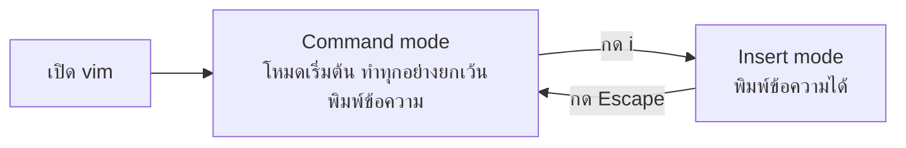

# Creating and Editing Text Files

`Tags: Linux, text-editor, nano, vim, gedit, emacs`

| Field            | Value                                         |
| ---------------- | --------------------------------------------- |
| **Certificate**  | IBM Data Engineering Professional Certificate |
| **Course**       | C06 Linux Commands and Shell Scripting        |
| **Module**       | M01 Introduction to Linux                     |
| **Lesson**       | L07 Creating and Editing Text Files           |
| **Date studied** | 2026-08-16                                    |

---

## Table of Contents

- [Overview](#overview)
- [Categories of Text Editors](#categories-of-text-editors)
- [gedit — GUI Text Editor](#gedit--gui-text-editor)
- [GNU nano — Command-Line Text Editor](#gnu-nano--command-line-text-editor)
- [vim — Command-Line Text Editor](#vim--command-line-text-editor)
- [Key Terms & Glossary](#-key-terms--glossary)
- [My Questions & Gaps](#-my-questions--gaps)
- [Resources](#-resources)

---

## Overview

วิดีโอนี้แนะนำ text editor สำหรับ Linux ทั้งสองประเภทคือแบบ command-line และแบบ GUI พร้อมเจาะลึกการใช้งาน **gedit** (GUI editor), **GNU nano** และ **vim** (command-line editor) รวมถึงคำสั่งพื้นฐานที่ใช้เปิด แก้ไข ค้นหา และบันทึกไฟล์ในแต่ละโปรแกรม

---

## Categories of Text Editors

Text editor สำหรับ Linux แบ่งได้เป็นสองกลุ่มหลัก:

| ประเภท                    | ตัวอย่าง                                              |
| ------------------------- | ----------------------------------------------------- |
| Command-line text editors | GNU nano, vi, vim, emacs (ใช้ในโหมด command line ได้) |
| GUI text editors          | gedit, emacs (ใช้ในโหมด GUI ได้)                      |

- **GNU nano** — modeless text editor ขนาดเล็กและใช้งานง่าย
- **vi** — command-line editor ดั้งเดิมที่สร้างขึ้นสำหรับ Unix
- **vim** — command-line editor แบบ mode-based ที่ทรงพลัง พัฒนาต่อยอดจาก vi
- **emacs** — หนึ่งใน free, open-source project ที่เก่าแก่ที่สุดที่ยังพัฒนาต่อเนื่อง ใช้ได้ทั้งโหมด GUI และ command line
- **gedit** — GUI editor ค่าเริ่มต้นของ GNOME environment

---

## gedit — GUI Text Editor

gedit คือ text editor แบบ GUI ที่นิยมและติดตั้งมาพร้อมกับ Linux distro ส่วนใหญ่ ออกแบบมาเป็น general-purpose text editor ตามแนวคิดของ GNOME project ที่เน้นความเรียบง่ายและใช้งานง่าย มีหน้าตา GUI ที่สะอาดตา

ฟีเจอร์เด่นของ gedit:

- Integrated file browser
- Undo และ redo
- Search and replace ที่รองรับ regular expressions
- Extensibility ผ่าน plugin จาก package `gedit-plugins`
- Syntax color coding เพื่อช่วยแยกแยะส่วนต่าง ๆ ของโค้ด

---

## GNU nano — Command-Line Text Editor

GNU nano เป็น command-line text editor ที่มีฟีเจอร์ครบครัน ได้แก่ undo/redo, search and replace ที่รองรับ regular expressions, syntax highlighting, automatic indentation, line numbering, line-by-line scrolling และรองรับหลาย buffer เพื่อทำงานกับหลายไฟล์พร้อมกัน

```bash
# เปิดไฟล์ในโปรแกรม nano
nano <filename>
```

การนำทางและแก้ไขในหน้าต่าง nano:

- ใช้ arrow keys, page up/down, home/end เพื่อเลื่อน cursor
- พิมพ์ข้อความได้ตรงตำแหน่ง cursor, ใช้ Delete/Backspace เพื่อลบ, กด Enter เพื่อขึ้นบรรทัดใหม่
- คำสั่งต่าง ๆ เรียกใช้ด้วยการกด `Ctrl` ค้างพร้อมตัวอักษรของคำสั่ง เช่น `Ctrl + G` เพื่อขอความช่วยเหลือ (Get Help)
- `Ctrl + W` เปิดฟังก์ชัน "Where Is" สำหรับค้นหาข้อความ — พิมพ์คำที่ต้องการค้นหาแล้วกด Enter, cursor จะกระโดดไปยังตำแหน่งที่พบคำนั้นถัดจากตำแหน่งปัจจุบัน

---

## vim — Command-Line Text Editor

vim คือ command-line editor แบบดั้งเดิมที่ทรงพลัง ต้องใช้เวลาฝึกฝนพอสมควรกว่าจะคุ้นเคย vim มีสองโหมดหลัก:



| Mode         | หน้าที่                                                                   |
| ------------ | ------------------------------------------------------------------------- |
| Command mode | โหมดเริ่มต้น ใช้จัดการไฟล์ นำทาง ค้นหา คัดลอก-วาง และคำสั่งอื่น ๆ ทั้งหมด |
| Insert mode  | โหมดสำหรับพิมพ์ข้อความเข้าไปใน buffer                                     |

```bash
# เปิด vim โดยไม่ระบุไฟล์
vim

# เปิด vim พร้อมระบุไฟล์ที่ต้องการแก้ไข (สร้างใหม่หรือแก้ไขไฟล์เดิม)
vim <filename>
```

```
# ภายใน vim session:
i              # กด i เพื่อเข้าสู่ Insert mode แล้วพิมพ์ข้อความ
<Esc>          # กด Escape เพื่อออกจาก Insert mode กลับสู่ Command mode
:w example.txt # บันทึกไฟล์ครั้งแรกพร้อมตั้งชื่อไฟล์ (write)
:w             # บันทึกการเปลี่ยนแปลงของไฟล์ที่มีอยู่แล้ว
:q             # ออกจาก vim
:q!            # ออกจาก vim โดยไม่บันทึกการเปลี่ยนแปลง (bang = ละทิ้งการเปลี่ยนแปลง)
```

หลังบันทึกไฟล์ครั้งแรก vim จะแสดงข้อความสรุป เช่น ชื่อไฟล์ สถานะว่าเป็นไฟล์ใหม่ จำนวนบรรทัดและ column ที่เขียน และผลลัพธ์ว่าบันทึกสำเร็จหรือไม่ นอกจากนี้ vim ยังมีคำสั่งอีกมากสำหรับนำทางใน text buffer และทำงานเช่น search, copy, paste และย้ายข้อความ

---

## 📖 Key Terms & Glossary

| Term (ศัพท์)        | คำอธิบาย (ภาษาไทย)                                                                |
| ------------------- | --------------------------------------------------------------------------------- |
| Text editor         | โปรแกรมที่ใช้เขียนและแก้ไขไฟล์ข้อความหรือโค้ด แบ่งเป็นแบบ command-line และแบบ GUI |
| gedit               | GUI text editor ค่าเริ่มต้นของ GNOME environment เน้นความเรียบง่ายและใช้งานง่าย   |
| GNU nano            | command-line text editor แบบ modeless ขนาดเล็ก ใช้งานง่าย                         |
| vi                  | command-line text editor ดั้งเดิมที่สร้างขึ้นสำหรับ Unix                          |
| vim                 | command-line text editor แบบ mode-based ที่ทรงพลัง พัฒนาต่อยอดจาก vi              |
| emacs               | text editor แบบ free/open-source ที่เก่าแก่ ใช้ได้ทั้งโหมด GUI และ command line   |
| Modeless editor     | text editor ที่ไม่มีโหมดแยกระหว่างการพิมพ์กับการสั่งคำสั่ง (เช่น nano)            |
| Mode-based editor   | text editor ที่แยกโหมดการทำงาน เช่น Insert mode กับ Command mode (เช่น vim)       |
| Buffer              | พื้นที่ชั่วคราวใน editor ที่เก็บข้อความก่อนถูกเขียนลงไฟล์จริง                     |
| Insert mode         | โหมดของ vim ที่ใช้พิมพ์ข้อความเข้าไปใน buffer                                     |
| Command mode        | โหมดเริ่มต้นของ vim ที่ใช้จัดการไฟล์และรันคำสั่งต่าง ๆ                            |
| Syntax highlighting | การเน้นสีข้อความตามโครงสร้างของโค้ดเพื่อให้อ่านง่ายขึ้น                           |
| Plugin              | ส่วนเสริมที่เพิ่มความสามารถให้กับโปรแกรม เช่น plugin ของ gedit                    |

---

## ❓ My Questions & Gaps

- [x] ความแตกต่างระหว่าง vi กับ vim ในทางปฏิบัติมีมากแค่ไหน — บาง distro มีแค่ vi หรือ vim ให้ใช้เท่านั้นหรือไม่
  - **คำตอบ** vim คือ vi เวอร์ชันที่พัฒนาต่อยอด เพิ่มฟีเจอร์ที่ vi ดั้งเดิมไม่มี เช่น window splitting, tabs, syntax highlighting, macros, undo/redo แบบหลายขั้น, command-line history และ word completion โหมด open และ visual ของ vi ถูกกำหนดไว้ใน Single UNIX Specification และมาตรฐาน POSIX ทำให้ vi เข้ากันได้กับระบบที่ compliant กับมาตรฐานนี้ ส่วนฟีเจอร์ที่ vim เพิ่มเข้ามาไม่ได้เป็นส่วนหนึ่งของมาตรฐาน POSIX แม้ว่า vim จะอ้างว่าเข้ากันได้กับ vi ราว 99% ก็ตาม ในทางปฏิบัติ Linux distro ส่วนใหญ่ในปัจจุบันติดตั้ง vim มาให้ และคำสั่ง `vi` มักจะถูก alias ให้เรียก vim โดยอัตโนมัติ ระบบที่ยังคงแยก vi กับ vim ออกจากกันจริง ๆ มักเป็นระบบ Unix สาย BSD เช่น OpenBSD ซึ่งมี vi ติดมาใน base system และ vim เป็น package แยกต่างหากที่ต้องติดตั้งเพิ่ม
- [x] คำสั่งพื้นฐานอื่น ๆ ของ vim ที่ใช้ copy/paste/navigate ข้อความมีอะไรบ้าง (น่าจะได้ฝึกใน hands-on lab)
  - **คำตอบ** คำสั่งพื้นฐานที่ใช้บ่อยใน Command mode ของ vim:

  | คำสั่ง          | หน้าที่                                                                         |
  | --------------- | ------------------------------------------------------------------------------- |
  | `h` `j` `k` `l` | เลื่อน cursor ไปทางซ้าย/ลง/ขึ้น/ขวา ทีละตัวอักษรหรือบรรทัด (ใช้แทนปุ่มลูกศรได้) |
  | `yy` หรือ `3yy` | yank (คัดลอก) ทั้งบรรทัดปัจจุบัน หรือคัดลอก 3 บรรทัดตามจำนวนที่ระบุ             |
  | `yw`            | yank คำ (word) ที่ cursor ชี้อยู่                                               |
  | `dd`            | delete (ตัด) บรรทัดปัจจุบัน — ข้อความที่ถูกลบจะถูกเก็บไว้เหมือน copy ด้วย       |
  | `p`             | paste ข้อความที่ yank/delete ไว้ ต่อจากตำแหน่ง cursor                           |
  | `P`             | paste ข้อความก่อนตำแหน่ง cursor                                                 |
  | `v`             | เข้าสู่ Visual mode แบบเลือกทีละตัวอักษร                                        |
  | `V`             | เข้าสู่ Visual mode แบบเลือกทั้งบรรทัด                                          |
  | `Ctrl + v`      | เข้าสู่ Visual Block mode สำหรับเลือกข้อความเป็นบล็อกสี่เหลี่ยม                 |

  เมื่ออยู่ใน Visual mode และเลือกข้อความไว้แล้ว กด `y` เพื่อคัดลอก หรือ `d` เพื่อตัดส่วนที่เลือกไว้ ข้อสังเกตสำคัญคือ ถ้า yank/delete ทั้งบรรทัดด้วย `yy`/`dd` การ paste จะแทรกเป็นบรรทัดใหม่ แต่ถ้า yank/delete เฉพาะบางส่วนของบรรทัด (เช่น `yw`) การ paste จะแทรกข้อความในบรรทัดเดิม ณ ตำแหน่ง cursor

---

## 🔗 Resources

- [Differences Between Vi and Vim Editors — Baeldung on Linux](https://www.baeldung.com/linux/vi-vim-editors)
- [How to Copy, Cut and Paste in Vim / Vi — Linuxize](https://linuxize.com/post/how-to-copy-cut-paste-in-vim/)
